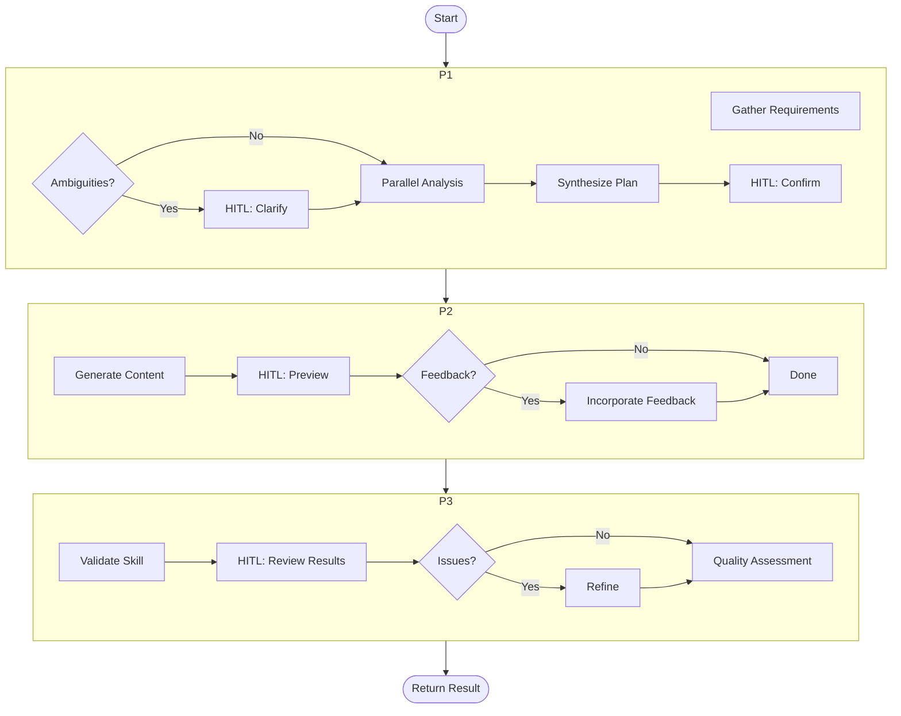
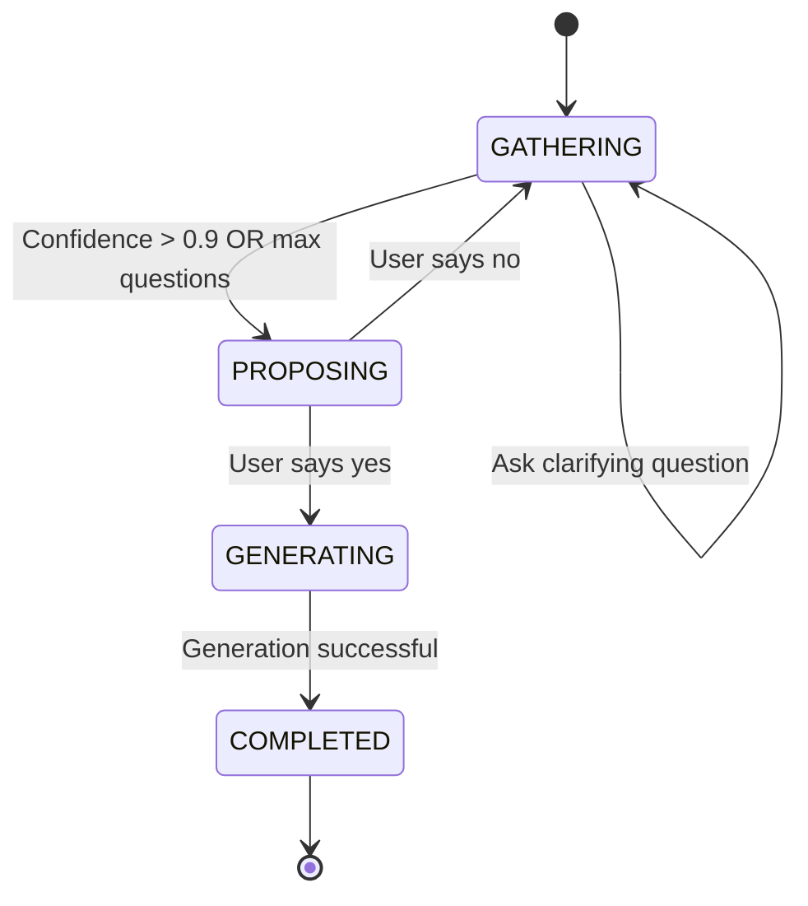

# DSPy Programs Reference

**Last Updated**: 2026-01-12
**Location**: `src/skill_fleet/core/programs/`

## Overview

DSPy programs **orchestrate** multiple modules to accomplish complex workflows. While modules implement individual steps, programs coordinate the entire skill creation process across phases, with integrated HITL (Human-in-the-Loop) checkpoints.

`★ Insight ─────────────────────────────────────`
Programs are the "glue code" of the workflow. They handle orchestration logic like: which phase to run next, when to pause for human input, how to handle errors, and how to combine outputs from multiple modules.
`─────────────────────────────────────────────────`

## Available Programs

| Program | Purpose | File |
|---------|---------|------|
| `SkillCreationProgram` | Main 3-phase skill creation workflow | `skill_creator.py` |
| `GuidedCreatorProgram` | Chat-based guided skill creation | `conversational.py` |

## SkillCreationProgram

**File**: `src/skill_fleet/core/programs/skill_creator.py`

The main orchestrator for the complete 3-phase skill creation workflow with integrated HITL.

### Class Definition

```python
class SkillCreationProgram(dspy.Module):
    """Complete 3-phase skill creation orchestrator with integrated HITL."""
```

### Constructor

```python
def __init__(self, quality_assured: bool = True, hitl_enabled: bool = True):
```

**Parameters:**
| Parameter | Type | Default | Description |
|-----------|------|---------|-------------|
| `quality_assured` | `bool` | `True` | Enable higher-quality generation modes |
| `hitl_enabled` | `bool` | `True` | Enable HITL checkpoints |

**Initialized Modules:**
```python
self.phase1 = Phase1UnderstandingModule()
self.phase2 = Phase2GenerationModule(quality_assured=quality_assured)
self.phase3 = Phase3ValidationModule()

# HITL Utility Modules
self.hitl_strategy = HITLStrategyModule()
self.readiness = ReadinessAssessorModule()
self.confirm_understanding = ConfirmUnderstandingModule()
self.preview_generator = PreviewGeneratorModule()
self.feedback_analyzer = FeedbackAnalyzerModule()
self.validation_formatter = ValidationFormatterModule()
self.refinement_planner = RefinementPlannerModule()
```

### Main Entry Point

```python
async def aforward(
    self,
    task_description: str,
    user_context: dict[str, Any],
    taxonomy_structure: str,
    existing_skills: str,
    hitl_callback: Callable[[str, dict[str, Any]], Any] | None = None,
    **kwargs
) -> SkillCreationResult:
```

**Parameters:**
| Parameter | Type | Description |
|-----------|------|-------------|
| `task_description` | `str` | Initial user task |
| `user_context` | `dict` | Context about the user (user_id, existing skills, preferences) |
| `taxonomy_structure` | `str` | Current taxonomy tree (JSON) |
| `existing_skills` | `str` | List of existing skills (JSON) |
| `hitl_callback` | `Callable` | Async callback for human interaction |
| `**kwargs` | `Any` | Additional parameters |

**Returns:**
```python
SkillCreationResult(
    status="completed",  # completed/cancelled/failed
    skill_content=str,
    metadata=SkillMetadata,
    validation_report=ValidationReport,
    quality_assessment=dict,
    error=str  # Only if status="failed"
)
```

### Workflow



### Phase 1: Understanding & Planning

**Goal**: Map user task to a specific taxonomy path with complete metadata.

**Steps:**

1. **HITL 1.1: Clarification** (if ambiguities detected)
   ```python
   if self.hitl_enabled and hitl_callback and requirements["ambiguities"]:
       clarifications = await hitl_callback("clarify", {
           "questions": generated_questions,
           "rationale": rationale
       })
   ```

2. **Parallel Analysis**
   ```python
   # Intent and Taxonomy run in parallel
   intent_result, taxonomy_result = await asyncio.gather(
       self.analyze_intent.aforward(...),
       self.find_taxonomy.aforward(...)
   )

   # Dependencies runs after (depends on intent)
   deps_result = await self.analyze_dependencies.aforward(...)
   ```

3. **HITL 1.2: Confirmation**
   ```python
   confirmation = await hitl_callback("confirm", {
       "summary": summary["summary"],
       "path": taxonomy_result["recommended_path"]
   })

   if confirmation.get("action") == "revise":
       # Loop back with revision
   ```

**Output**: Complete skill metadata, content plan, generation instructions

### Phase 2: Content Generation

**Goal**: Generate the actual SKILL.md content.

**Steps:**

1. **Load Template** (optional)
   ```python
   skill_md_template = _load_skill_md_template()
   if skill_md_template:
       generation_instructions = (
           f"{generation_instructions}\n\n"
           f"Follow this SKILL.md template structure:\n\n"
           f"{skill_md_template}"
       )
   ```

2. **Generate Content**
   ```python
   p2_result = await self.phase2.aforward(
       skill_metadata=plan["skill_metadata"],
       content_plan=plan["content_plan"],
       generation_instructions=generation_instructions,
       parent_skills_content="",
       dependency_summaries=deps_result
   )
   ```

3. **HITL 2.1: Preview & Feedback**
   ```python
   preview = await self.preview_generator.aforward(...)
   feedback = await hitl_callback("preview", {
       "content": preview["preview"],
       "highlights": preview["highlights"]
   })

   if feedback.get("action") == "refine":
       # Re-run Phase 2 with feedback
   ```

**Output**: Complete SKILL.md content with examples and best practices

### Phase 3: Validation & Refinement

**Goal**: Validate compliance and iteratively refine.

**Steps:**

1. **Validate**
   ```python
   p3_result = await self.phase3.aforward(
       skill_content=p2_result["skill_content"],
       skill_metadata=plan["skill_metadata"],
       content_plan=plan["content_plan"],
       validation_rules="Standard agentskills.io compliance",
       target_level=requirements["target_level"]
   )
   ```

2. **HITL 3.1: Final Review**
   ```python
   report = await self.validation_formatter.aforward(...)
   final_decision = await hitl_callback("validate", {
       "report": report["formatted_report"],
       "passed": p3_result["validation_report"].passed
   })

   if final_decision.get("action") == "refine":
       # Re-run Phase 3 with user feedback
   ```

**Output**: Validated and refined skill content

### HITL Callback Interface

The `hitl_callback` parameter enables flexible human interaction:

```python
async def hitl_callback(
    checkpoint: str,
    payload: dict[str, Any]
) -> dict[str, Any]:
    """Handle HITL interaction.

    Args:
        checkpoint: Checkpoint type ('clarify', 'confirm', 'preview', 'validate')
        payload: Checkpoint-specific data

    Returns:
        Dict with:
            - 'action': 'proceed' | 'revise' | 'refine' | 'cancel'
            - 'feedback': User feedback (for revise/refine)
            - 'response': User response (for clarify)
    """
```

**Checkpoint Types:**

| Checkpoint | Payload | Expected Response |
|------------|--------|-------------------|
| `clarify` | `{questions, rationale}` | `{response: "..."} or {answers: {...}}` |
| `confirm` | `{summary, path}` | `{action: "proceed"|"revise", feedback: "..."}` |
| `preview` | `{content, highlights}` | `{action: "proceed"|"refine", feedback: "..."}` |
| `validate` | `{report, passed}` | `{action: "accept"|"refine", feedback: "..."}` |

**Actions:**
- **`proceed`**: Continue to next phase
- **`revise`**: Restart current phase with feedback
- **`refine`**: Run refinement with feedback
- **`cancel`**: Cancel skill creation

### Usage Example

```python
from skill_fleet.llm.dspy_config import configure_dspy
from skill_fleet.core.programs.skill_creator import SkillCreationProgram

# Configure DSPy once
configure_dspy()

# Create the program
program = SkillCreationProgram(
    quality_assured=True,
    hitl_enabled=True
)

# Define HITL callback
async def my_hitl_callback(checkpoint: str, payload: dict):
    print(f"\n=== HITL Checkpoint: {checkpoint} ===")
    print(f"Payload: {payload}")

    # Get user input (CLI, API, webhook, etc.)
    if checkpoint == "clarify":
        response = input("Your answer: ")
        return {"response": response}
    elif checkpoint == "confirm":
        approved = input("Proceed? (y/n): ").lower() == 'y'
        return {"action": "proceed" if approved else "revise"}
    # ... handle other checkpoints

# Run skill creation
result = await program.aforward(
    task_description="Create a Python async programming skill",
    user_context={"user_id": "user_123"},
    taxonomy_structure=json.dumps(taxonomy_tree),
    existing_skills=json.dumps(skill_list),
    hitl_callback=my_hitl_callback
)

print(f"Status: {result.status}")
print(f"Content length: {len(result.skill_content)}")
```

### Auto-Approve Mode

For CI/CD or automated workflows:

```python
program = SkillCreationProgram(hitl_enabled=False)

# Or with callback that always approves
async def auto_approve_callback(checkpoint: str, payload: dict):
    return {"action": "proceed"}

result = await program.aforward(
    task_description="...",
    # ... other params
    hitl_callback=auto_approve_callback
)
```

---

## GuidedCreatorProgram

**File**: `src/skill_fleet/core/programs/conversational.py`

A chat-based guided skill creation experience. Users interact naturally while the program guides them through understanding requirements, proposing a plan, and initiating generation.

### Class Definition

```python
class GuidedCreatorProgram(dspy.Module):
    """DSPy program to guide users through skill creation via chat."""
```

### ChatSessionState

```python
class ChatSessionState(BaseModel):
    """Internal state for a guided chat session."""

    session_id: str
    history: list[dict[str, str]] = []
    current_phase: Literal["GATHERING", "PROPOSING", "GENERATING", "COMPLETED"] = "GATHERING"
    refined_intent: str = ""
    understanding_summary: str = ""
    confidence: float = 0.0
    question_count: int = 0
    metadata: SkillMetadata | None = None
    job_id: str | None = None
```

### Phases

| Phase | Description | Entry Condition |
|-------|-------------|-----------------|
| **GATHERING** | Collect requirements via clarifying questions | Start |
| **PROPOSING** | Present taxonomy path and name for approval | Confidence > 0.9 OR 6 questions asked |
| **GENERATING** | Execute SkillCreationProgram | User approves proposal |
| **COMPLETED** | Skill created successfully | Generation finishes |

### Main Entry Point

```python
async def aforward(
    self,
    user_input: str,
    state: ChatSessionState
) -> dict[str, Any]:
```

**Parameters:**
| Parameter | Type | Description |
|-----------|------|-------------|
| `user_input` | `str` | Latest message from the user |
| `state` | `ChatSessionState` | Current conversation state |

**Returns:**
```python
{
    "agent_message": str,
    "action_required": "ask_clarification" | "propose_plan" | "start_generation" | "none",
    "updated_state": ChatSessionState,
    "rationale": str,
}
```

### Conversation Flow



### Usage Example

```python
from skill_fleet.core.programs.conversational import (
    GuidedCreatorProgram,
    ChatSessionState
)

program = GuidedCreatorProgram()
state = ChatSessionState(session_id="chat_123")

# Simulate conversation
while state.current_phase != "COMPLETED":
    user_input = input("You: ")

    result = await program.aforward(
        user_input=user_input,
        state=state
    )

    state = result["updated_state"]
    print(f"Agent: {result['agent_message']}")
    print(f"Action: {result['action_required']}")
```

### Transition Logic

**GATHERING → PROPOSING:**
```python
if action == "propose_plan":
    if state.current_phase == "GATHERING":
        state.current_phase = "PROPOSING"
        proposal = await self.generate_proposal.acall(...)
        agent_message = f"Proposed path: {proposal.proposed_taxonomy_path}\n..."
```

**PROPOSING → GENERATING:**
```python
elif action == "start_generation":
    if state.current_phase == "PROPOSING":
        state.current_phase = "GENERATING"
        # Launch background SkillCreationProgram job
```

---

## Program Selection Guide

| Program | Use Case | HITL | Interaction Style |
|---------|----------|------|-------------------|
| `SkillCreationProgram` | Direct skill creation | Configurable | Checkpoint-based |
| `GuidedCreatorProgram` | Chat-based creation | Always | Conversational |

`★ Insight ─────────────────────────────────────`
The `GuidedCreatorProgram` uses a simplified HITL model—continuous conversation with fewer formal checkpoints. This lowers friction for users who prefer a more natural chat interface while still gathering all necessary requirements.
`─────────────────────────────────────────────────`

## Error Handling

All programs return a `SkillCreationResult` with status:

```python
class SkillCreationResult(BaseModel):
    status: Literal["completed", "cancelled", "failed"]
    skill_content: str | None = None
    metadata: SkillMetadata | None = None
    validation_report: ValidationReport | None = None
    quality_assessment: dict | None = None
    error: str | None = None  # Only if status="failed"
```

**Handling Errors:**
```python
result = await program.aforward(...)

if result.status == "failed":
    logger.error(f"Skill creation failed: {result.error}")
    # Handle error
elif result.status == "cancelled":
    logger.info("Skill creation cancelled by user")
else:
    # Success - use result.skill_content
```

## See Also

- **[Signatures Documentation](signatures.md)** - Input/output contracts
- **[Modules Documentation](modules.md)** - Module implementations
- **[DSPy Overview](index.md)** - Architecture and concepts
- **[HITL System](../hitl/)** - Human-in-the-Loop details
