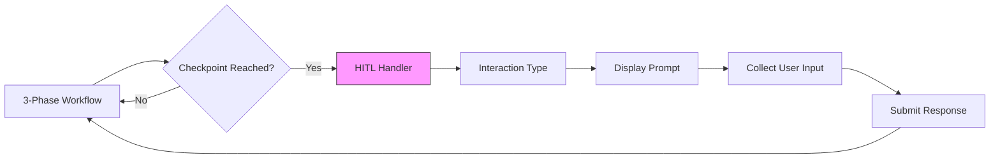

# HITL System Documentation

**Last Updated**: 2026-01-12
**Location**: `src/skill_fleet/core/signatures/hitl.py`, `src/skill_fleet/cli/hitl/runner.py`

## Overview

The Human-in-the-Loop (HITL) system enables interactive skill creation by pausing the workflow at key checkpoints to collect user feedback. This ensures the generated skills meet user expectations before finalization.

`★ Insight ─────────────────────────────────────`
HITL transforms skill creation from a black-box process into a collaborative experience. By pausing at critical decision points (requirements confirmation, content preview, validation results), users can guide the AI toward better outcomes.
`─────────────────────────────────────────────────`

## HITL Architecture

## Checkpoint Locations

| Phase | Checkpoint | Purpose | Interaction |
|-------|-----------|---------|--------------|
| **Phase 1** | Clarify | Resolve ambiguities | Questions |
| **Phase 1** | Confirm | Verify understanding | Summary + approve/revise |
| **Phase 2** | Preview | Review generated content | Content preview + feedback |
| **Phase 3** | Validate | Review validation results | Report + accept/refine |

## Next Steps

- **[Callbacks Documentation](callbacks.md)** - Callback interface
- **[Interactions Documentation](interactions.md)** - Interaction types
- **[Runner Documentation](runner.md)** - HITL runner implementation

## Related Documentation

- **[DSPy Signatures - HITL](../dspy/signatures.md#hitl-signatures)** - HITL DSPy signatures
- **[CLI Interactive Chat](../cli/interactive-chat.md)** - Chat mode HITL
- **[API Jobs](../api/jobs.md)** - Background job HITL
