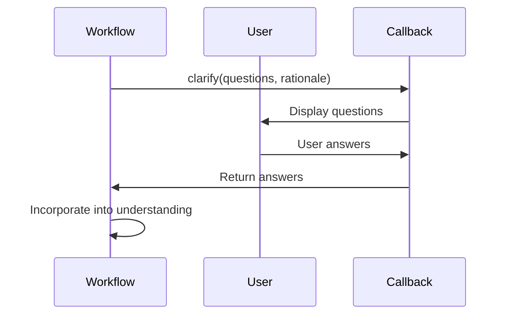
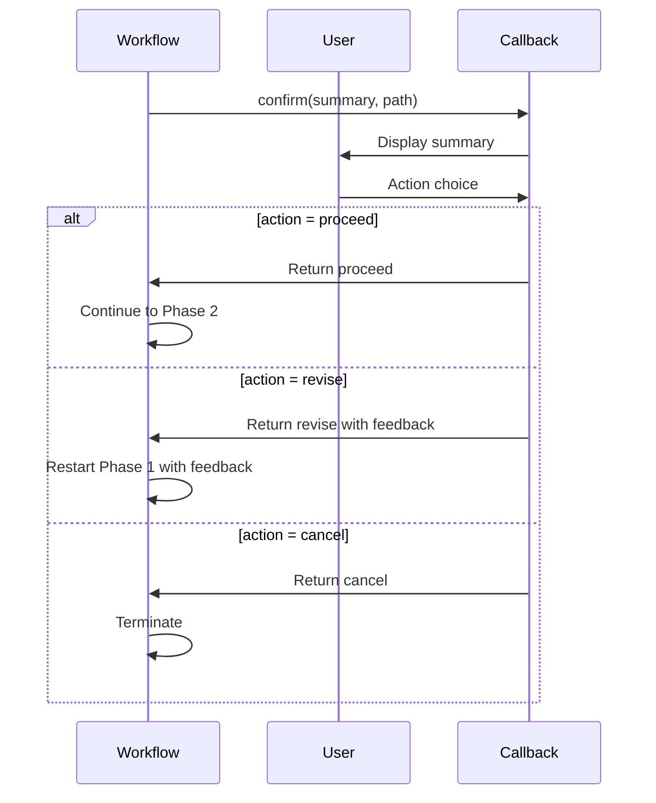
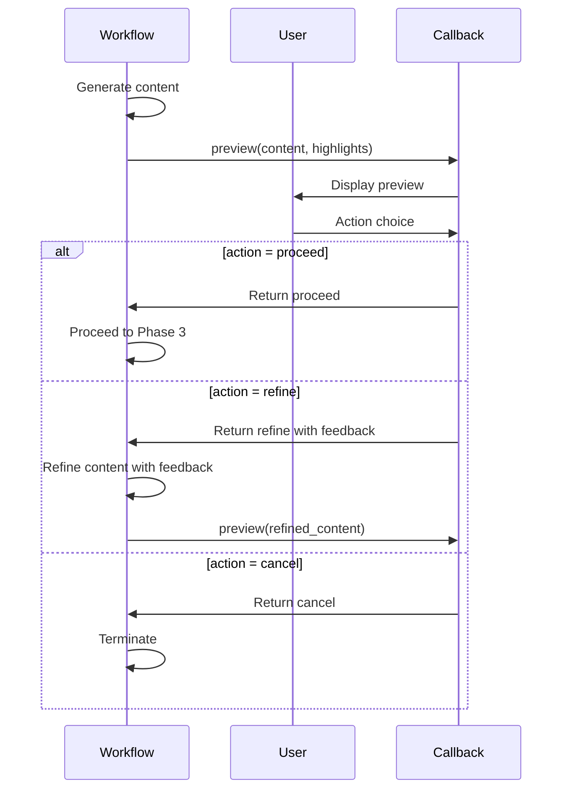
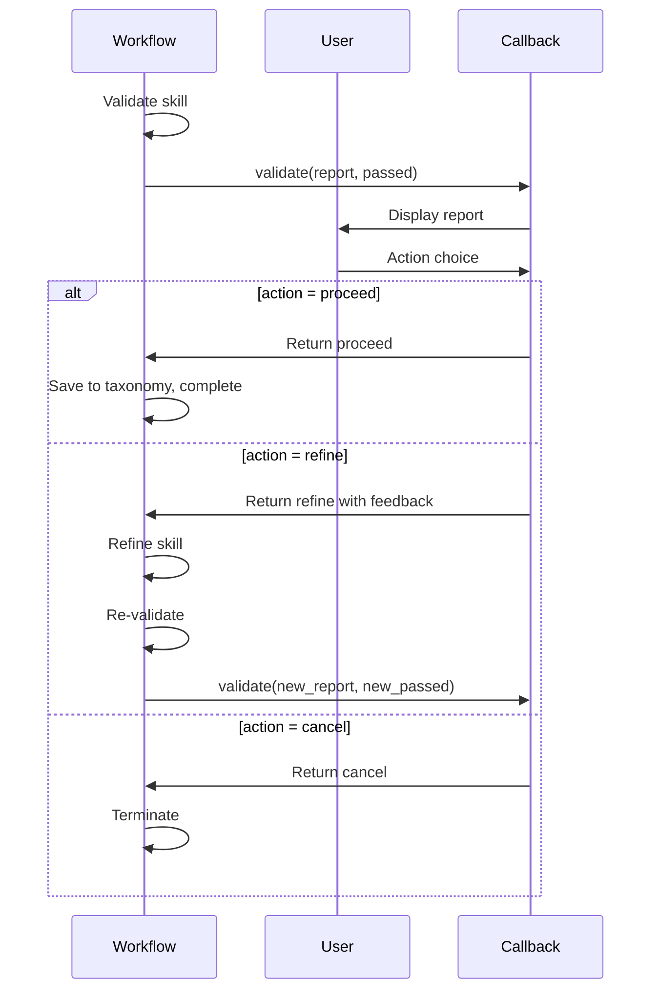
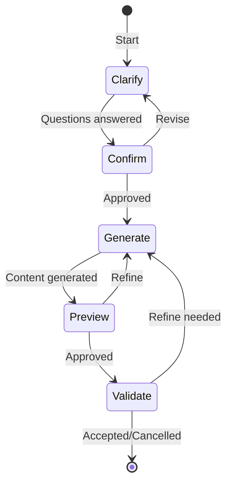

# HITL Interactions Reference

**Last Updated**: 2026-01-13

## Overview

This document describes all HITL interaction types in detail, including their purpose, payload structure, user actions, and workflow integration.

`★ Insight ─────────────────────────────────────`
Each interaction type serves a specific purpose in the skill creation workflow. Clarification resolves ambiguities early, confirmation validates understanding, preview enables content feedback, and validation ensures quality before completion.
`─────────────────────────────────────────────────`

## Interaction Types

| Type                   | Phase | Purpose                   | Input                | Actions                 |
| ---------------------- | ----- | ------------------------- | -------------------- | ----------------------- |
| **ClarifyingQuestion** | 1     | Resolve ambiguities       | Free text or options | proceed                 |
| **Confirmation**       | 1     | Verify understanding      | Summary + path       | proceed, revise, cancel |
| **Preview**            | 2     | Review generated content  | Content preview      | proceed, refine, cancel |
| **Validation**         | 3     | Review validation results | Validation report    | proceed, refine, cancel |

---

## 1. ClarifyingQuestion

### Purpose

Generate focused clarifying questions to better understand user intent before expensive generation begins.

### When It Happens

- After initial requirements gathering
- When ambiguities are detected
- Before moving to detailed planning

### Payload Structure

```python
{
    "questions": [
        {
            "question": "What level of detail should this skill cover?",
            "options": ["beginner", "intermediate", "advanced"],
            "rationale": "Need to understand target audience"
        }
    ],
    "rationale": "Why we're asking these questions"
}
```

Note: Some workflows may return `questions` as a single markdown string with a numbered list.
The CLI normalizes both formats and prompts one question at a time.

### Display Format (CLI)

The CLI displays one question at a time, and when options are present it uses
prompt-toolkit arrow-key selection (with an **Other (type my own)** free-text option).

```
╭────────────────────────────── Question 1/1 ──────────────────────────────╮
│ What level of detail should this skill cover?                             │
╰──────────────────────────────────────────────────────────────────────────╯

Select one option:  (arrow keys)
```

### User Response

**Free-form:**

```python
{
    "answers": {
        "response": "Intermediate level with practical examples"
    }
}
```

**Structured:**

```python
{
    "answers": {
        "level": "intermediate",
        "focus": "practical"
    }
}
```

### Workflow Integration



---

## 2. Confirmation

### Purpose

Summarize understanding of user intent and get confirmation before proceeding to generation.

### When It Happens

- After Phase 1 analysis is complete
- Before moving to Phase 2 generation
- After clarifying questions (if any)

### Payload Structure

```python
{
    "summary": "• Skill: Python async programming\n• Target: Intermediate developers\n• Topics: Coroutines, event loops, async/await syntax\n• Prerequisites: Basic Python knowledge",
    "path": "technical_skills/python/async",
    "key_assumptions": [
        "Users know basic Python syntax",
        "Focus on async/await not asyncio library",
        "Practical examples over theory"
    ],
    "confidence": 0.85
}
```

### Display Format (CLI)

```
╭─ 📋 Understanding Summary ──────────╮
│ • Skill: Python async programming    │
│ • Target: Intermediate developers     │
│ • Topics:                             │
│   - Coroutines                        │
│   - Event loops                       │
│   - async/await syntax                │
│                                       │
│ Proposed path:                        │
│ technical_skills/python/async         │
╰──────────────────────────────────────╯

Proceed? (proceed/revise/cancel) [proceed]:
```

### User Actions

| Action    | Description         | Follow-up                         |
| --------- | ------------------- | --------------------------------- |
| `proceed` | Accept and continue | Proceed to Phase 2                |
| `revise`  | Request changes     | Ask for feedback, restart Phase 1 |
| `cancel`  | Cancel job          | Terminate workflow                |

### Response Format

**Proceed:**

```python
{
    "action": "proceed"
}
```

**Revise:**

```python
{
    "action": "revise",
    "feedback": "Make it more advanced, targeting expert developers"
}
```

**Cancel:**

```python
{
    "action": "cancel"
}
```

### Workflow Integration



---

## 3. Preview

### Purpose

Show a preview of generated content for user review and feedback before finalization.

### When It Happens

- After Phase 2 content generation
- Before Phase 3 validation
- When content may be lengthy or complex

### Payload Structure

```python
{
    "content": "## Overview\nPython async/await provides...\n\n## Key Concepts\n- Coroutines\n- Event loops",
    "highlights": [
        "Clear explanations of async/await",
        "Practical examples throughout",
        "Common pitfalls covered"
    ],
    "potential_issues": [
        "Could add more error handling examples",
        "Consider adding a troubleshooting section"
    ]
}
```

### Display Format (CLI)

```
╭─ 📝 Content Preview ────────────────╮
│ ## Overview                           │
│ Python async/await provides...        │
│                                       │
│ ## Key Concepts                       │
│ • Coroutines                          │
│ • Event loops                         │
│ • async/await syntax                  │
│ ...                                   │
╰──────────────────────────────────────╯

Highlights:
  • Clear explanations of async/await
  • Practical examples throughout
  • Common pitfalls covered

Looks good? (proceed/refine/cancel) [proceed]:
```

### User Actions

| Action    | Description          | Follow-up                        |
| --------- | -------------------- | -------------------------------- |
| `proceed` | Accept content       | Proceed to validation            |
| `refine`  | Request improvements | Ask for feedback, refine content |
| `cancel`  | Cancel job           | Terminate workflow               |

### Response Format

**Proceed:**

```python
{
    "action": "proceed"
}
```

**Refine:**

```python
{
    "action": "refine",
    "feedback": "Add more error handling examples and a troubleshooting section"
}
```

**Cancel:**

```python
{
    "action": "cancel"
}
```

### Workflow Integration



---

## 4. Validation

### Purpose

Display validation results and ask for final acceptance or refinement.

### When It Happens

- After Phase 3 validation is complete
- Before final skill acceptance
- When validation issues are found

### Payload Structure

```python
{
    "report": "Status: PASSED\n\nAll checks passed:\n✓ YAML frontmatter valid\n✓ Documentation complete\n✓ Examples present",
    "passed": true,
    "skill_content": "Full skill content...",
    "saved_path": "/path/to/skills/technical_skills/python/async",
    "validation_score": 0.95
}
```

### Display Format (CLI)

```
╭─ ✅ Validation Report ──────────────╮
│ Status: PASSED                        │
│                                       │
│ All checks passed:                    │
│ ✓ YAML frontmatter valid               │
│ ✓ Documentation complete               │
│ ✓ Examples present (5)                │
│                                       │
│ Validation Score: 0.95                │
╰──────────────────────────────────────╯

Accept? (proceed/refine/cancel) [proceed]:
```

### User Actions

| Action    | Description          | Follow-up                           |
| --------- | -------------------- | ----------------------------------- |
| `proceed` | Accept skill         | Mark as completed, save to taxonomy |
| `refine`  | Request improvements | Refine based on feedback            |
| `cancel`  | Cancel job           | Terminate workflow                  |

### Response Format

**Proceed:**

```python
{
    "action": "proceed"
}
```

**Refine:**

```python
{
    "action": "refine",
    "feedback": "Add 2 more examples to meet the minimum requirement"
}
```

**Cancel:**

```python
{
    "action": "cancel"
}
```

### Workflow Integration



---

## Interaction Flow



---

## Error Handling

| Error                  | Handling                             |
| ---------------------- | ------------------------------------ |
| **Timeout**            | Cancel job, save error message       |
| **Invalid action**     | Prompt user for valid action         |
| **Empty response**     | Use default action (usually proceed) |
| **Malformed response** | Ask user to re-submit                |

---

## Auto-Approve Mode

In auto-approve mode, all interactions use default responses:

```python
if auto_approve:
    if interaction_type == "clarify":
        return {"answers": {"response": ""}}
    else:
        return {"action": "proceed"}
```

---

## See Also

- **[HITL Overview](index.md)** - System overview
- **[Callbacks Documentation](callbacks.md)** - Callback interface
- **[Runner Documentation](runner.md)** - Runner implementation
- **[DSPy HITL Signatures](../dspy/signatures.md#hitl-signatures)** - DSPy signatures
