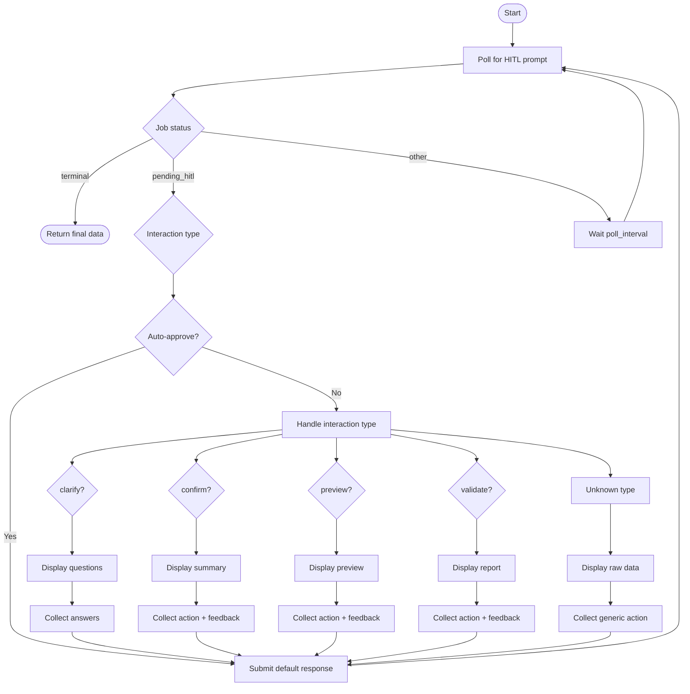

# HITL Runner

**Last Updated**: 2026-01-13
**Location**: `src/skill_fleet/cli/hitl/runner.py`

## Overview

The HITL runner is the shared implementation for handling Human-in-the-Loop interactions in CLI commands. It polls the API for job status, displays prompts, collects user input, and submits responses.

`★ Insight ─────────────────────────────────────`
The runner is **shared** by both `create` and `chat` commands. This centralizes the polling logic and interaction handling, ensuring consistent behavior across all CLI entry points.
`─────────────────────────────────────────────────`

## API Reference

### run_hitl_job()

Poll and satisfy HITL prompts until the job reaches a terminal state.

```python
async def run_hitl_job(
    *,
    console: Console,
    client: SkillFleetClient,
    job_id: str,
    auto_approve: bool = False,
    ui: PromptUI | None = None,
    show_thinking: bool = True,
    force_plain_text: bool = False,
    poll_interval: float = HITL_POLL_INTERVAL,
) -> dict[str, Any]:
    """Poll and satisfy HITL prompts until the job reaches a terminal state.

    Args:
        console: Rich console for output
        client: HTTP client for API communication
        job_id: Job identifier to track
        auto_approve: Skip all prompts and auto-proceed
        ui: Prompt UI implementation (prompt-toolkit when available, Rich fallback)
        show_thinking: Show rationale panels when provided by the server
        force_plain_text: Disable arrow-key dialogs (useful for limited terminals/CI)
        poll_interval: Seconds between polls (default: 2.0)

    Returns:
        Final prompt payload with status and result fields

    Raises:
        TimeoutError: If HITL interaction times out (1 hour default)
    """
```

## Constants

```python
# Default polling interval (seconds)
HITL_POLL_INTERVAL = 2.0

# HITL timeout (seconds)
HITL_TIMEOUT = 3600.0  # 1 hour
```

## Implementation Flow



## Interaction Handlers

### Clarify Handler

Clarify prompts are normalized and displayed one question at a time.

- If `questions` is a numbered markdown string, the runner splits it into individual questions.
- Each question is rendered in its own panel for readability.

```python
if interaction_type == "clarify":
    rationale = prompt_data.get("rationale", "")

    if rationale:
        console.print(Panel(
            Markdown(rationale),
            title="[dim]Why I'm asking[/dim]",
            border_style="dim"
        ))

    # The runner displays each question panel separately.
    # Answers are collected one-at-a-time, then submitted as one combined response.
    answer = await ui.ask_text("Your answer (or /cancel)", default="")

    if answers.strip().lower() in {"/cancel", "/exit", "/quit"}:
        await client.post_hitl_response(job_id, {"action": "cancel"})
    else:
        await client.post_hitl_response(job_id, {"answers": {"response": answer}})
```

### Confirm Handler

```python
if interaction_type == "confirm":
    summary = prompt_data.get("summary", "")
    path = prompt_data.get("path", "")

    console.print(Panel(
        Markdown(summary),
        title="[bold cyan]📋 Understanding Summary[/bold cyan]",
        border_style="cyan"
    ))

    if path:
        console.print(f"[dim]Proposed path: {path}[/dim]")

    action = await ui.choose_one(
        "Proceed?",
        [("proceed", "Proceed"), ("revise", "Revise"), ("cancel", "Cancel")],
        default_id="proceed",
    )

    payload = {"action": action}
    if action == "revise":
        payload["feedback"] = await ui.ask_text("What should change?", default="")

    await client.post_hitl_response(job_id, payload)
```

### Preview Handler

```python
if interaction_type == "preview":
    content = prompt_data.get("content", "")
    highlights = prompt_data.get("highlights", [])

    console.print(Panel(
        Markdown(content),
        title="[bold blue]📝 Content Preview[/bold blue]",
        border_style="blue"
    ))

    if highlights:
        console.print("[dim]Highlights:[/dim]")
        for h in highlights:
            console.print(f"  • {h}")

    action = Prompt.ask(
        "Looks good?",
        choices=["proceed", "refine", "cancel"],
        default="proceed",
        show_choices=True,
    )

    payload = {"action": action}
    if action == "refine":
        payload["feedback"] = Prompt.ask("What should be improved?", default="")

    await client.post_hitl_response(job_id, payload)
```

### Validate Handler

```python
if interaction_type == "validate":
    report = prompt_data.get("report", "")
    passed = prompt_data.get("passed", False)

    title_style = "green" if passed else "red"
    title_icon = "✅" if passed else "⚠️"

    console.print(Panel(
        Markdown(report),
        title=f"[bold {title_style}]{title_icon} Validation Report[/bold {title_style}]",
        border_style=title_style,
    ))

    action = Prompt.ask(
        "Accept?",
        choices=["proceed", "refine", "cancel"],
        default="proceed",
        show_choices=True,
    )

    payload = {"action": action}
    if action == "refine":
        payload["feedback"] = Prompt.ask("What should be improved?", default="")

    await client.post_hitl_response(job_id, payload)
```

## Helper Functions

### \_render_questions()

```python
def _render_questions(questions: object) -> str:
    """Render questions to a displayable string."""
    if isinstance(questions, str):
        return questions
    if isinstance(questions, list):
        lines = []
        for idx, q in enumerate(questions, 1):
            if isinstance(q, dict):
                text = q.get("question") or q.get("text") or str(q)
            else:
                text = str(q)
            lines.append(f"{idx}. {text}")
        return "\n".join(lines)
    return str(questions or "")
```

## Usage Examples

### In Create Command

```python
from skill_fleet.cli.hitl.runner import run_hitl_job

async def _run():
    job_id = await client.create_skill(task, user_id)

    prompt_data = await run_hitl_job(
        console=console,
        client=client,
        job_id=job_id,
        auto_approve=False,
    )

    if prompt_data["status"] == "completed":
        console.print("Skill created successfully!")
```

### In Chat Command

```python
while True:
    result = await client.create_skill(task_description, user_id)
    job_id = result["job_id"]

    prompt_data = await run_hitl_job(
        console=console,
        client=client,
        job_id=job_id,
        auto_approve=auto_approve,
    )

    # Ask if user wants to create another
    again = Prompt.ask("Create another skill? (y/n)")
    if again != "y":
        break
```

### With Auto-Approve

```python
# For CI/CD or automation
prompt_data = await run_hitl_job(
    console=console,
    client=client,
    job_id=job_id,
    auto_approve=True,  # Skip all prompts
)
```

## Terminal States

The runner returns when the job reaches one of these states:

| State         | Meaning                    | Contains                      |
| ------------- | -------------------------- | ----------------------------- |
| **completed** | Skill created successfully | `skill_content`, `saved_path` |
| **failed**    | Job failed                 | `error` message               |
| **cancelled** | User cancelled             | Empty result                  |

## Error Handling

```python
try:
    prompt_data = await run_hitl_job(
        console=console,
        client=client,
        job_id=job_id,
    )
except httpx.HTTPStatusError as e:
    console.print(f"[red]HTTP Error: {e.response.status_code}[/red]")
except TimeoutError:
    console.print("[red]HITL interaction timed out[/red]")
except Exception as e:
    console.print(f"[red]Unexpected error: {type(e).__name__}: {e}[/red]")
```

## Rich Panel Styling

| Interaction         | Border Style | Icon | Color  |
| ------------------- | ------------ | ---- | ------ |
| **Clarify**         | `yellow`     | 🤔   | Yellow |
| **Confirm**         | `cyan`       | 📋   | Cyan   |
| **Preview**         | `blue`       | 📝   | Blue   |
| **Validate (pass)** | `green`      | ✅   | Green  |
| **Validate (fail)** | `red`        | ⚠️   | Red    |

## Performance Considerations

| Setting           | Effect                              | Recommendation        |
| ----------------- | ----------------------------------- | --------------------- |
| **Poll interval** | Lower = faster response, higher CPU | 2.0 seconds (default) |
| **Timeout**       | How long to wait for user           | 3600 seconds (1 hour) |
| **Auto-approve**  | Skips polling entirely              | Use for CI/CD only    |

## Testing

```python
import pytest
from unittest.mock import AsyncMock, patch

@pytest.mark.asyncio
async def test_run_hitl_job_completed():
    """Test runner with completed job."""
    client = AsyncMock()
    client.get_hitl_prompt.return_value = {
        "status": "completed",
        "skill_content": "Generated content"
    }

    result = await run_hitl_job(
        console=console,
        client=client,
        job_id="test-job-id",
    )

    assert result["status"] == "completed"
    assert result["skill_content"] == "Generated content"

@pytest.mark.asyncio
async def test_run_hitl_job_with_clarify():
    """Test runner with clarify interaction."""
    client = AsyncMock()
    client.get_hitl_prompt.side_effect = [
        {"status": "pending_hitl", "type": "clarify", "questions": ["What?"]},
        {"status": "running"},
        {"status": "completed"}
    ]
    client.post_hitl_response.return_value = {"status": "accepted"}

    # Patch Rich Prompt to avoid interactive prompt
    with patch('skill_fleet.cli.hitl.runner.Prompt.ask', return_value="answer"):
        result = await run_hitl_job(
            console=console,
            client=client,
            job_id="test-job-id",
        )

    assert result["status"] == "completed"
```

## See Also

- **[HITL Overview](index.md)** - System overview
- **[Callbacks Documentation](callbacks.md)** - Callback interface
- **[Interactions Documentation](interactions.md)** - Interaction types
- **[CLI Interactive Chat](../cli/interactive-chat.md)** - Chat mode usage
