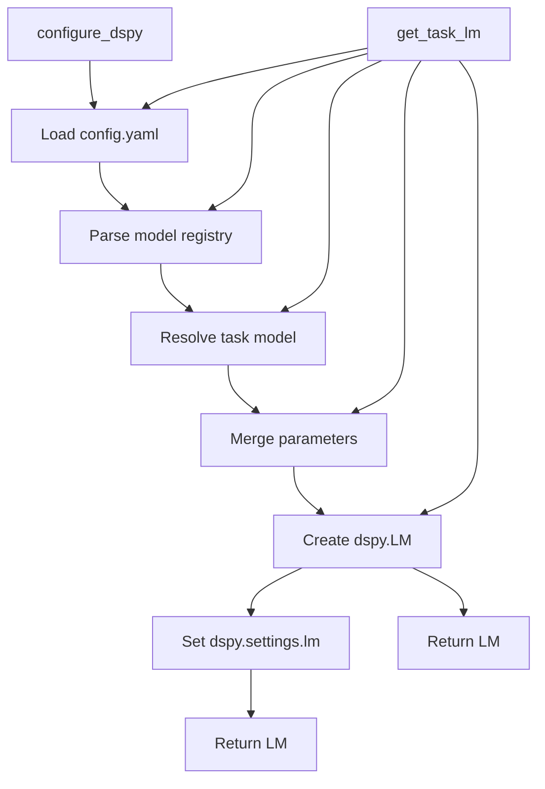

# DSPy Configuration

**Last Updated**: 2026-01-12
**Location**: `src/skill_fleet/llm/dspy_config.py`

## Overview

The `dspy_config` module provides centralized DSPy configuration for Skills Fleet. It handles loading config files, building LLM instances, and setting up DSPy's global settings.

`★ Insight ─────────────────────────────────────`
This module is the **single source of truth** for DSPy configuration. All parts of the application should use `configure_dspy()` or `get_task_lm()` rather than instantiating LLMs directly. This ensures consistent configuration and makes model selection easy.
`─────────────────────────────────────────────────`

## API Reference

### configure_dspy()

Configure DSPy with fleet config and return default LM.

```python
def configure_dspy(
    config_path: Path | None = None,
    default_task: str = "skill_understand",
) -> dspy.LM:
    """Configure DSPy with fleet config and return default LM.

    Args:
        config_path: Path to config/config.yaml (default: project root)
        default_task: Default task to use for dspy.settings.lm

    Returns:
        The configured LM instance (also set as dspy.settings.lm)

    Example:
        >>> from skill_fleet.llm.dspy_config import configure_dspy
        >>> lm = configure_dspy()
        >>> # Now all DSPy modules use this LM by default
    """
```

**Usage:**
```python
from skill_fleet.llm.dspy_config import configure_dspy

# Configure once at application startup
lm = configure_dspy()

# All DSPy modules now use this LM
result = await module.aforward(...)
```

### get_task_lm()

Get an LM for a specific task without changing global settings.

```python
def get_task_lm(task_name: str, config_path: Path | None = None) -> dspy.LM:
    """Get an LM for a specific task without changing global settings.

    Use this when you need a task-specific LM temporarily.
    For persistent task-specific LMs, use dspy.context() instead.

    Args:
        task_name: Task name from config (e.g., "skill_understand", "skill_edit")
        config_path: Path to config/config.yaml (default: project root)

    Returns:
        Configured LM for the specified task

    Example:
        >>> from skill_fleet.llm.dspy_config import get_task_lm
        >>> lm = get_task_lm("skill_edit")
        >>> with dspy.context(lm=lm):
        ...     result = my_module(**inputs)
    """
```

**Usage:**
```python
from skill_fleet.llm.dspy_config import get_task_lm
import dspy

# Get task-specific LM
edit_lm = get_task_lm("skill_edit")

# Use temporarily
with dspy.context(lm=edit_lm):
    result = await module.aforward(...)

# Global LM unchanged
```

---

## Configuration Flow



---

## Environment Variables

| Variable | Purpose | Example |
|----------|---------|---------|
| `DSPY_CACHEDIR` | Cache directory for LLM responses | `/var/cache/dspy` |
| `DSPY_TEMPERATURE` | Global temperature override | `0.7` |
| `FLEET_MODEL_<TASK>` | Override model for specific task | `gemini:gemini-2.5-pro` |
| `SKILL_FLEET_CONFIG` | Custom config path | `/path/to/config.yaml` |

### DSPY_CACHEDIR

```bash
export DSPY_CACHEDIR="/var/cache/dspy"
```

Enables caching of LLM responses. When the same input is sent to the LLM, the cached response is returned instead of making a new API call.

### DSPY_TEMPERATURE

```bash
export DSPY_TEMPERATURE="0.5"
```

Overrides temperature for all models. This takes precedence over config file values.

---

## Path Resolution

Config file is searched in this order:

1. Explicit `config_path` parameter
2. `SKILL_FLEET_CONFIG` environment variable
3. Default: `<repo_root>/config/config.yaml`

```python
from skill_fleet.common.paths import default_config_path

# Gets repo root and appends config/config.yaml
path = default_config_path()
```

---

## Parameter Merging

Parameters are merged in this order (later values override earlier):

1. **Model defaults**: `models.registry.<model_key>.parameters`
2. **Role defaults**: `roles.<role_name>.parameter_overrides`
3. **Task config**: `tasks.<task_name>.parameters`
4. **Environment override**: `DSPY_TEMPERATURE`

```python
# Example: skill_edit task
# 1. Model defaults
{"temperature": 0.7, "max_tokens": 4096}

# 2. Role defaults (creative_generation)
{"temperature": 0.6}  # Overrides model temperature

# 3. Task config
{"temperature": 0.6, "max_tokens": 8192}  # task-specific max_tokens

# 4. Environment (if set)
{"temperature": 0.5}  # Would override all above
```

---

## Usage Examples

### Application Startup

```python
from skill_fleet.api.app import create_app
from skill_fleet.llm.dspy_config import configure_dspy

# Configure DSPy before creating app
configure_dspy()

app = create_app()
```

### CLI Usage

```python
from skill_fleet.llm.dspy_config import configure_dspy
from skill_fleet.core.programs.skill_creator import SkillCreationProgram

# Configure
configure_dspy()

# Create and run program
program = SkillCreationProgram()
result = await program.aforward(...)
```

### Task-Specific LLMs

```python
from skill_fleet.llm.dspy_config import get_task_lm
import dspy

# Get different LMs for different tasks
understand_lm = get_task_lm("skill_understand")  # High reasoning
validate_lm = get_task_lm("skill_validate")      # Low temperature

# Use task-specific LMs
with dspy.context(lm=understand_lm):
    understanding = await analyzer.aforward(...)

with dspy.context(lm=validate_lm):
    validation = await validator.aforward(...)
```

### Temporary Override

```python
import dspy

# Create custom LM directly
custom_lm = dspy.LM(
    "gemini/gemini-2.0-flash-exp",
    api_key=os.environ["GEMINI_API_KEY"],
    temperature=0.8,
)

# Use temporarily
with dspy.context(lm=custom_lm):
    result = await module.aforward(...)
```

---

## Error Handling

```python
from skill_fleet.llm.fleet_config import FleetConfigError

try:
    lm = configure_dspy()
except FleetConfigError as e:
    print(f"Configuration error: {e}")
    print("Check your config/config.yaml file")
```

**Common Errors:**

| Error | Cause | Solution |
|-------|-------|----------|
| `Model key not found` | Invalid model in config | Check registry entry |
| `Missing API key` | No API key set | Set environment variable |
| `Invalid config format` | YAML syntax error | Check config.yaml syntax |

---

## Best Practices

1. **Configure Once**: Call `configure_dspy()` once at application startup
2. **Use Task LMs**: Use `get_task_lm()` for task-specific operations
3. **Context Managers**: Use `dspy.context()` for temporary LM changes
4. **Environment Variables**: Use environment variables for deployment-specific settings
5. **Validation**: Validate config on startup, fail fast

---

## Testing

```python
import pytest
from skill_fleet.llm.dspy_config import configure_dspy, get_task_lm

def test_configure_dspy():
    lm = configure_dspy()
    assert lm is not None
    assert dspy.settings.lm == lm

def test_get_task_lm():
    lm = get_task_lm("skill_understand")
    assert lm is not None
    assert lm.kwargs["temperature"] > 0.5  # High reasoning
```

---

## See Also

- **[LLM Configuration Overview](index.md)** - Configuration system
- **[Providers Documentation](providers.md)** - Provider setup
- **[Task Models Documentation](task-models.md)** - Task-specific mapping
- **[DSPy Overview](../dspy/)** - DSPy architecture
