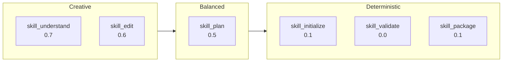

# Task-Specific Model Mapping

**Last Updated**: 2026-01-12

## Overview

Skills Fleet uses different LLM configurations for different phases of the skill creation workflow. This ensures each phase uses a model optimized for its specific requirements.

`★ Insight ─────────────────────────────────────`
The **one-size-fits-all** approach to LLM selection is inefficient. Understanding requires high reasoning (higher temperature), while validation requires precision (lower temperature). Task-specific models balance quality with cost.
`─────────────────────────────────────────────────`

## Task Mappings

| Task | Phase | Purpose | Recommended Model | Temperature | Reasoning |
|------|-------|---------|-------------------|-------------|-----------|
| **skill_understand** | Phase 1 | Task analysis | High reasoning model | 0.7 | Complex analysis needs creativity |
| **skill_plan** | Phase 1 | Structure planning | Medium reasoning model | 0.5 | Structured planning needs precision |
| **skill_initialize** | Phase 2 | Directory setup | Fast model | 0.1 | Simple operation, deterministic |
| **skill_edit** | Phase 2 | Content generation | Creative model | 0.6 | Content creation needs creativity |
| **skill_package** | Phase 3 | Validation | Precise model | 0.1 | Validation needs consistency |
| **skill_validate** | Phase 3 | Compliance check | Precise model | 0.0 | Strict checking, no variance |

## Task Details

### skill_understand

**Phase:** Phase 1 - Understanding & Planning
**Purpose:** Deep analysis of user requirements and intent

**Requirements:**
- High reasoning capability
- Complex comprehension
- Nuanced understanding

**Model Characteristics:**
- **Temperature:** 0.7 (higher for diverse analysis)
- **Max Tokens:** 4096
- **Reasoning:** High

**Used by:**
- `IntentAnalyzerModule`
- `TaxonomyPathFinderModule`

**Why High Temperature:**
Understanding user intent often requires exploring multiple interpretations. Higher temperature allows the model to consider diverse possibilities before settling on the best approach.

---

### skill_plan

**Phase:** Phase 1 - Understanding & Planning
**Purpose:** Synthesize plan from all analyses

**Requirements:**
- Structured output
- Logical organization
- Consistency

**Model Characteristics:**
- **Temperature:** 0.5 (medium for balance)
- **Max Tokens:** 4096
- **Reasoning:** Medium

**Used by:**
- `PlanSynthesizerModule`

**Why Medium Temperature:**
Planning requires both creativity (to design good plans) and consistency (to produce structured output). Temperature 0.5 balances these needs.

---

### skill_initialize

**Phase:** Phase 2 - Content Generation
**Purpose:** Initialize directory structure

**Requirements:**
- Fast execution
- Deterministic output
- Minimal reasoning

**Model Characteristics:**
- **Temperature:** 0.1 (low for determinism)
- **Max Tokens:** 2048
- **Reasoning:** Low

**Used by:**
- Directory creation operations

**Why Low Temperature:**
Directory initialization is a mechanical task. Low temperature ensures consistent, predictable output with minimal variance.

---

### skill_edit

**Phase:** Phase 2 - Content Generation
**Purpose:** Generate skill content

**Requirements:**
- Creative writing
- High quality
- Engaging explanations

**Model Characteristics:**
- **Temperature:** 0.6 (higher for creativity)
- **Max Tokens:** 8192
- **Reasoning:** Medium-High

**Used by:**
- `ContentGeneratorModule`
- `FeedbackIncorporatorModule`

**Why High Temperature:**
Content generation is the most creative phase. Higher temperature allows for varied examples, engaging explanations, and creative analogies.

---

### skill_package

**Phase:** Phase 3 - Validation & Refinement
**Purpose:** Package and format skill

**Requirements:**
- Consistent formatting
- Accurate metadata
- Reliable validation

**Model Characteristics:**
- **Temperature:** 0.1 (low for determinism)
- **Max Tokens:** 2048
- **Reasoning:** Low

**Used by:**
- Packaging operations
- Final formatting

**Why Low Temperature:**
Packaging requires consistency and accuracy. Low temperature ensures the same input always produces the same formatted output.

---

### skill_validate

**Phase:** Phase 3 - Validation & Refinement
**Purpose:** Validate compliance and quality

**Requirements:**
- Strict validation
- No variance
- Precise checking

**Model Characteristics:**
- **Temperature:** 0.0 (no variance)
- **Max Tokens:** 2048
- **Reasoning:** Low

**Used by:**
- `SkillValidatorModule`
- `QualityAssessorModule`

**Why Zero Temperature:**
Validation must be deterministic. The same skill should always produce the same validation result. Zero temperature eliminates variance entirely.

---

## Temperature vs Task Type



**Key Insight:**
- **Creative tasks** (understanding, editing) → Higher temperature (0.6-0.7)
- **Balanced tasks** (planning) → Medium temperature (0.5)
- **Deterministic tasks** (initialization, validation) → Low/zero temperature (0.0-0.1)

---

## Configuration

### Default Config

```yaml
tasks:
  skill_understand:
    role: understanding
    model: "gemini/gemini-2.0-flash-exp"
    parameters:
      temperature: 0.7

  skill_plan:
    role: planning
    model: "gemini/gemini-2.0-flash-exp"
    parameters:
      temperature: 0.5

  skill_initialize:
    role: fast_operation
    model: "gemini/gemini-2.0-flash-exp"
    parameters:
      temperature: 0.1

  skill_edit:
    role: creative_generation
    model: "gemini/gemini-2.5-pro"
    parameters:
      temperature: 0.6

  skill_package:
    role: validation
    model: "gemini/gemini-2.0-flash-exp"
    parameters:
      temperature: 0.1

  skill_validate:
    role: strict_validation
    model: "gemini/gemini-2.0-flash-exp"
    parameters:
      temperature: 0.0
```

---

## Overriding Task Models

### Via Config File

```yaml
# Use Claude for all editing tasks
tasks:
  skill_edit:
    model: "zai:claude-sonnet-4-20250514"
```

### Via Environment Variable

```bash
# Override specific task
export FLEET_MODEL_SKILL_EDIT="zai:claude-sonnet-4-20250514"

# Override all tasks to use same model
export FLEET_MODEL_DEFAULT="deepinfra:meta-llama/Meta-Llama-3.1-70B"
```

### Programmatically

```python
from skill_fleet.llm.dspy_config import get_task_lm
import dspy

# Get task-specific LM
edit_lm = get_task_lm("skill_edit")

# Verify temperature
assert edit_lm.kwargs["temperature"] == 0.6
```

---

## Cost Optimization

| Strategy | Description | Savings |
|----------|-------------|---------|
| **Fast model for initialization** | Use flash models for simple tasks | ~50% |
| **Zero temp for validation** | No need for creativity in validation | More consistent |
| **Cache enabled** | Enable `DSPY_CACHEDIR` | Variable |

**Example Cost-Optimized Config:**

```yaml
tasks:
  # Use fast/cheap model for initialization
  skill_initialize:
    model: "gemini:gemini-2.0-flash-exp"
    parameters:
      temperature: 0.1

  # Use high-quality model only for content generation
  skill_edit:
    model: "gemini:gemini-2.5-pro"
    parameters:
      temperature: 0.6

  # Use fast model for validation (deterministic anyway)
  skill_validate:
    model: "gemini:gemini-2.0-flash-exp"
    parameters:
      temperature: 0.0
```

---

## Quality vs Speed Tradeoffs

| Configuration | Quality | Speed | Cost |
|---------------|---------|-------|------|
| **All Flash** | Medium | Fast | Low |
| **Edit = Pro** | High | Medium | Medium |
| **All Pro** | Very High | Slow | High |
| **Mixed** | High | Medium | Medium |

**Recommended:** Mixed configuration (default)

---

## Testing Task Models

```python
import pytest
from skill_fleet.llm.dspy_config import get_task_lm

def test_skill_understand_model():
    """Test that skill_understand uses high temperature."""
    lm = get_task_lm("skill_understand")
    assert lm.kwargs["temperature"] >= 0.6

def test_skill_validate_model():
    """Test that skill_validate uses zero temperature."""
    lm = get_task_lm("skill_validate")
    assert lm.kwargs["temperature"] == 0.0

def test_skill_edit_model():
    """Test that skill_edit uses creative model."""
    lm = get_task_lm("skill_edit")
    assert "pro" in lm.model_name.lower() or lm.kwargs["temperature"] >= 0.5
```

---

## See Also

- **[LLM Configuration Overview](index.md)** - Configuration system
- **[DSPy Config Documentation](dspy-config.md)** - Programmatic usage
- **[Providers Documentation](providers.md)** - Provider setup
