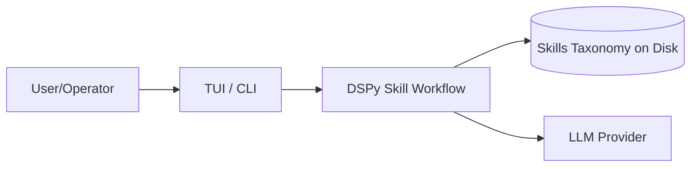
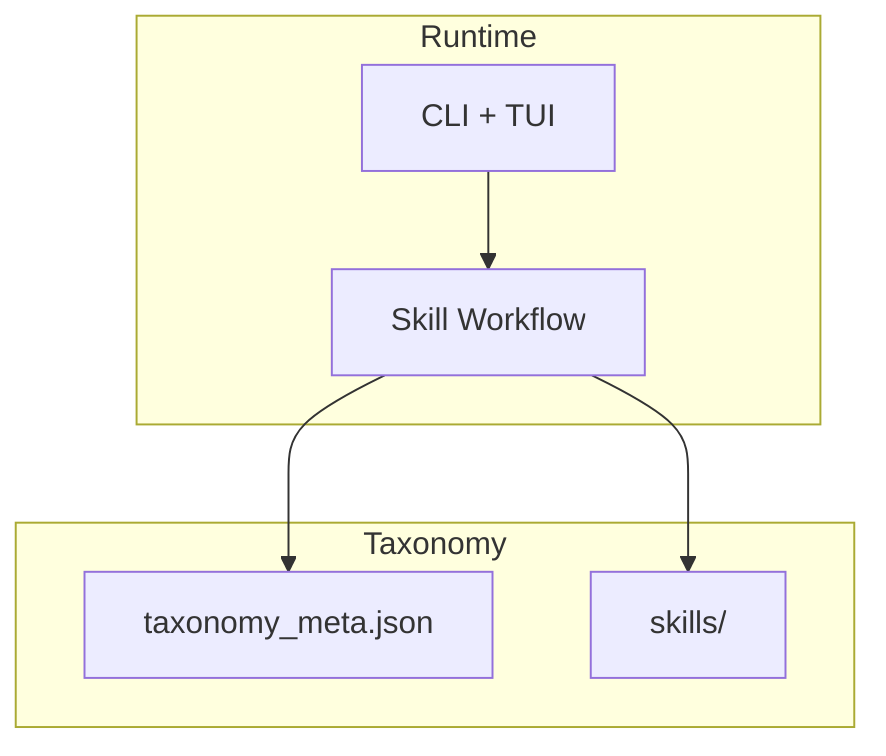
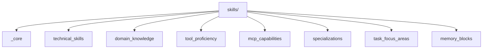
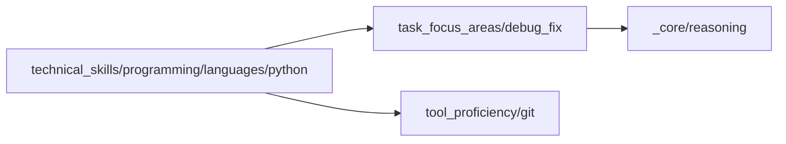

# Skills Fleet: System Overview

This document introduces the **skill-fleet** system: a taxonomy-driven, on‑disk skills library with a DSPy workflow for generating and validating new skills on demand.

## Audience

- **Builders** integrating the skills workflow into agentic systems
- **Maintainers** evolving the taxonomy and skill quality standards
- **Operators** running the workflow via CLI or TUI

## Why This System Exists

Agentic systems fail when they cannot **reliably compose, reuse, and audit** the behavior they generate. This repo treats “skills” as **first‑class, versioned artifacts** on disk, with a consistent taxonomy and validation rules. The result is a system where capabilities are:

- discoverable (taxonomy paths, agentskills.io-compliant metadata)
- composable (dependencies + capabilities)
- auditable (metadata + SKILL.md + history)
- reproducible (workflow outputs can be cached)
- interoperable (agentskills.io standard for cross-system compatibility)

## Core Idea

Instead of a monolithic prompt or ad‑hoc tool chain, the system stores skills as **structured folders and metadata** inside a taxonomy. A DSPy‑based workflow then **creates new skills from tasks** and **registers them** in the taxonomy with validation and traceability.

`★ Draft-First Execution (Current) ───────────────`
Skill creation runs as a FastAPI background job and is **draft-first**:

- Jobs write drafts under `skills/_drafts/<job_id>/...` once content exists.
- Promotion into the taxonomy is explicit (`skill-fleet promote <job_id>` or `POST /api/v2/drafts/{job_id}/promote`).

This design keeps the taxonomy stable and makes review/iteration the default before “publishing” a new skill.
`─────────────────────────────────────────────────`

## Primary Use Cases

- **Skill bootstrapping**: generate a new skill from a user task and store it in the taxonomy.
- **Capability standardization**: enforce consistent metadata, structure, and documentation across skills.
- **Skill discovery**: search by taxonomy path and dependencies to assemble working sets.
- **Operational reliability**: run skill creation with caching and validation to avoid regressions.

## Benefits

- **Structured knowledge**: skills are stable artifacts, not ephemeral prompts.
- **Repeatable creation**: the workflow follows a 6‑step process with validations.
- **Controlled growth**: taxonomy conventions keep the system scalable.
- **Operational visibility**: metadata + validation reports + cache stats aid debugging.
- **Composable behavior**: skills can declare dependencies and capabilities.

## System Context



This system is local-first: the taxonomy lives on disk and is updated by the workflow. The only external dependency is the LLM provider (Google Gemini 3 by default) defined in `config/config.yaml`.

## Conceptual Components



- **CLI/TUI**: entry points to trigger skill creation and validation.
- **Workflow**: DSPy modules that map tasks to taxonomy paths and generate content.

- **Automatic Code Quality**: All generated skills are automatically linted and formatted using ruff to ensure consistent Python code style in examples and scripts.

- **Taxonomy**: on‑disk storage for skills, metadata, and templates.

## Taxonomy Model

Skills are stored under:

- `skills/`

Each skill typically includes:

- `metadata.json` — required metadata (type, weight, dependencies, etc.)
- `SKILL.md` — full documentation with agentskills.io-compliant YAML frontmatter
- `capabilities/`, `examples/`, `tests/`, `resources/`

Some always‑loaded skills are single JSON files under:

- `_core/`, `mcp_capabilities/`, `memory_blocks/`

## agentskills.io Compliance

All skills follow the [agentskills.io](https://agentskills.io) specification for skill standardization and discoverability:

- **YAML Frontmatter**: Every SKILL.md file starts with YAML frontmatter containing:
  - `name`: Kebab-case identifier (e.g., `python-decorators`)
  - `description`: 1-1024 character description
  - `metadata`: Extended fields (skill_id, version, type, weight)
- **XML Generation**: The system can generate `<available_skills>` XML for agent context injection
- **Migration Tools**: Utilities to convert existing skills to the agentskills.io format
- **Validation**: Automated checks ensure compliance with the specification

See [agentskills.io Compliance Guide](../docs/agentskills-compliance.md) for detailed information.

## DSPy Integration

### Centralized Configuration

Skills Fleet provides centralized DSPy configuration through `src/skill_fleet/llm/dspy_config.py`. This module ensures consistent language model settings across all workflow steps:

- **`configure_dspy()`** — One-time initialization that sets up DSPy's global LM from `config/config.yaml`
- **`get_task_lm(task_name)`** — Returns task-specific LM instances without changing global settings
- **Environment variables** — Supports `DSPY_CACHEDIR` and `DSPY_TEMPERATURE` for overrides
- **Configuration priority** — Environment variables → config.yaml → defaults

The CLI automatically calls `configure_dspy()` at startup, ensuring all commands use consistent LM settings.

```python
from skill_fleet.llm.dspy_config import configure_dspy, get_task_lm

# Configure once at startup
lm = configure_dspy(default_task="skill_understand")

# Get task-specific LM when needed
edit_lm = get_task_lm("skill_edit")
```

### Evolution Tracking

Skills track their evolution through proper metadata in `metadata.json`:

- **`timestamp`** — ISO 8601 UTC timestamp of creation/revision
- **`change_summary`** — Human-readable description of changes
- **`status`** — Current state (approved, needs_revision, etc.)
- **`previous_versions`** — List of prior version references (future enhancement)

This enables:
- **Skill versioning** — Track changes over time
- **Rollback support** — Revert to previous versions if needed
- **Change history** — Audit trail for compliance and debugging
- **Quality metrics** — Link revisions to feedback and validation results

### Task-Specific LMs

The system uses different LM configurations for different workflow phases:

| Task | Purpose | Configuration |
|------|---------|---------------|
| `skill_understand` | Task analysis and understanding | High temperature for creativity |
| `skill_plan` | Structure planning | Medium temperature |
| `skill_initialize` | Directory and metadata initialization | Minimal temperature |
| `skill_edit` | Content generation | Medium temperature |
| `skill_package` | Validation and packaging | Low temperature for precision |
| `skill_validate` | Compliance checking | Minimal temperature |

These are configured in `config/config.yaml` under the `model_tasks` section.

## Hierarchical Skills Taxonomy for Agentic Systems

The taxonomy is a **hierarchical, path‑addressable catalog** of skills. Each node is a skill or a category. Paths encode semantics, ownership, and scope so that agents (and humans) can reason about what a skill does, where it belongs, and how it composes.

### Goals of the Hierarchy

- **Discoverability**: skills live at predictable paths.
- **Composability**: dependencies form a directed graph that mirrors the tree.
- **Scalability**: new branches can be added without breaking older ones.
- **Governance**: metadata enforces consistency and prevents drift.

### Taxonomy Shape

The tree is intentionally broad at the top and deep where needed.



### Path Semantics (Skill IDs)

Skill IDs are **path strings**, not dots:

- `technical_skills/programming/languages/python`
- `task_focus_areas/debug_fix`
- `mcp_capabilities/tool_integration`

These paths function as **stable identifiers** and are used as dependency references.

### Skill vs. Category Nodes

- **Category nodes**: directories that organize skills (may not contain metadata).
- **Skill nodes**: directories that contain `metadata.json` + `SKILL.md`.
- **Single‑file skills**: JSON files in `_core`, `mcp_capabilities`, `memory_blocks` that are always‑loaded and lightweight.

### Required Structure

Directory skills must include:

- `metadata.json`
- `SKILL.md`
- `capabilities/`
- `examples/`
- `tests/`
- `resources/`

Single‑file skills include metadata only (no `SKILL.md`), optimized for always‑loaded runtime features.

### Core Metadata Fields

Every directory skill must contain metadata fields used for routing, validation, and composition:

- `skill_id`: path‑style ID (e.g., `general/testing`)
- `version`: semantic version (e.g., `1.0.0`)
- `type`: one of `cognitive | technical | domain | tool | mcp | specialization | task_focus | memory`
- `weight`: `lightweight | medium | heavyweight`
- `load_priority`: `always | task_specific | on_demand | dormant`
- `dependencies`: list of skill IDs
- `capabilities`: list of discrete capabilities

### Weight & Load Priority

These control how the system treats skills:

- **weight**: estimated complexity/size
  - `lightweight`: small, reusable building blocks
  - `medium`: multi‑capability modules
  - `heavyweight`: complex workflows or domain bundles
- **load_priority**: when to mount the skill
  - `always`: loaded at startup
  - `task_specific`: loaded by router intent
  - `on_demand`: loaded only when referenced
  - `dormant`: archived or experimental

### Capability Granularity

Capabilities are expected to be **atomic and testable**. A single skill typically exposes 1–10 capabilities, depending on weight. This enables:

- targeted testing
- dependency validation
- precise capability coverage checks

### Dependency Graph (Beyond the Tree)

The taxonomy tree organizes skills, but dependencies form a **graph**. This enables composition across branches.



### Discovery & Routing

At runtime, tasks are mapped to branches using keyword heuristics (Phase 1) and later semantic routing. The router uses:

- keywords from the request
- existing mounted skills
- branch summaries from the taxonomy

### Governance and Evolution

The taxonomy is designed to evolve:

- New branches are appended rather than reshaped.
- Skills are versioned and can be superseded.
- Validation enforces structural consistency.
- Evolution metadata records approvals and changes.

### Example: Skill Node Layout

```
skills/
  technical_skills/
    programming/
      languages/
        python/
          metadata.json
          SKILL.md
          capabilities/
          examples/
          tests/
          resources/
```

### Example: Always‑Loaded Skill

```
skills/_core/reasoning.json
```

### Design Trade‑offs

- **File‑based vs DB**: file system keeps it inspectable and easy to version control.
- **Path‑style IDs**: readable and composable, but require governance to avoid collisions.
- **Strict metadata**: adds friction but prevents taxonomy drift over time.

## Workflow (6‑Step Pattern)

1. **Understand** — infer intent and map to taxonomy path
2. **Plan** — define metadata, dependencies, and capabilities
3. **Initialize** — create the skill skeleton
4. **Edit** — generate SKILL.md and capability docs
5. **Package** — validate and produce a packaging manifest
6. **Iterate** — human‑in‑the‑loop approval and evolution metadata

These steps are implemented in `src/skill_fleet/workflow/` and use task‑scoped LLMs configured in `config/config.yaml`.

## Caching and Validation

- **Workflow caching**: optional cache of step outputs to speed up repeated tasks.
- **Validation**: checks metadata completeness, structure, documentation, and naming.

## How to Run

```bash
# from repo root

# Install Python deps
uv sync --group dev

# Install TUI deps (requires Zig for OpenTUI)
bun install

# Create a skill (CLI)
uv run skill-fleet create-skill --task "Create a Python async programming skill"

# Create a skill with auto-approval (skips interactive review)
uv run skill-fleet create-skill --task "Create a Python async programming skill" --auto-approve

# Validate a skill
uv run skill-fleet validate-skill skills/general/testing

# Run the TUI
bun run tui
```

## Key Configurations

- `config/config.yaml`: LLM configuration for workflow steps
- `skills/_templates/skill_template.json`: structure template

## What This System Is Not

- It is **not** a runtime agent orchestrator — it produces skills, it doesn’t execute them.
- It is **not** a centralized database — taxonomy is local and file‑based.
- It is **not** a general knowledge base — skills are operational artifacts with strict structure.

## Extension Points

- Add new taxonomy branches under `skills/`
- Introduce specialized validators
- Add a richer HITL interface for approvals
- Integrate with multi‑agent runners to consume the generated skills

---

## Getting Started with Skill Creation

For practical, hands-on guidance on creating skills, see **[Skill Creation Guidelines](skill-creation-guidelines.md)**, which provides:
- Comprehensive skill creation interrogations (discovery questions)
- Structure and format requirements
- Content guidelines and best practices
- Step-by-step process workflow
- Validation checklist
- Troubleshooting guide

For workflow internals, see [`docs/architecture/skill-creation-workflow.md`](architecture/skill-creation-workflow.md).

---

## Further Reading

### Core System Documentation

| Topic | Description |
|-------|-------------|
| **[README](../README.md)** | Project overview, quick start, and differentiation |
| **[DSPy Documentation](dspy/)** | 3-phase workflow, signatures, modules, programs, optimization |
| **[API Documentation](api/)** | REST API endpoints, schemas, jobs, middleware |
| **[CLI Documentation](cli/)** | Command reference, interactive chat, architecture |
| **[LLM Configuration](llm/)** | Provider setup, DSPy config, task-specific models |
| **[HITL System](hitl/)** | Callbacks, interactions, runner implementation |

### Concept Guides

- **[Introduction](intro/introduction.md)** - System introduction and documentation map
- **[Getting Started](getting-started/)** - Installation, quick start, templates
- **[Developer Reference](concepts/developer-reference.md)** - Development workflows and patterns
- **[agentskills.io Compliance](agentskills-compliance.md)** - Schema and validation rules
