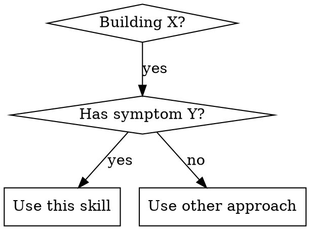

{{!--
SKILL.md Template - skill-fleet Convention

Spec: https://agentskills.io/specification
Authoring: See writing-skills for TDD-based skill creation process

═══════════════════════════════════════════════════════════════════
TOKEN BUDGET (Critical for agent context efficiency)
═══════════════════════════════════════════════════════════════════

Frontmatter: ~100 tokens (name + description injected into XML prompt)
Body by skill type: - Getting-started/frequent: <150 words - Standard skills: <500 words  
 - Complex technical: <5000 tokens (~500 lines max)

Use capabilities/ for deep dives that load on demand.

═══════════════════════════════════════════════════════════════════
DIRECTORY STRUCTURE (skill-fleet convention)
═══════════════════════════════════════════════════════════════════

skill-name/
├── SKILL.md # Required - main skill document
├── metadata.json # Optional - tooling metadata (see metadata*template.json)
├── best_practices.md # Optional - supporting guidelines
├── integration.md # Optional - integration patterns
├── capabilities/ # Optional - deep-dive pattern docs (progressive disclosure)
│ ├── pattern-one.md
│ └── pattern-two.md
├── examples/ # Optional - runnable demos
│ └── example-name/
│ ├── README.md
│ └── implementation files
├── resources/ # Optional - reference materials
│ ├── quick-reference.md
│ └── troubleshooting.md
└── tests/ # Optional - test scenarios for skill validation
└── test*\*.json

═══════════════════════════════════════════════════════════════════
FRONTMATTER (agentskills.io compliant)
═══════════════════════════════════════════════════════════════════

REQUIRED:
name: Max 64 chars. Lowercase + hyphens only. Must match directory.
description: Max 1024 chars. See CSO section below.

OPTIONAL (use sparingly):
license: License name or LICENSE file reference
compatibility: Max 500 chars. Environment requirements
metadata: Key-value pairs for frontmatter-level tooling data - skill_id, version, type, weight, load_priority - Note: prefer metadata.json for complex tooling data
allowed-tools: Space-delimited tool list (experimental)

═══════════════════════════════════════════════════════════════════
CLAUDE SEARCH OPTIMIZATION (CSO) - Critical for Discovery
═══════════════════════════════════════════════════════════════════

Description = WHEN to use, NOT WHAT it does

The description field determines if Claude loads your skill.
If you summarize the workflow, Claude may follow the description
instead of reading the full skill content.

❌ BAD: Summarizes workflow (Claude takes shortcut)
description: Use when executing plans - dispatches subagent per task with code review

❌ BAD: Too vague
description: For async testing

✅ GOOD: Triggering conditions only
description: Use when building FastAPI apps with async database operations, connection pool issues, or partial update bugs

✅ GOOD: Symptoms and error messages
description: Use when tests have race conditions, timing dependencies, or pass/fail inconsistently

Include in description: - Concrete triggers and symptoms - Error messages agents might search for - Technology names if skill is technology-specific

Do NOT include: - Process steps or workflow summary - What the skill teaches (save for Overview)

═══════════════════════════════════════════════════════════════════
ANTI-PATTERNS (from writing-skills)
═══════════════════════════════════════════════════════════════════

❌ Narrative examples: "In session 2025-10-03, we found..."
→ Too specific, not reusable

❌ Multi-language dilution: example-js.js, example-py.py, example-go.go
→ Mediocre quality, maintenance burden. One excellent example beats many.

❌ Code in flowcharts: step1 [label="import fs"]
→ Can't copy-paste, hard to read

❌ Generic labels: helper1, step2, pattern4
→ Labels should have semantic meaning

## --}}

---
name: {{skill_name_kebab}}
description: Use when {{triggering_conditions}}
{{#if license}}
license: {{license}}
{{/if}}
{{#if compatibility}}
compatibility: {{compatibility}}
{{/if}}
{{#if metadata}}
metadata:
{{#each metadata}}
{{@key}}: {{this}}
{{/each}}
{{/if}}

---

# {{skill_name}}

## Overview

{{overview_description}}

**Core principle:** {{core_principle}}

## Capabilities

{{!-- List 3-8 concrete, testable capabilities. Prefer short verb phrases. --}}

- {{capability_1}}
- {{capability_2}}
- {{capability_3}}

## Dependencies

{{!-- List prerequisite skills/tools AND why they matter. Keep it scannable. --}}

- {{dependency_1}} — {{why_dependency_1}}
- {{dependency_2}} — {{why_dependency_2}}

## When to Use

{{!-- Optional: Include decision flowchart for non-obvious decisions



--}}

**Use when:**
{{#each use_when}}

- {{this}}
  {{/each}}

**When NOT to use:**
{{#each not_use_when}}

- {{this}}
  {{/each}}

## Quick Reference

| Problem | Solution | Keywords |
| ------- | -------- | -------- |

{{#each quick_reference}}
| {{problem}} | {{solution}} |
{{/each}}

## Core Patterns

### {{pattern_name}}

**The problem:** {{problem_description}}

**❌ Common mistake:**

```{{language}}
{{bad_example}}
```

**✅ Production pattern:**

```{{language}}
{{good_example}}
```

**Key insight:** {{key_insight}}

{{!-- For complex skills with multiple patterns, link to capabilities/ --}}
{{#if capabilities}}

> **Deep dives:** See `capabilities/` for detailed pattern documentation:
> {{#each capabilities}}
>
> - [{{this}}](capabilities/{{this}}.md)
>   {{/each}}
>   {{/if}}

## Usage Examples

{{!-- Include at least 1–3 runnable examples with fenced code blocks. --}}

### {{example_title}}

{{example_description}}

```{{language}}
{{example_code}}
```

## Common Mistakes

| Mistake | Why It's Wrong | Fix |
| ------- | -------------- | --- |

{{#each common_mistakes}}
| {{mistake}} | {{why_wrong}} | {{fix}} |
{{/each}}

{{#if real_world_impact}}

## Real-World Impact

{{#each real_world_impact}}

- {{this}}
  {{/each}}
  {{/if}}

## Strong Guidance

{{!-- Iron Law style rules – imperative statements that MUST be followed --}}

{{#if strong_guidance}}
{{#each strong_guidance}}
- **{{this}}**
{{/each}}
{{else}}
- **NO [action] WITHOUT [prerequisite]** — [explanation]
- **ALWAYS [action]** — [explanation]
- **NEVER [action]** — [explanation]
{{/if}}

## Red Flags

{{#each red_flags}}

- {{this}}
  {{/each}}

**All of these mean: Revisit your approach before proceeding.**

---

## Validation

```bash
# Validate the skill directory
uv run skill-fleet validate path/to/{{skill_name_kebab}}

# Ensure skills are discoverable (optional)
uv run skill-fleet generate-xml
```

**Authoring process:** See `writing-skills` for TDD-based skill creation checklist.
