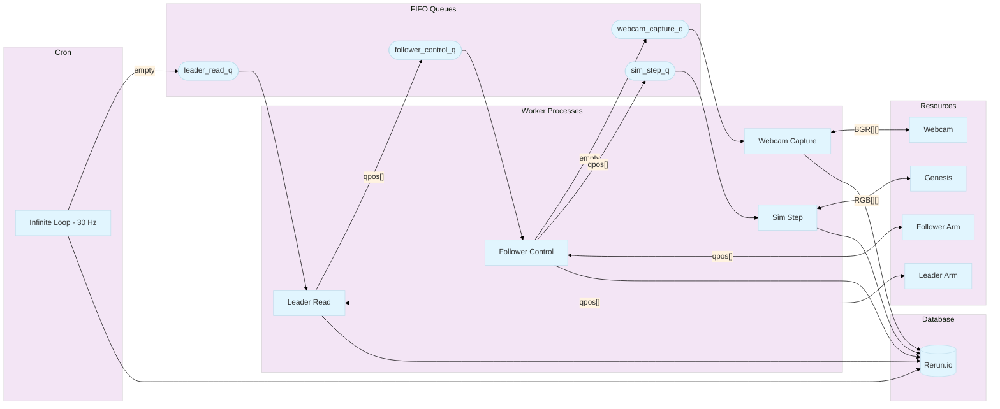

# LeRobot SO-ARM-100 6 DOF robotic arm manipulation with Genesis simulator and Feetech motors

There are 2 main use cases

1. sim to real, where genesis controls the physical robot
2. real to sim, where the physical robot moves will refresh the robot rendering in genesis

## TOC

- [Acknowledgements](doc/acknowledgements.md)
- [Installation](doc/installation.md)
- [Calibration & Validation](doc/calibration_validation.md)
- [Real 2 Sim](doc/real2sim.md)
- [Policies](doc/policies.md)
- [Tele-operation](doc/teleoperate.md)
- [Examples](doc/examples.md)
- [Gradio apps](doc/gradio_apps.md)
- [LeRobot dataset EDA](notebooks/so100_ball_cup2.ipynb)

## Goal

The goal is to replay a recorded LeRobot dataset episode or Rerun.io recording in a simulation environment.

| Real | Sim Visual | Sim Collision |
|------|------------|---------------|
| <video controls src="https://github.com/user-attachments/assets/0cd6b8a6-f75c-4e72-adf0-ffdeddc1c45b"></video> | <video controls src="https://github.com/user-attachments/assets/1bc9a00e-fdda-4590-8fb7-ee414f0ef183"></video> | <video controls src="https://github.com/user-attachments/assets/0e8e0346-5ef1-475e-9eba-1374347e4f71"></video> |

## Tele-operation

For live simulation, the tele-operation process should rely on a scalable asynchronous process.

<video controls src="https://github.com/user-attachments/assets/65dc44ab-3c72-4925-8f55-30a4bbf3d3f1"></video>

With pub/sub, workers repeatedly poll tasks from their dedicated queue, pushing their output to rerun.io database.

See [Tele-operation](doc/teleoperate.md) for more details.

