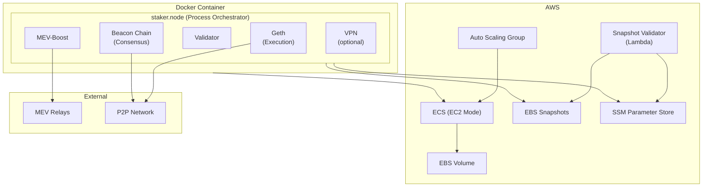

# Ethereum Staking Node

[](https://pypi.org/project/staker/)
[](https://www.python.org/downloads/)
[](https://opensource.org/licenses/MIT)

A complete Ethereum validator infrastructure running **Geth** (execution) + **Prysm** (consensus) + **MEV-Boost** on AWS ECS.

## 🏗️ Architecture



## 💖 Support

Love this tool? Your support means the world! ❤️

<table align="center">
  <tr>
    <th>Currency</th>
    <th>Address</th>
    <th>QR</th>
  </tr>
  <tr>
    <td><strong>₿ BTC</strong></td>
    <td><code>bc1qwn7ea6s8wqx66hl5rr2supk4kv7qtcxnlqcqfk</code></td>
    <td></td>
  </tr>
  <tr>
    <td><strong>Ξ ETH</strong></td>
    <td><code>0x7cdB1861AC1B4385521a6e16dF198e7bc43fDE5f</code></td>
    <td></td>
  </tr>
  <tr>
    <td><strong>ɱ XMR</strong></td>
    <td><code>463fMSWyDrk9DVQ8QCiAir8TQd4h3aRAiDGA8CKKjknGaip7cnHGmS7bQmxSiS2aYtE9tT31Zf7dSbK1wyVARNgA9pkzVxX</code></td>
    <td></td>
  </tr>
  <tr>
    <td><strong>◈ BNB</strong></td>
    <td><code>0x7cdB1861AC1B4385521a6e16dF198e7bc43fDE5f</code></td>
    <td></td>
  </tr>
</table>

## 📦 Installation

### PyPI (Recommended)

```bash
uv pip install staker
```

### From Source

```bash
git clone https://github.com/alkalescent/ethereum.git
cd ethereum
make install
```

## 📁 Project Structure

```
src/staker/
├── config.py       # Configuration constants and relay lists
├── environment.py  # Runtime abstraction (AWS vs local)
├── mev.py          # MEV relay selection and health checking
├── node.py         # Main orchestrator - starts/monitors processes
├── snapshot.py     # EBS snapshot management for persistence
└── utils.py        # Utility functions (IP check, log coloring)
```

## ✅ Prerequisites

- [uv](https://docs.astral.sh/uv/) (Python package manager)
- Docker
- AWS CLI (configured with appropriate permissions)
- Python 3.11+

## ⚙️ Configuration

### Environment Variables

| Variable | Description | Required |
|----------|-------------|----------|
| `DEPLOY_ENV` | `dev` (Hoodi testnet) or `prod` (Mainnet) | ✅ |
| `ETH_ADDR` | Fee recipient address | ✅ |
| `AWS` | Set to `true` when running on AWS | ❌ |
| `DOCKER` | Set to `true` when running in container | ❌ |
| `VPN` | Set to `true` to enable VPN | ❌ |

### Network Ports

| Port | Protocol | Purpose |
|------|----------|---------|
| 30303 | TCP/UDP | Geth P2P |
| 13000 | TCP | Prysm P2P |
| 12000 | UDP | Prysm P2P |

## 🛠️ Development

```bash
make install   # Install dependencies
make lint      # Run linting
make format    # Format code
make test      # Run tests
make cov       # Run tests with coverage
make build     # Build Docker image
make run       # Run Docker container
make kill      # Stop container gracefully
make deploy    # Deploy to AWS
```

## ⚡ MEV Relays

The node connects to multiple MEV relays for optimal block building:

**Mainnet**: Flashbots, Ultra Sound, bloXroute, Aestus, Agnostic, Titan, Wenmerge

**Hoodi**: Flashbots, Aestus, bloXroute, Titan

Relays are automatically tested on startup; unreliable ones are filtered out.

## 💾 Backup Strategy

- Snapshots created every 30 days
- Maximum 3 snapshots retained (90 days)
- Automatic launch template updates with latest snapshot
- Graceful shutdown triggers snapshot on instance draining

## 📊 Version Info

| Component | Version |
|-----------|---------|
| Geth | 1.16.7 |
| Prysm | v7.1.2 |
| MEV-Boost | 1.10.1 |
| Base Image | Ubuntu 24.04 |

## 📄 License

MIT License - see [LICENSE](LICENSE) for details.
