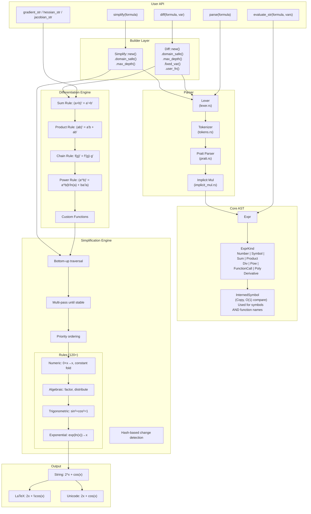
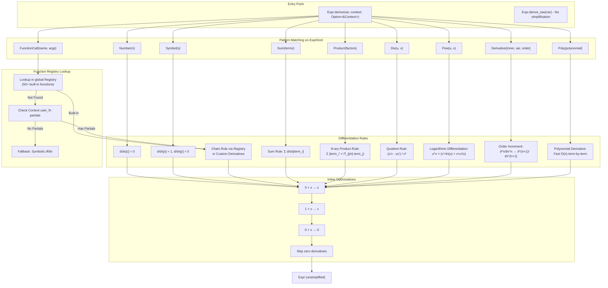
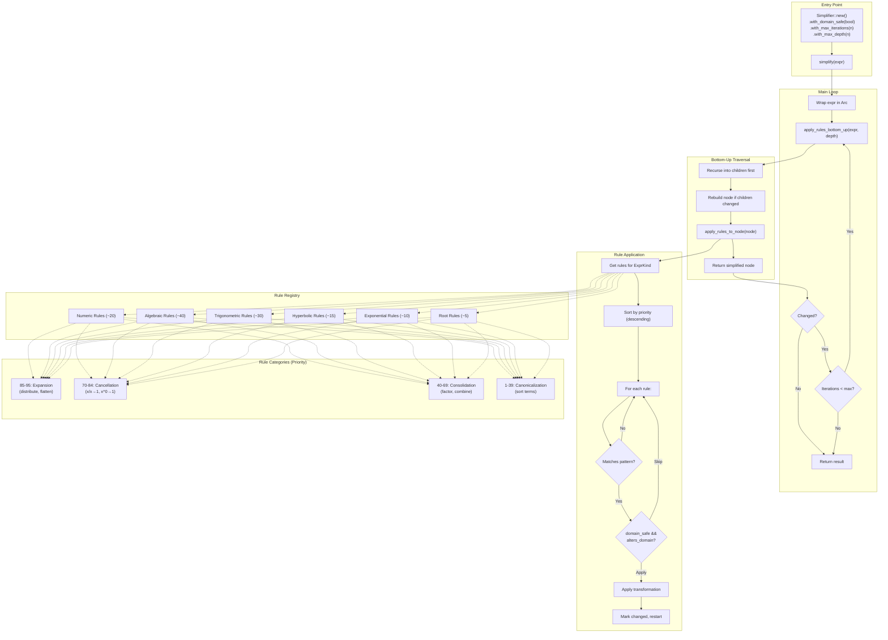
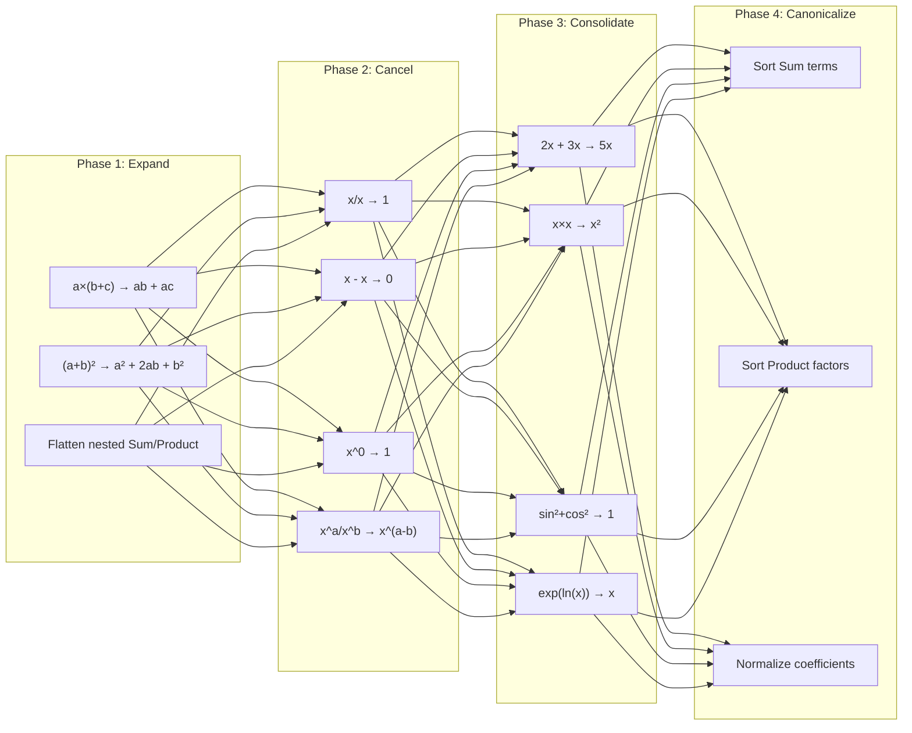
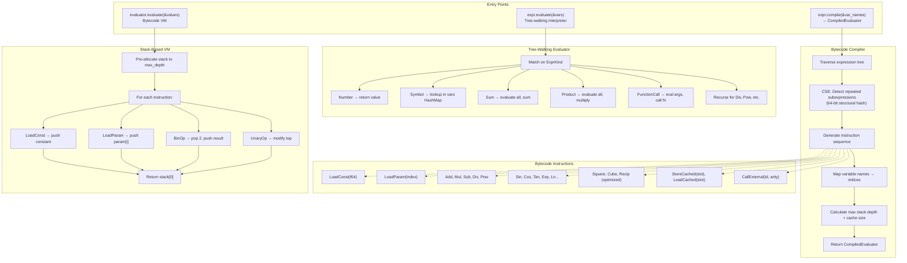
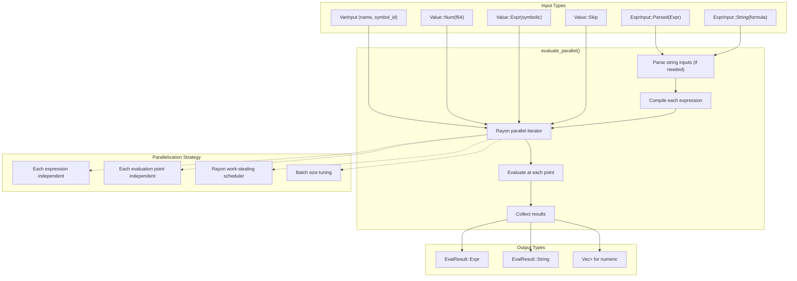
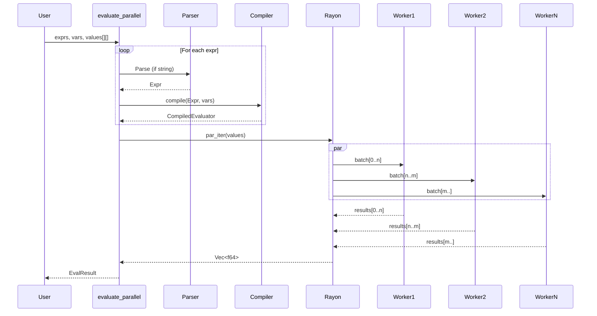
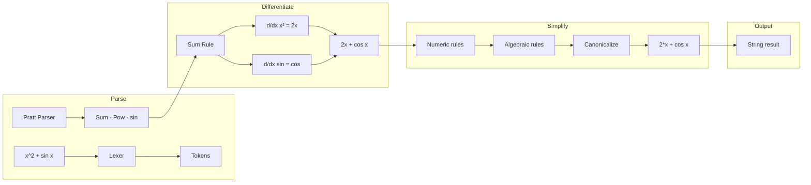

# SymbAnaFis Architecture

This document describes the internal architecture of SymbAnaFis, a high-performance symbolic mathematics library.

## Overview



---

## Differentiation Engine Architecture

The differentiation engine (`diff/engine.rs`) implements symbolic differentiation via recursive rule application.



### Key Differentation Features

| Feature                         | Implementation                                                             |
| ------------------------------- | -------------------------------------------------------------------------- |
| **Logarithmic Differentiation** | Handles `x^x`, `f^g` correctly                                             |
| **Custom Functions**            | `Diff::user_fn("f", UserFunction)` with partial derivatives and evaluation |
| **Multi-arg Partials**          | `CustomFn::partial(0, \|args                                               | ...)` for chain rule |
| **Fixed Variables**             | Variables in `fixed_vars` treated as constants (derivative = 0)            |
| **Inline Optimization**         | Prevents expression explosion during recursion                             |

--- 

## Simplification Engine Architecture

The simplification engine (`simplification/engine.rs`) uses a multi-pass, rule-based approach.



### Rule Execution Flow



---

## Evaluation Engine Architecture

The evaluation engine provides both tree-walking and compiled bytecode evaluation.



### Compiled vs Tree-Walking Performance

| Operation | Tree-Walking       | Compiled                                    |
| --------- | ------------------ | ------------------------------------------- |
| Setup     | None               | ~1-5 μs compile                             |
| Per-eval  | ~100-500 ns        | ~10-50 ns (up to 28% faster with CSE)       |
| Best for  | Single evaluation  | Batch evaluation (1000s of points)          |
| Memory    | O(depth) recursion | Pre-allocated stack + CSE cache             |

---

## Parallel Evaluation Architecture

The parallel module (`bindings/parallel.rs`) provides Rayon-powered batch evaluation.



### Parallel Evaluation Flow



### Usage Example

```rust
use symb_anafis::bindings::parallel::*;

// Evaluate derivative at 1000 points
let expr = symb_anafis::diff("sin(x)^2", "x", None, None)?;
let vars = vec!["x".into()];
let values: Vec<Vec<f64>> = (0..1000)
    .map(|i| vec![i as f64 * 0.001])
    .collect();

let results = evaluate_parallel(
    vec![expr.into()],
    vec![vars],
    vec![values],
)?;
// results[0] contains 1000 f64 values
```

---

### Data Flow: `diff("x^2 + sin(x)", "x")`



## Module Structure

```
src/
├── lib.rs                    # Public API: diff(), simplify(), re-exports (6KB)
├── core/                     # Core types and utilities
│   ├── mod.rs               # Re-exports
│   ├── expr.rs              # Expr, ExprKind - core expression types (61KB)
│   ├── symbol.rs            # InternedSymbol, Symbol - Copy symbols (58KB)
│   ├── known_symbols.rs     # Pre-interned symbols for O(1) lookup
│   ├── evaluator/           # Modular bytecode evaluation system (v0.7.0)
│   │   ├── mod.rs           # Public API: CompiledEvaluator (464 lines)
│   │   ├── compiler.rs      # Bytecode compilation with CSE (941 lines)
│   │   ├── execution.rs     # Scalar evaluation hot path (668 lines)
│   │   ├── simd.rs          # SIMD batch evaluation with f64x4 (1106 lines)
│   │   ├── stack.rs         # Unsafe stack primitives (380 lines)
│   │   ├── instruction.rs   # Bytecode instruction definitions (615 lines)
│   │   └── tests.rs         # Unit tests (402 lines)
│   ├── unified_context.rs   # Context, UserFunction - isolated registries (19KB)
│   ├── display.rs           # to_string(), to_latex(), to_unicode() (34KB)
│   ├── error.rs             # DiffError, Span - error types (14KB)
│   ├── traits.rs            # MathScalar trait
│   ├── poly.rs              # Univariate polynomial type (24KB)
│   └── visitor.rs           # AST visitor pattern
│
├── parser/                   # String → Expr
│   ├── mod.rs               # parse() function
│   ├── lexer.rs             # Tokenizer (30KB)
│   ├── tokens.rs            # Token definitions (13KB)
│   ├── pratt.rs             # Pratt parsing algorithm (17KB)
│   └── implicit_mul.rs      # 2x → 2*x handling
│
├── api/                      # Builder layer
│   ├── mod.rs               # Re-exports
│   ├── builder.rs           # Diff, Simplify builders (fluent API) (14KB)
│   └── helpers.rs           # gradient, hessian, jacobian (8KB)
│
├── diff/                     # Differentiation engine
│   ├── mod.rs               # Module exports
│   └── engine.rs            # Core differentiation logic (23KB)
│
├── simplification/           # Rule-based simplification
│   ├── mod.rs               # simplify_expr() entry point
│   ├── engine.rs            # Multi-pass engine (13KB)
│   ├── helpers.rs           # Expression utilities (27KB)
│   ├── README.md            # Rule documentation
│   ├── patterns/            # Pattern matching
│   └── rules/               # 120+ rules organized by category
│       ├── mod.rs           # Rule trait, priority system, RuleRegistry (21KB)
│       ├── numeric/         # 0+x→x, constant folding
│       ├── algebraic/       # 9 files: factoring, power, terms, etc.
│       ├── trigonometric/   # 7 files: Pythagorean, double angle, etc.
│       ├── hyperbolic/      # 5 files: sinh/cosh identities
│       ├── exponential/     # exp/ln rules
│       └── root/            # sqrt/cbrt rules
│
├── uncertainty.rs            # Uncertainty propagation (GUM formula) (12KB)
│
├── functions/                # Built-in functions
│   ├── mod.rs               # Function registry
│   ├── definitions.rs       # 50+ function defs (55KB)
│   └── registry.rs          # Name → Function lookup
│
├── math/                     # Numeric implementations
│   ├── mod.rs               # Special function evaluations (gamma, bessel, etc.)
│   └── dual.rs              # Dual numbers for automatic differentiation
│
├── bindings/                 # Optional feature-gated bindings
│   ├── mod.rs               # Feature gates
│   ├── eval_f64.rs          # Fast f64 evaluation helper (6KB)
│   ├── parallel.rs          # (parallel feature) Rayon batch evaluation (25KB)
│   └── python.rs            # (python feature) PyO3 bindings (99KB)
│
└── tests/                    # 65 test files (+22 integration tests at root)
```

### Key File Sizes

| File                        | Size   | Purpose                                                  |
| --------------------------- | ------ | -------------------------------------------------------- |
| `bindings/python.rs`        | 99 KB  | Full Python API bindings via PyO3                        |
| `core/expr.rs`              | 61 KB  | Expr, ExprKind, constructors, methods                    |
| `core/symbol.rs`            | 58 KB  | InternedSymbol, Symbol, global registry                  |
| `functions/definitions.rs`  | 55 KB  | All built-in function derivatives/evaluations            |
| `core/evaluator/` (total)   | ~45 KB | Modular bytecode VM (v0.7.0 refactor, 7 modules)         |
| `core/display.rs`           | 34 KB  | LaTeX/Unicode/String formatting                          |
| `parser/lexer.rs`           | 30 KB  | Tokenizer with edge case handling                        |
| `simplification/helpers.rs` | 27 KB  | Pattern matching utilities                               |
| `diff/engine.rs`            | 23 KB  | Core differentiation rules (chain, product, etc.)        |

---

## Core Components

### 1. Expression AST (`core/expr.rs`)

The fundamental data structure is `Expr`, a tree-based AST using `Arc` for shared ownership.

```rust
pub struct Expr {
    pub id: u64,          // Structural hash for equality/caching
    pub hash: u64,        // Pre-computed hash for HashMap
    pub kind: ExprKind,
}

pub enum ExprKind {
    Number(f64),
    Symbol(InternedSymbol),
    
    // N-ary operations (flat, auto-sorted)
    Sum(Vec<Arc<Expr>>),      // a + b + c + ...
    Product(Vec<Arc<Expr>>),  // a * b * c * ...
    
    // Binary operations (non-associative)
    Div(Arc<Expr>, Arc<Expr>),
    Pow(Arc<Expr>, Arc<Expr>),
    
    FunctionCall { name: InternedSymbol, args: Vec<Arc<Expr>> },
    Derivative { inner: Arc<Expr>, var: String, order: u32 },
    Poly(Poly),               // Optimized polynomial representation
}
```

**Design decisions:**
- **`Arc<Expr>`** for sharing subexpressions (e.g., in `x + x`)
- **Binary operators** as separate variants (faster pattern matching than n-ary)
- **`Derivative`** variant for unevaluated partial derivatives

### 2. Symbol System (`symbol.rs`)

Symbols are **interned** for O(1) comparison and implement **`Copy`** for ergonomic usage.

```rust
/// An interned symbol stored in the global registry
#[derive(Debug, Clone)]
pub struct InternedSymbol {
    id: u64,
    name: Option<Arc<String>>,  // None for anonymous symbols
}

/// Copy-able handle to an interned symbol (just the ID)
#[derive(Copy, Clone)]
pub struct Symbol {
    id: u64,
}
```

**Key features:**
- `symb("x")` - Get or create symbol (idempotent)
- `symb_new("x")` - Create only (errors if exists)
- `symb_get("x")` - Get only (errors if not found)
- Registry is **global with RwLock** for thread-safe access
- **Function names** also use `InternedSymbol` for O(1) pattern matching

**Why Copy?** Enables natural operator usage: `x + x` works without `.clone()`.

### 2b. Unified Context (`unified_context.rs`)

The `Context` type provides **isolated symbol registries** and **user-defined functions** for advanced use cases.

```rust
use symb_anafis::{Context, UserFunction, Expr, Diff};

let ctx = Context::new()
    .with_symbol("x")
    .with_symbol("alpha")  // Multi-char symbol for parsing
    .with_function("f", UserFunction::new(1..=1)
        .body(|args| (*args[0]).clone().pow(2.0) + 1.0)
        .partial(0, |args| 2.0 * (*args[0]).clone()).expect("valid"));

let x = ctx.symb("x");
let derivative = Diff::new()
    .with_context(&ctx)
    .differentiate(&Expr::func("f", x), &x);
```

**Key features:**
- **Isolated registries**: Symbols created via `ctx.symb()` don't collide with global symbols
- **User-defined functions**: `UserFunction` with optional body and partial derivatives
- **Thread-safe**: Uses `Arc<RwLock>` internally for concurrent access

| Method                              | Purpose                                     |
| ----------------------------------- | ------------------------------------------- |
| `with_symbol(name)`                 | Register symbol for parsing hints           |
| `with_function(name, UserFunction)` | Register custom function with body/partials |
| `symb(name)`                        | Get or create symbol in this context        |
| `get_user_fn(name)`                 | Retrieve a registered function              |

### 3. Parser (`parser/`)

A **Pratt parser** (operator-precedence) with custom lexer supporting:

```
parser/
├── lexer.rs        # Tokenizes input (numbers, symbols, operators)
├── tokens.rs       # Token definitions
├── pratt.rs        # Pratt parsing algorithm
└── implicit_mul.rs # Handles implicit multiplication (2x, xy)
```

**Features:**
- Implicit multiplication: `2x` → `2 * x`, `xy` → `x * y`
- Scientific notation: `1e-5`, `2.5e3`
- Multi-character symbols: `sigma`, `alpha`
- Function calls: `sin(x)`, `besselj(0, x)`

**Parsing speed:** ~500-900 ns per expression (1.6-2.3x faster than Symbolica)

### 4. Differentiation (`diff/engine.rs`)

Implements standard calculus rules:

| Rule     | Implementation                          |
| -------- | --------------------------------------- |
| Constant | d/dx[c] = 0                             |
| Variable | d/dx[x] = 1                             |
| Sum      | d/dx[a + b] = a' + b'                   |
| Product  | d/dx[a · b] = a'b + ab'                 |
| Quotient | d/dx[a/b] = (a'b - ab')/b²              |
| Chain    | d/dx[f(g)] = f'(g) · g'                 |
| Power    | d/dx[a^b] = a^b · (b' ln(a) + b · a'/a) |

**Custom functions:**
```rust
Diff::new()
    .user_fn("f", UserFunction::new(1..=1)
        .partial(0, |args: &[Arc<Expr>]| {
            // ∂f/∂u = 2u
            Expr::number(2.0) * Expr::from(&args[0])
        })
        .expect("valid arg"))
```

### 5. Simplification Engine (`simplification/`)

A **multi-pass, rule-based** simplification system.

```
simplification/
├── engine.rs       # Bottom-up tree traversal
├── helpers.rs      # Expression matching utilities
└── rules/          # 120+ categorized rules
    ├── numeric/    # Constant folding, 0+x→x
    ├── algebraic/  # Factoring, distribution, powers
    ├── trigonometric/  # sin²+cos²=1, double angles
    ├── hyperbolic/     # sinh/cosh identities
    ├── exponential/    # exp(ln(x))→x, log rules
    └── root/           # sqrt/cbrt simplification
```

**Priority ordering:** Expand → Cancel → Compact

| Priority | Phase            | Purpose               |
| -------- | ---------------- | --------------------- |
| 85-95    | Expansion        | Distribute, flatten   |
| 70-84    | Cancellation     | x^0→1, x/x→1          |
| 40-69    | Consolidation    | Factor, combine terms |
| 1-39     | Canonicalization | Sort terms            |

**Domain-safe mode:** Skips rules that alter domains (e.g., `sqrt(x²) → x`).

### 6. Builder Pattern (`builder.rs`)

Fluent API for configuration:

```rust
Diff::new()
    .domain_safe(true)      // Preserve domains
    .max_depth(200)         // AST depth limit
    .max_nodes(50000)       // Node count limit
    .fixed_var(&symb("a"))  // Treat as constant
    .custom_fn("f")         // Register function
    .diff_str("a*f(x)", "x")
```

Both `Diff` and `Simplify` builders share similar configuration.

---

## Data Flow

### `diff("x^2 + sin(x)", "x")`

```
1. PARSE
   "x^2 + sin(x)" → Expr::Add(Pow(x,2), sin(x))

2. DIFFERENTIATE
   d/dx[x² + sin(x)]
   = d/dx[x²] + d/dx[sin(x)]
   = 2x + cos(x)

3. SIMPLIFY (automatic)
   Multi-pass rule application
   Result: "2*x + cos(x)"

4. FORMAT
   Expr → String: "2*x + cos(x)"
```

---

## Special Features

### Vector Calculus (`helpers.rs`)

```rust
gradient_str("x^2 + y^2", &["x", "y"])?;  // ["2*x", "2*y"]
hessian_str("x^2*y", &["x", "y"])?;       // [["2*y", "2*x"], ["2*x", "0"]]
jacobian_str(&["x+y", "x*y"], &["x", "y"])?;
```

### Uncertainty Propagation (`uncertainty.rs`)

Implements the GUM formula: σ_f = √(Σᵢ Σⱼ (∂f/∂xᵢ)(∂f/∂xⱼ) Cov(xᵢ, xⱼ))

```rust
uncertainty_propagation(&expr, &["x", "y"], Some(&cov_matrix))?;
```

### Parallel Evaluation (`parallel.rs`, requires `parallel` feature)

Batch evaluation using Rayon:

```rust
eval_parallel!(
    [expr1, expr2],
    [["x"], ["x", "y"]],
    [[[1.0, 2.0]], [[1.0, 2.0], [3.0, 4.0]]]
)
```

### Python Bindings (`python.rs`, requires `python` feature)

PyO3 bindings exposing:
- `diff()`, `simplify()`, `parse()`
- `PyExpr` with operator overloading
- `PyDiff`, `PySimplify` builders

---

## Built-in Functions (`functions/`)

50+ functions with differentiation and evaluation rules:

| Category   | Functions                               |
| ---------- | --------------------------------------- |
| Trig       | sin, cos, tan, cot, sec, csc + inverses |
| Hyperbolic | sinh, cosh, tanh + inverses             |
| Exp/Log    | exp, ln, log, log10, log2               |
| Special    | gamma, digamma, polygamma, beta         |
| Bessel     | besselj, bessely, besseli, besselk      |
| Error      | erf, erfc                               |
| Other      | zeta, LambertW, abs, signum             |

---

## Extension Points

1. **Custom functions:** `Diff::new().user_fn("f", UserFunction)` with partial derivatives and evaluation
2. **Custom evaluation:** `Diff::new().custom_eval("f", ...)`
3. **New simplification rules:** Add to `simplification/rules/`
4. **New functions:** Add to `functions/definitions.rs` and `registry.rs`
