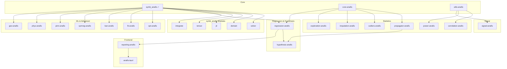

# AnaFis Ecosystem Roadmap

> **AnaFis**: Advanced Numerical Analysis and Fitting Interface System  
> A "No-Compromise" Statistical Engine for Experimental Physics (SOTA 2025)

## Version Release Plan

| Version | Target Features                                                          |
| ------- | ------------------------------------------------------------------------ |
| v0.7.0  | ✅ CSE, Modular Evaluator, Property Testing, Developer Docs (CURRENT)    |
| v0.8.0  | Compiler Config, Domain Analysis, Extended Functions                     |
| v0.9.0  | Symbolic Solver, LaTeX I/O, Jupyter Integration                          |
| v1.0.0  | JIT Compilation (Cranelift), Tensor/Matrix Support, Symbolic Integration |

## Philosophy: "Neural & Rigorous Metrology"

- **Classical-Neural Hybrid**: AnaFis doesn't discard classical statistics (GUM/JCGM) but augments it with modern ML (Variational Inference, PINNs, Neural Estimators) where analytics fail.
- **Uncertainty First**: `UncertaintyTensor` is the source of truth. Methods that don't propagate uncertainty are banned or wrapped in probabilistic layers.
- **Compliance**: JCGM 101/102 as foundation, extended to modern "Uncertainty Quantification" (UQ) frontiers.

---

## Phase 0: Foundation (Current State ✓)

### `symb_anafis` - Symbolic Engine
- [x] Pratt parser with implicit multiplication
- [x] Symbolic differentiation engine  
- [x] Registry of 50+ functions with derivatives
- [x] Compiled bytecode evaluator with SIMD
- [x] Uncertainty propagation via dual numbers
- [x] Python bindings (PyO3)
- [x] CSE (Common Subexpression Elimination) in compiler
- [x] Compile-time singularity detection (E/E, sin(E)/E → sinc)
- [x] Modular evaluator architecture (7 focused modules)
- [x] Property-based testing (quickcheck)
- [x] Developer documentation (CONTRIBUTING.md, agentic workflows)

---

## Phase 1: Core `symb_anafis` Enhancements

### 1.1 Symbolic Solver (`symb_anafis::solver`)
> **Target: v0.9.0** - Equation solving and domain analysis

| Milestone | Description                                           |
| --------- | ----------------------------------------------------- |
| v0.1      | Linear system solver (Gaussian elimination on Expr)   |
| v0.2      | Polynomial root finding (analytical, degrees ≤4)      |
| v0.3      | Variable isolation: `solve(y = f(x), x)`              |
| v0.4      | Transcendental pattern matching (sin(x) = 0 → x = nπ) |

### 1.2 Compiler Optimization Levels (`symb_anafis::config`)
> **Target: v0.8.0** - Flexible compilation strategy (Setup vs Run speed)

| Milestone | Description                                                  | Status |
| --------- | ------------------------------------------------------------ | ------ |
| v0.1      | `CompilerConfig` struct with flags for CSE, JIT, SIMD        | ⏳     |
| v0.2      | **Profile Presets**: Real-Time, Simulation, HPC, Safe        | ⏳     |
| v0.3      | **CSE** (Common Subexpression Elimination) pass optimization | ✅     |
| v0.4      | Integration with JIT and Domain Analysis modules             | ⏳     |

### 1.3 Domain Analysis (`symb_anafis::domain`)
> **Target: v0.8.0** - Singularity detection and handling

| Milestone | Description                                            | Status |
| --------- | ------------------------------------------------------ | ------ |
| v0.1      | Detect division by zero patterns at compile time       | ⏳     |
| v0.2      | Conditional bytecode with L'Hôpital fallbacks          | ⏳     |
| v0.3      | Series expansion for limits (`series(sin(x)/x, x, 0)`) | ⏳     |
| v0.4      | Full domain inference (log domain, sqrt domain, etc.)  | ⏳     |

### 1.4 JIT Compilation (`symb_anafis::jit`)
> **Target: v1.0.0** - Native machine code for hot paths

| Milestone | Description                                       |
| --------- | ------------------------------------------------- |
| v0.1      | Cranelift backend: basic arithmetic ops           |
| v0.2      | Trig/exp/log function calls                       |
| v0.3      | SIMD vectorization in JIT                         |
| v0.4      | Benchmarks: target > Stack VM for >1M evaluations |

### 1.5 Extended Functions (`symb_anafis::special`)
> **Target: v0.8.0** - Complete special function coverage

| Milestone | Description                         |
| --------- | ----------------------------------- |
| v0.1      | Factorial, DoubleFactorial bytecode |
| v0.2      | Exponential integrals (Ei, Li)      |
| v0.3      | Trigonometric integrals (Si, Ci)    |
| v0.4      | Fresnel integrals (S, C)            |

### 1.6 Input/Output (`symb_anafis::io`)
> **Target: v0.9.0** - Format interoperability

| Milestone | Description                               |
| --------- | ----------------------------------------- |
| v0.1      | LaTeX parsing: `parse(r"\frac{1}{2}x^2")` |
| v0.2      | MathML output                             |
| v0.3      | Pretty printing with precedence           |
| v0.4      | Jupyter display integration               |

### 1.7 Tensor/Matrix Support (`symb_anafis::tensor`)
> **Target: v1.0.0+** - First-class symbolic tensors

| Milestone | Description                                |
| --------- | ------------------------------------------ |
| v0.1      | `Expr::Matrix` variant with shape tracking |
| v0.2      | Element-wise operations                    |
| v0.3      | Matrix multiplication differentiation      |
| v0.4      | Einstein notation parsing                  |

### 1.8 Integration (`symb_anafis::integrate`)
> **Target: v1.0.0+** - Symbolic integration (stretch goal)

| Milestone | Description                         |
| --------- | ----------------------------------- |
| v0.1      | Table lookup for common patterns    |
| v0.2      | Polynomial integration              |
| v0.3      | Heuristic Risch algorithm (partial) |
| v0.4      | Numerical fallback with uncertainty |

---

## Phase 2: Core Infrastructure Crates

### `core-anafis` - Shared Data Types

| Milestone | Description                                           |
| --------- | ----------------------------------------------------- |
| v0.1      | `UncertaintyTensor<T>`: value + σ + correlation       |
| v0.2      | Trait `Measurable`: anything with uncertainty         |
| v0.3      | `from_gum_type_a()`, `from_gum_type_b()` constructors |
| v0.4      | `#[derive(Measurable)]` proc macro                    |
| v0.5      | Arrow/ndarray interop                                 |

### `utils-anafis` - Shared Utilities

| Milestone | Description                                            |
| --------- | ------------------------------------------------------ |
| v0.1      | `kernels.rs`: KD-tree (kiddo) + Gaussian kernels       |
| v0.2      | `optimization.rs`: argmin wrapper (LBFGS, constraints) |
| v0.3      | `neural.rs`: burn/candle abstraction layer             |
| v0.4      | `persistence.rs`: rusqlite result caching              |

---

## Phase 3: Statistical Module Crates

### `power-anafis` - Experimental Design
> Simulation-Based Power Analysis + Bayesian Optimization

| Milestone | Description                                  |
| --------- | -------------------------------------------- |
| v0.1      | Grid-based power simulation (naive)          |
| v0.2      | GP surrogate for β(N) curve                  |
| v0.3      | Bayesian optimization (Expected Improvement) |
| v0.4      | Multi-objective: power vs cost tradeoff      |

### `correlation-anafis` - Information Theory
> KSG + Neural MI Estimation

| Milestone | Description                              |
| --------- | ---------------------------------------- |
| v0.1      | Basic KSG (k=3 neighbors)                |
| v0.2      | Error-convolved KSG (physics robustness) |
| v0.3      | Partial MI / conditional independence    |
| v0.4      | MINE/InfoNCE neural estimator (high-dim) |

### `exploration-anafis` - Latent Variable Models
> Heteroscedastic PPCA

| Milestone | Description                                          |
| --------- | ---------------------------------------------------- |
| v0.1      | Homoscedastic PPCA via EM                            |
| v0.2      | Heteroscedastic: Ψ = diag(σ²) from UncertaintyTensor |
| v0.3      | Confidence intervals on loadings                     |
| v0.4      | Factor rotation (varimax, promax)                    |

### `propagator-anafis` - Uncertainty Propagation
> Hybrid Auto-Diff + MCM

| Milestone | Description                                            |
| --------- | ------------------------------------------------------ |
| v0.1      | Dual-number propagation (linear/1st-order, GUM Type B) |
| v0.2      | Non-linearity detection via Hessian threshold          |
| v0.3      | MCM fallback with adaptive sampling (JCGM 101)         |
| v0.4      | Correlated inputs handling (covariance matrix)         |

### `outliers-anafis` - Robust Detection
> FastMCD with uncertainty-weighted distance

| Milestone | Description                                 |
| --------- | ------------------------------------------- |
| v0.1      | Basic MCD with fixed covariance             |
| v0.2      | Uncertainty-weighted Mahalanobis distance   |
| v0.3      | Iterative refinement with convergence check |
| v0.4      | Multivariate outlier visualization          |

### `imputation-anafis` - Missing Data
> GPR with uncertainty-scaled kernel

| Milestone | Description                                    |
| --------- | ---------------------------------------------- |
| v0.1      | Basic GPR (RBF + WhiteNoise)                   |
| v0.2      | Noise scaled by known σ from UncertaintyTensor |
| v0.3      | Batch imputation with covariance propagation   |
| v0.4      | Multiple imputation for downstream uncertainty |

### `signal-anafis` - Signal Processing
> Wavelets + PINN Smoothing

| Milestone | Description                                    |
| --------- | ---------------------------------------------- |
| v0.1      | DWT with hard thresholding                     |
| v0.2      | CWT + ridge detection (peak finding)           |
| v0.3      | Adaptive threshold (SureShrink)                |
| v0.4      | PINN smoother with physics constraint          |
| v0.5      | Baseline correction (asymmetric least squares) |

### `regression-anafis` - Model Fitting
> Generalized ODR + SINDy

| Milestone | Description                                          |
| --------- | ---------------------------------------------------- |
| v0.1      | Basic ODR with known σ_x, σ_y (current `odr_anafis`) |
| v0.2      | Symbolic Jacobian from symb_anafis                   |
| v0.3      | Parameter uncertainty via exact Hessian              |
| v0.4      | Constrained optimization (physical bounds)           |
| v0.5      | SINDy: sparse identification of dynamics             |
| v0.6      | Model selection (AIC, BIC, cross-validation)         |

### `hypothesis-anafis` - Bayesian Testing
> Bayes Factors via Bridge Sampling

| Milestone | Description                                   |
| --------- | --------------------------------------------- |
| v0.1      | Laplace approximation for marginal likelihood |
| v0.2      | Bridge sampling (more accurate)               |
| v0.3      | Nuisance parameter marginalization (Type B)   |
| v0.4      | Savage-Dickey density ratio                   |

---

## Phase 4: ML & Advanced Crates

### `opt-anafis` - Optimization
> General-purpose optimization with symbolic gradients

| Milestone | Description                                      |
| --------- | ------------------------------------------------ |
| v0.1      | Gradient descent (SGD, momentum)                 |
| v0.2      | Adam, AdaGrad optimizers                         |
| v0.3      | Newton's method (symbolic Hessian)               |
| v0.4      | L-BFGS for large-scale                           |
| v0.5      | Constrained optimization (barriers, projections) |

### `fit-anafis` - General Fitting
> High-level fitting API

| Milestone | Description                                         |
| --------- | --------------------------------------------------- |
| v0.1      | Nonlinear Least Squares (Levenberg-Marquardt)       |
| v0.2      | Weighted Least Squares                              |
| v0.3      | Model builders (polynomial, exponential, power law) |
| v0.4      | Residual analysis and diagnostics                   |
| v0.5      | Confidence/prediction bands                         |

### `kan-anafis` - Kolmogorov-Arnold Networks
> Symbolic KAN with interpretable basis

| Milestone | Description                              |
| --------- | ---------------------------------------- |
| v0.1      | Basic KAN layer (B-spline basis)         |
| v0.2      | Training loop with symbolic output       |
| v0.3      | Spline-to-symbolic conversion            |
| v0.4      | Pruning and simplification               |
| v0.5      | Physics-informed KAN (conservation laws) |

### `symreg-anafis` - Symbolic Regression
> Genetic programming for equation discovery

| Milestone | Description                           |
| --------- | ------------------------------------- |
| v0.1      | Expression tree genome                |
| v0.2      | Crossover and mutation operators      |
| v0.3      | Fitness with complexity penalty       |
| v0.4      | Pareto front (accuracy vs simplicity) |
| v0.5      | Constants optimization (CMA-ES)       |

### `pinn-anafis` - Physics-Informed Neural Networks
> Neural networks constrained by PDEs

| Milestone | Description                                    |
| --------- | ---------------------------------------------- |
| v0.1      | Basic PINN architecture (burn backend)         |
| v0.2      | PDE residual loss from symb_anafis expressions |
| v0.3      | Boundary condition handling                    |
| v0.4      | Inverse problems (parameter estimation)        |
| v0.5      | Uncertainty quantification (ensemble/dropout)  |

### `phys-anafis` - Physics Utilities
> ODE/PDE tools and mechanics

| Milestone | Description                                 |
| --------- | ------------------------------------------- |
| v0.1      | ODE integrators (RK4, adaptive step)        |
| v0.2      | Sensitivity analysis (forward/adjoint)      |
| v0.3      | Lagrangian → Euler-Lagrange derivation      |
| v0.4      | Hamiltonian mechanics helpers               |
| v0.5      | Noether's theorem (symmetry → conservation) |

### `geo-anafis` - Geometry & Graphics
> Curves, surfaces, and ray-marching

| Milestone | Description                                     |
| --------- | ----------------------------------------------- |
| v0.1      | Implicit surface utilities (normals, curvature) |
| v0.2      | Ray-marching with symbolic SDF                  |
| v0.3      | Parametric curve/surface tools                  |
| v0.4      | Curve fitting with symbolic gradients           |
| v0.5      | CSG operations                                  |

---

## Phase 5: Integration & GUI

### `reporting-anafis` - Output Generation
> Reports and visualization

| Milestone | Description                               |
| --------- | ----------------------------------------- |
| v0.1      | Markdown report generator                 |
| v0.2      | LaTeX report with GUM tables              |
| v0.3      | Plot generation (gnuplot/plotly bindings) |
| v0.4      | Jupyter notebook export                   |

### `anafis-tauri` - Lab Companion GUI
> Desktop application for lab work

| Milestone | Description                           |
| --------- | ------------------------------------- |
| v0.1      | GUI framework setup (Tauri) done      |
| v0.2      | Data import (CSV, SQLite, Excel) done |
| v0.3      | Module workflow orchestration         |
| v0.4      | Interactive plots with error bars     |
| v0.5      | Real-time sensor data streaming       |

---

## Ideas / Backlog (Long Term)

| Feature             | Notes                                   |
| ------------------- | --------------------------------------- |
| GPU Acceleration    | OpenCL/CUDA for eval_batch >100M points |
| Complex Numbers     | First-class complex arithmetic          |
| Interval Arithmetic | Rigorous bounds computation             |
| WASM Demo           | Interactive "Try it now" web page       |

---

## Documentation & Examples

| Topic                                     | Status                       |
| ----------------------------------------- | ---------------------------- |
| "Discovering Physical Laws from Data"     | [ ] Symbolic Regression demo |
| "Neural ODE Training with SymbAnaFis"     | [ ] PINN + ODE tutorial      |
| "Solving Heat Equation via JIT"           | [ ] JIT performance demo     |
| "Uncertainty Propagation for Lab Reports" | [ ] GUM workflow tutorial    |
| "ODR Fitting with Error Bars"             | [ ] Physics lab example      |

---

## Dependency Graph

---

## Technology Stack

| Component     | Crate              | Notes                  |
| ------------- | ------------------ | ---------------------- |
| Core          | ndarray, arrow     | Numeric foundation     |
| Optimization  | argmin             | LBFGS, constraints     |
| JIT           | cranelift          | Native code generation |
| Kernels       | kiddo              | KD-tree for KSG        |
| Distributions | statrs             | PDFs                   |
| FFT           | rustfft            | Spectral/wavelets      |
| GP            | linfa-gp or custom | Imputation             |
| Neural        | burn / candle      | MINE, PINNs, KANs      |
| Persistence   | rusqlite           | Heavy result caching   |
| GUI           | tauri + egui       | Desktop app            |

---

## Contributing

Priority areas:
1. **Beta Testers**: Users applying to ML/Physics problems to report edge cases
2. **Special Functions**: Numeric implementations for obscure physics functions
3. **Docs**: "How-to" guides for beginners
4. **KAN Research**: Novel architectures and training methods
