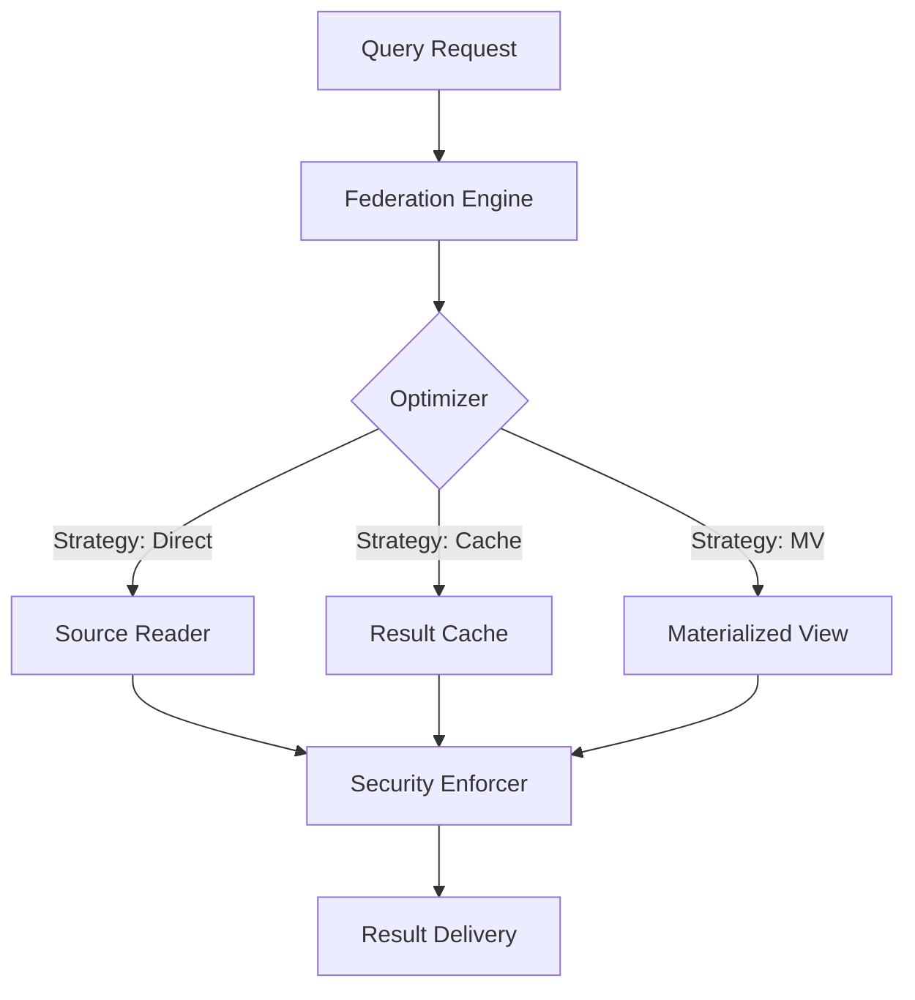

# 🌐 Tauro Virtualization: High-Performance Data Federation

[](#)
[](#)
[](#)
[](#)

## 📖 Overview

The `tauro.virtualization` module provides a high-performance **Data Virtualization Layer** that enables unified access to heterogeneous data sources without physical data movement. By abstracting storage complexity, it allows engineers to query PostgreSQL, Snowflake, S3, and Delta Lake through a single, secure interface while maintaining original data locality.

Designed for **Data Mesh** and **Privacy-First** architectures, it combines intelligent query federation (predicate pushdown) with enterprise-grade security (RLS, PII masking, and multi-tenant isolation).

---

## 🗺️ Navigation

- [✨ Key Features](#-key-features)
- [🏗️ Orchestration Architecture](#-orchestration-architecture)
- [📡 Supported Virtual Sources](#-supported-virtual-sources)
- [🛡️ Security & Governance](#-security--governance)
- [🚀 Performance Optimization](#-performance-optimization)
- [🛠️ Technical Usage](#-technical-usage)
- [🆘 Troubleshooting](#-troubleshooting)

---

## ✨ Key Features

| Feature | Description |
| :--- | :--- |
| **Zero-Copy Access** | Query disparate sources (SQL, DW, Files) without ETL or duplication. |
| **Federated Execution** | Cost-based query planning with automatic predicate pushdown. |
| **Granular Security** | Row-Level Security (RLS) and Field-Level Masking (PII protection). |
| **Smart Caching** | Heuristic-based strategy selection (Direct vs. Cache vs. Materialized). |
| **Audit Compliance** | Full traceability of who accessed what data, compatible with GDPR/SOC2. |
| **Unified Registry** | Centralized metadata catalog with schema evolution tracking. |

---

## 🏗️ Orchestration Architecture

Tauro's virtualization engine separates the logical schema from physical execution through a three-layer stack:

1.  **Schema Registry**: Manages the logical table definitions, statistics, and lineage.
2.  **Federation Engine**: Analyzes incoming queries, optimizes predicates, and selects the most efficient execution strategy.
3.  **Security Enforcer**: Intercepts data at the edge to apply masking, encryption, and row-level filters before delivery.



---

## 📡 Supported Virtual Sources

### Input Formats (Readers)

| Category | Sources | Characteristics |
| :--- | :--- | :--- |
| **Filesystem** | S3, Azure Blob, GCS, Local | Reads Parquet, Delta, CSV via Tauro I/O. |
| **Relational** | PostgreSQL, MySQL, SQLite | Optimized SQL pushdown and connection pooling. |
| **Warehouse** | Snowflake, BigQuery, Redshift | Native drivers with partition pruning support. |
| **Analytic** | Databricks SQL, Presto/Trino | Support for high-concurrency BI queries. |

---

## 🛡️ Security & Governance

### 1. Row-Level Security (RLS)
Apply dynamic filters based on the `principal` (user/role) identity.

```python
from tauro.virtualization.security import TableSecurityPolicy

policy = TableSecurityPolicy(table_name="customers")
policy.row_level_filters = {
    "analyst": "department = 'Sales'",      # Static filter
    "manager": "manager_id = {principal}",  # Dynamic identity filter
    "admin": ""                             # Bypass (Full Access)
}
```

### 2. PII Masking Strategies
Automatic protection for sensitive data types.

```python
from tauro.virtualization.security import EmailMasker, PhoneMasker

# Examples of output:
# Email: f***o@example.com
# Phone: ******5678
```

### 3. Integrated Auditing
Every virtual query generates a structured audit log for compliance.

```json
{
  "timestamp": "2025-01-20T10:00:00Z",
  "principal": "analyst_user",
  "operation": "SELECT",
  "table": "customers"
}
```

---

## 🚀 Performance Optimization

### Predicate Pushdown (SQL Injection Protected)
Tauro translates logical predicates into native source queries. This reduces network I/O and memory usage by filtering data at the source.

```python
from tauro.virtualization.federation_engine import Predicate, PredicateOperator

# This predicate "age > 18" is pushed down to the SQL database
predicates = [Predicate("age", PredicateOperator.GT, 18)]
```

### Execution Strategy Heuristics
| Cost Range | Selected Strategy | Behavior |
| :--- | :--- | :--- |
| **< 0.5** | `DIRECT` | Executes live against the source provider. |
| **0.5 - 10** | `CACHE` | Attempts to retrieve from the local result cache. |
| **> 10** | `MATERIALIZED` | Uses a background pre-aggregated view with a specific TTL. |

---

## 🛠️ Technical Usage

### 1. Unified Interface via VirtualContext

```python
from tauro.virtualization import VirtualContext, VirtualTable, SourceType

# Initialize Context
vctx = VirtualContext()

# Register a Cloud SQL Table
vctx.register_table(VirtualTable(
    name="active_users",
    source_type=SourceType.DATABASE,
    connector_type="postgresql",
    connection_id="main_db",
    table_name="users",
    schema={"id": "INT", "status": "STRING"}
))
```

### 2. Federated Query Execution with Telemetry

```python
from tauro.virtualization.federation_engine import FederationEngine

engine = FederationEngine()

# 1. Plan with cost estimation
plan = engine.plan_query("active_users", predicates=[...])

# 2. Execute and collect real-time statistics
results, stats = engine.execute_query(plan, my_source_executor)

print(f"Time: {stats.execution_time_ms}ms | Strategy: {stats.execution_strategy.value}")
```

### 3. Applying Security Policies

```python
from tauro.virtualization.security import SecurityEnforcer, TableSecurityPolicy

enforcer = SecurityEnforcer()
policy = TableSecurityPolicy(table_name="active_users", allowed_roles=["admin"])

# Apply field masking and RLS to raw results
filtered_data = enforcer.apply_row_level_security("active_users", "analyst", raw_results)
masked_data = enforcer.apply_field_masking("active_users", "analyst", filtered_data)
```

---

## 🆘 Troubleshooting

| Issue | Cause | Solution |
| :--- | :--- | :--- |
| `Pushdown Error` | Unsupported operator or complex expression. | Verify compatibility in `PredicateOperator`. |
| `Access Denied` | RLS filter or Role policy blocked the query. | Check principal identity and policy registration. |
| `Latency Spikes` | Strategy defaulted to `DIRECT` for large tables. | Enable `MATERIALIZED` or adjust `CACHE` TTL. |
| `Memory Overflow` | Fetching too many rows from a virtual source. | Always use `limit` in your `QueryPlan`. |

---

## API Quick Reference

- `FederationEngine`: Handles cost-based optimization and planning.
- `SecurityEnforcer`: Manages RLS, masking, and auditing.
- `VirtualTable`: Schema definition for physical-to-logical mapping.
- `VirtualReaderFactory`: Instantiates optimized readers for specific backends.

---

## License

Copyright (c) 2025 Faustino Lopez Ramos. See [LICENSE](../../LICENSE) for details.

virtual_layer = VirtualDataLayer.from_config(config)
```

### Configuration Options

| Option | Type | Default | Description |
|--------|------|---------|-------------|
| `source_type` | Enum | - | DATABASE, FILESYSTEM, API, STREAM, DATA_WAREHOUSE |
| `connector_type` | String | - | postgresql, mysql, snowflake, bigquery, s3, kafka, etc. |
| `connection_id` | String | - | Connection pool identifier |
| `cache_strategy` | Enum | SMART | NEVER, ALWAYS, SMART, PERIODIC |
| `cache_ttl_seconds` | Integer | 3600 | Cache time-to-live in seconds |
| `partitions` | List | [] | Partition column names for pruning |
| `tags` | List | [] | Metadata tags for filtering |

---

## 🔐 Security

### Data Classification

Tag sensitive tables for automatic protection:

```python
from tauro import VirtualTable, SourceType

customers = VirtualTable(
    name="customers",
    source_type=SourceType.DATABASE,
    connector_type="postgresql",
    connection_id="prod_db",
    table_name="customers",
    tags=["pii", "confidential", "financial"]  # ← Tags for classification
)
```

### Field-Level Encryption

```python
from tauro import FieldSecurityPolicy, AccessLevel

# PII fields encrypted at rest
ssn_policy = FieldSecurityPolicy(
    field_name="ssn",
    access_level=AccessLevel.ENCRYPTED,
    encryption_enabled=True,
    allowed_roles=["hr_admin", "compliance"]  # Only these roles see plaintext
)

policy.field_policies["ssn"] = ssn_policy
```

### Row-Level Security (RLS) Examples

```python
# Department-based filtering
policy.row_level_filters["analyst"] = "department = 'Sales'"

# User-based filtering
policy.row_level_filters["manager"] = "manager_id = {principal}"

# Complex expressions
policy.row_level_filters["regional_lead"] = "region IN ('North', 'South')"

# Numeric comparisons
policy.row_level_filters["junior_analyst"] = "salary < 100000"

# Date-based (cohort analysis)
policy.row_level_filters["retention_analyst"] = "signup_date >= DATE_SUB(NOW(), INTERVAL 1 YEAR)"
```

### Compliance Checklist

- [ ] **GDPR**: Enable audit logging, implement RLS for user data, encrypt PII
- [ ] **HIPAA**: Use field-level encryption for health data, maintain audit trail
- [ ] **SOC2**: Configure comprehensive audit logging, enable access controls
- [ ] **PCI-DSS**: Encrypt payment data fields, restrict access by role
- [ ] **CCPA**: Implement data masking, provide audit trail for consumer requests

### Security Hardening

```python
# Maximum security configuration
from tauro import (
    SecurityEnforcer, TableSecurityPolicy, FieldSecurityPolicy, AccessLevel
)

enforcer = SecurityEnforcer()

# Restrictive policy
strict_policy = TableSecurityPolicy(
    table_name="financial_data",
    allowed_roles=["finance_admin", "auditor"],  # Whitelist only
    audit_all_access=True,  # Log every access
    requires_encryption=True,  # All fields encrypted
    field_policies={
        "account_number": FieldSecurityPolicy(
            field_name="account_number",
            access_level=AccessLevel.ENCRYPTED,
            encryption_enabled=True,
            allowed_roles=["finance_admin"]
        ),
        "balance": FieldSecurityPolicy(
            field_name="balance",
            access_level=AccessLevel.ENCRYPTED,
            encryption_enabled=True,
            allowed_roles=["finance_admin", "auditor"]
        )
    }
)

enforcer.register_policy(strict_policy)
```

---

## ⚡ Performance

### Optimization Strategies

| Strategy | When to Use | Benefit |
|----------|-------------|---------|
| **Predicate Pushdown** | Filtering large tables | 90% I/O reduction |
| **Projection** | Selecting few columns | Network bandwidth savings |
| **Caching** | Repeated queries | Sub-second response time |
| **Materialized Views** | Complex aggregations | 10-100x speedup |
| **Partitioning** | Date/region fields | Partition pruning |

### Cache Strategies

```python
from tauro import CacheStrategy, VirtualTable

# NEVER: Always fetch from source (for real-time data)
events = VirtualTable(
    name="user_events",
    cache_strategy=CacheStrategy.NEVER
)

# ALWAYS: Cache results for 1 hour (for stable data)
product_catalog = VirtualTable(
    name="products",
    cache_strategy=CacheStrategy.ALWAYS,
    cache_ttl_seconds=3600
)

# SMART: Let engine decide (balanced default)
customers = VirtualTable(
    name="customers",
    cache_strategy=CacheStrategy.SMART,
    cache_ttl_seconds=3600
)

# PERIODIC: Refresh on schedule (for aggregations)
daily_summary = VirtualTable(
    name="sales_summary",
    cache_strategy=CacheStrategy.PERIODIC,
    cache_ttl_seconds=86400  # Refresh daily
)
```

### Query Plan Analysis

```python
from tauro import FederationEngine

federation = FederationEngine()

predicates = [...]
plan = federation.plan_query("customers", predicates)

# Analyze plan
print(f"Execution Strategy: {plan.execution_strategy.value}")
print(f"Estimated Cost: {plan.estimated_cost:.2f}")
print(f"Estimated Rows: {plan.estimated_rows:,}")
print(f"Estimated Bytes: {plan.estimated_bytes:,}")

# View optimization metrics
metrics = federation.query_optimizer.get_optimization_metrics()
print(f"Cache Hit Rate: {metrics['cache_hit_rate']:.1%}")
print(f"Avg Time: {metrics['avg_execution_time_ms']:.1f}ms")
```

### Performance Tuning Tips

1. **Enable Predicate Pushdown**: Set `supports_pushdown=True`
2. **Limit Result Sets**: Always use `limit` parameter
3. **Project Early**: Specify only needed columns
4. **Use Partitions**: Define partition columns for large tables
5. **Monitor Cache**: Track hit rates and adjust TTL
6. **Profile Queries**: Use execution statistics to identify bottlenecks

---

## 📊 Monitoring

### Health Metrics

```python
# Schema registry status
catalog = virtual_layer.schema_registry.export_catalog()
print(f"Registered tables: {len(catalog['tables'])}")
print(f"Total lineage edges: {len(catalog['lineage'])}")

# Query optimization metrics
metrics = federation.query_optimizer.get_optimization_metrics()
print(f"Total queries: {metrics['total_queries']}")
print(f"Cache hit rate: {metrics['cache_hit_rate']:.1%}")
print(f"Avg execution time: {metrics['avg_execution_time_ms']:.1f}ms")

# Security audit status
logs = enforcer.get_audit_logs(table_name="customers")
print(f"Access events: {len(logs)}")

# Denied access attempts
denied = [log for log in logs if log.status == "DENIED"]
print(f"Denied accesses: {len(denied)}")
for log in denied[:5]:
    print(f"  - {log.principal} → {log.table_name}: {log.denial_reason}")
```

### Monitoring Dashboard Queries

```python
# Query performance distribution
stats_by_table = {}
for qid, stat in federation.query_optimizer._statistics.items():
    table = stat.table_name
    if table not in stats_by_table:
        stats_by_table[table] = []
    stats_by_table[table].append(stat.execution_time_ms)

for table, times in stats_by_table.items():
    print(f"{table}:")
    print(f"  Min: {min(times):.1f}ms")
    print(f"  Avg: {sum(times)/len(times):.1f}ms")
    print(f"  Max: {max(times):.1f}ms")

# Security audit summary
from datetime import datetime, timedelta

last_24h = datetime.utcnow() - timedelta(hours=24)
recent_logs = enforcer.get_audit_logs(start_time=last_24h)

by_operation = {}
for log in recent_logs:
    op = log.operation.value
    by_operation[op] = by_operation.get(op, 0) + 1

print("Operations (last 24h):")
for op, count in sorted(by_operation.items()):
    print(f"  {op}: {count}")
```

---

## 🔧 Troubleshooting

### Common Issues

#### Issue: Slow Queries

**Symptoms**: Queries taking longer than expected

**Diagnosis**:
```python
from tauro import FederationEngine

federation = FederationEngine()

# Check query plan
plan = federation.plan_query("customers", predicates)
print(f"Estimated cost: {plan.estimated_cost}")
print(f"Strategy: {plan.execution_strategy.value}")

# Check cache hit rate
metrics = federation.query_optimizer.get_optimization_metrics()
print(f"Cache hit rate: {metrics['cache_hit_rate']:.1%}")
```

**Solutions**:
- ✅ Enable predicate pushdown: `supports_pushdown=True`
- ✅ Check indexes on source tables
- ✅ Consider materialized view for repeated queries
- ✅ Increase cache TTL for stable data

#### Issue: Query Execution Errors

**Symptoms**: "Query execution failed"

**Diagnosis**:
```python
try:
    results, stats = federation.execute_query(plan, executor)
    for row in results:
        print(row)
except Exception as e:
    logger.error(f"Query failed: {e}")
    # Check source connectivity
    # Verify table/column names
    # Check predicate syntax
```

**Solutions**:
- ✅ Verify source connectivity
- ✅ Check virtual table configuration
- ✅ Validate predicate syntax
- ✅ Review source error logs

#### Issue: Security Policy Not Applied

**Symptoms**: Data accessible without expected filtering

**Diagnosis**:
```python
from tauro import SecurityEnforcer

enforcer = SecurityEnforcer()

# Verify policy is registered
policy = enforcer.get_policy("customers")
print(f"Policy exists: {policy is not None}")

# Check RLS filter
print(f"RLS filters: {policy.row_level_filters}")

# Verify enforcement
rows = list(results)
print(f"Before RLS: {len(rows)} rows")

filtered = enforcer.apply_row_level_security("customers", "analyst", rows)
print(f"After RLS: {len(filtered)} rows")
```

**Solutions**:
- ✅ Confirm policy is registered with `register_policy()`
- ✅ Verify RLS expression syntax
- ✅ Check user/role assignments
- ✅ Review audit logs for enforcement

#### Issue: Out of Memory

**Symptoms**: Process crashes with large datasets

**Solutions**:
- ✅ Use pagination with `limit` parameter
- ✅ Stream results instead of loading all at once
- ✅ Apply filters before caching
- ✅ Use partition pruning for large tables

---

## 📚 API Reference

### Core Classes

#### `VirtualTable`
Represents a virtual table abstraction over a data source.

```python
VirtualTable(
    name: str,                          # Unique table identifier
    source_type: SourceType,            # DATABASE, FILESYSTEM, API, STREAM, DATA_WAREHOUSE
    connector_type: str,                # "postgresql", "snowflake", "s3", etc.
    connection_id: str,                 # Connection pool ID
    query: Optional[str] = None,        # SQL query (for databases)
    table_name: Optional[str] = None,   # Table name (if not query-based)
    path: Optional[str] = None,         # File path (for filesystem)
    schema: Dict[str, str] = {},        # {column: type}
    partitions: List[str] = [],         # Partition columns
    source_tables: List[str] = [],      # Upstream dependencies
    transformation: Optional[str] = None,  # Transformation description
    cache_strategy: CacheStrategy = SMART,  # Caching strategy
    cache_ttl_seconds: int = 3600,      # Cache TTL
    encryption_config: Optional[EncryptionConfig] = None,
    access_control: Dict[str, List[str]] = {},
    description: str = "",
    tags: List[str] = []
)
```

#### `SchemaRegistry`
Central metadata catalog.

```python
registry = SchemaRegistry()

# Register table
registry.register_table(table: VirtualTable) -> None

# Retrieve table
table = registry.get_table(name: str) -> Optional[VirtualTable]

# List tables with filters
tables = registry.list_tables(
    source_type: Optional[SourceType] = None,
    connector_type: Optional[str] = None,
    tag: Optional[str] = None
) -> List[VirtualTable]

# Get data lineage
lineage = registry.get_lineage(table_name: str) -> Dict[str, List[str]]

# Export catalog
catalog = registry.export_catalog(format: str = "json") -> Dict
```

#### `FederationEngine`
Query planning and execution.

```python
engine = FederationEngine()

# Plan query
plan = engine.plan_query(
    table_name: str,
    predicates: List[Predicate],
    projection: Optional[List[str]] = None,
    limit: Optional[int] = None,
    supports_pushdown: bool = True
) -> QueryPlan

# Execute query
results, stats = engine.execute_query(
    plan: QueryPlan,
    executor_func,  # Function to fetch data
    query_id: Optional[str] = None
) -> Tuple[Iterator, QueryStatistics]

# Plan join
join_plan = engine.plan_federated_join(
    tables: List[str],
    join_predicates: Dict[str, str]
) -> JoinPlan
```

#### `SecurityEnforcer`
Access control and encryption.

```python
enforcer = SecurityEnforcer()

# Register policy
enforcer.register_policy(policy: TableSecurityPolicy) -> None

# Validate access
can_access = enforcer.validate_access(
    principal: str,
    table_name: str,
    field_names: Optional[List[str]] = None
) -> bool

# Apply RLS
filtered = enforcer.apply_row_level_security(
    table_name: str,
    principal: str,
    rows: List[Dict]
) -> List[Dict]

# Apply masking
masked = enforcer.apply_field_masking(
    table_name: str,
    principal: str,
    rows: List[Dict]
) -> List[Dict]

# Audit access
log = enforcer.audit_access(
    principal: str,
    table_name: str,
    field_names: Optional[List[str]] = None,
    row_count: int = 0,
    status: str = "SUCCESS",
    denial_reason: str = ""
) -> AuditLog

# Export audit trail
trail = enforcer.export_audit_trail(format: str = "json") -> str
```

### Enums

- **SourceType**: DATABASE, FILESYSTEM, API, STREAM, DATA_WAREHOUSE
- **CacheStrategy**: NEVER, ALWAYS, SMART, PERIODIC
- **ExecutionStrategy**: DIRECT, CACHE, MATERIALIZED, STREAM, DISTRIBUTED
- **PredicateOperator**: EQ, NEQ, GT, GTE, LT, LTE, IN, NOT_IN, LIKE, IS_NULL, IS_NOT_NULL
- **AccessLevel**: UNRESTRICTED, MASKED, ENCRYPTED, RESTRICTED
- **Operation**: SELECT, INSERT, UPDATE, DELETE, EXPORT

---

---

## 🚀 Integration with Tauro Pipeline

VirtualContext integrates seamlessly with Tauro's execution engine:

```python
from tauro import VirtualContext, StreamingContext, PipelineExecutor

# Create contexts
virtual_ctx = VirtualContext(config=virtual_config)
streaming_ctx = StreamingContext(topics=["kafka:events"])

# Use in pipeline
executor = PipelineExecutor()
result = executor.execute(
    "pipeline.yaml",
    contexts={
        "virtual": virtual_ctx,
        "streaming": streaming_ctx,
    }
)
```

## 🤝 Contributing

See [CONTRIBUTING.md](../../docs/contributing.rst) for guidelines.

## 📄 License

MIT License. See [LICENSE](../../LICENSE).

## 📞 Support

- **Documentation**: [VIRTUALIZATION_NATIVE_INTEGRATION.md](../../VIRTUALIZATION_NATIVE_INTEGRATION.md)
- **Native Integration**: ✅ First-class Tauro module
- **Tests**: `python test_native_integration.py`
- **Issues**: GitHub Issues
- **Discussions**: GitHub Discussions
