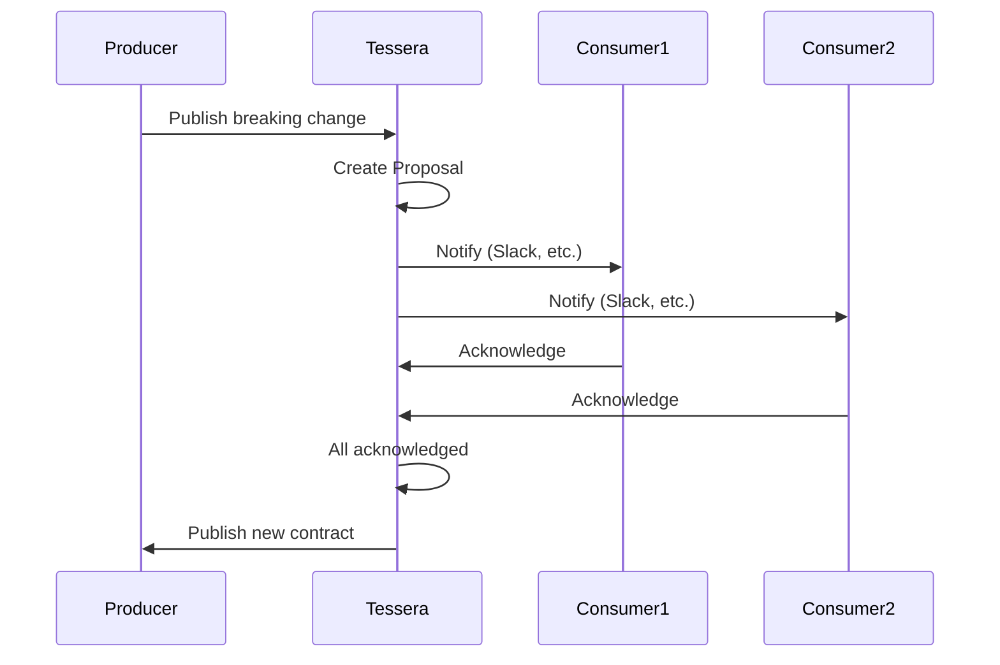

# Breaking Changes

When Tessera detects a breaking change, it creates a proposal workflow to coordinate with consumers.

## The Proposal Workflow



## Creating a Proposal

Proposals are created automatically when you try to publish a breaking change:

```bash
curl -X POST http://localhost:8000/api/v1/assets/{id}/contracts \
  -H "Authorization: Bearer $API_KEY" \
  -d '{
    "schema": { ... },  # Schema with breaking changes
    "compatibility_mode": "backward"
  }'
```

Response:

```json
{
  "action": "proposal_created",
  "proposal": {
    "id": "proposal-uuid",
    "status": "pending",
    "breaking_changes": [...],
    "total_consumers": 3,
    "acknowledgment_count": 0
  }
}
```

## Acknowledging Changes

Consumers acknowledge proposals to signal they're ready:

```bash
curl -X POST http://localhost:8000/api/v1/proposals/{id}/acknowledge \
  -H "Authorization: Bearer $CONSUMER_API_KEY" \
  -d '{
    "notes": "Updated our dashboards to handle this change"
  }'
```

## Proposal Status

| Status | Description |
|--------|-------------|
| `pending` | Waiting for acknowledgments |
| `approved` | All consumers acknowledged |
| `rejected` | Proposal was rejected |
| `published` | Change was published |
| `expired` | Proposal timed out |

## Force Publishing

Admins can force-publish without waiting for acknowledgments:

```bash
curl -X POST http://localhost:8000/api/v1/proposals/{id}/force-publish \
  -H "Authorization: Bearer $ADMIN_API_KEY" \
  -d '{
    "reason": "Critical security fix, cannot wait"
  }'
```

!!! warning "Audit Trail"
    Force publishing is logged in the audit trail with the reason provided.

## Viewing Proposals

### List All Proposals

```bash
curl http://localhost:8000/api/v1/proposals \
  -H "Authorization: Bearer $API_KEY"
```

### Get Proposal Details

```bash
curl http://localhost:8000/api/v1/proposals/{id} \
  -H "Authorization: Bearer $API_KEY"
```

Response includes:

- Breaking changes details
- Consumer list with acknowledgment status
- Proposed schema diff

## Best Practices

1. **Communicate early**: Reach out to consumers before submitting breaking changes
2. **Provide migration guide**: Include notes on how consumers should adapt
3. **Use deprecation**: Mark fields as deprecated before removing
4. **Batch changes**: Combine multiple breaking changes into one proposal
5. **Set deadlines**: Follow up with consumers who haven't acknowledged
