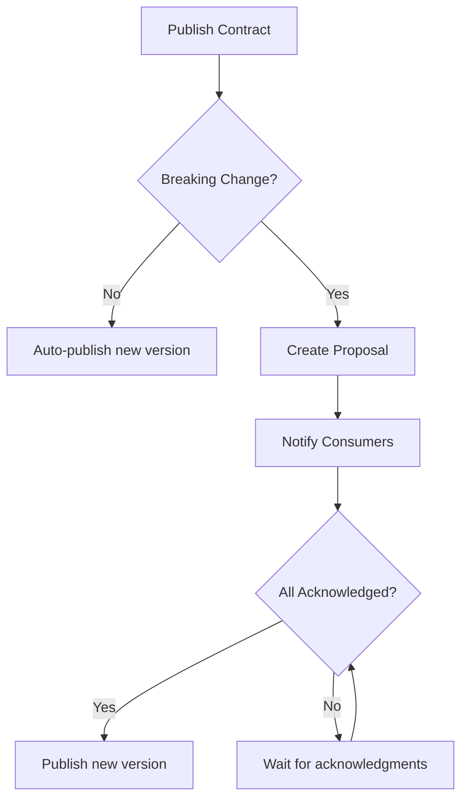

# Concepts Overview

Tessera is built around a few core concepts that work together to coordinate data contracts.

## Core Entities

### Assets

An **Asset** represents a data object in your warehouse - a table, view, or model. Each asset has:

- **FQN (Fully Qualified Name)**: Unique identifier like `warehouse.schema.table`
- **Owner Team**: The team responsible for the asset
- **Metadata**: Tags, descriptions, dbt info

```json
{
  "fqn": "analytics.marts.dim_customers",
  "owner_team_id": "team-uuid",
  "metadata": {
    "resource_type": "model",
    "tags": ["pii", "core"]
  }
}
```

### Contracts

A **Contract** defines the schema guarantee for an asset. It specifies:

- **Schema**: JSON Schema definition of columns and types
- **Compatibility Mode**: How changes are evaluated (backward, forward, full, none)
- **Version**: Semantic version (auto-incremented)
- **Guarantees**: SLAs like freshness and volume requirements

```json
{
  "schema": {
    "type": "object",
    "properties": {
      "customer_id": {"type": "integer"},
      "email": {"type": "string"}
    },
    "required": ["customer_id"]
  },
  "compatibility_mode": "backward",
  "version": "1.0.0"
}
```

### Teams

**Teams** are groups of users who own assets and consume data. Teams:

- Own assets (producers)
- Register as consumers of other assets
- Acknowledge breaking changes

### Registrations

A **Registration** records that a consumer team depends on a contract. When breaking changes are proposed, registered consumers must acknowledge.

### Proposals

A **Proposal** is created when a breaking change is detected. It:

- Lists all breaking changes
- Tracks acknowledgments from consumers
- Can be force-published by admins

## Workflow



## Compatibility Modes

| Mode | Breaking Changes |
|------|------------------|
| `backward` | Remove field, add required, narrow type |
| `forward` | Add field, widen type |
| `full` | Any schema change |
| `none` | Nothing (notify only) |

## Next Steps

- [Assets & Contracts](assets-contracts.md)
- [Schema Diffing](schema-diffing.md)
- [Breaking Changes](breaking-changes.md)
