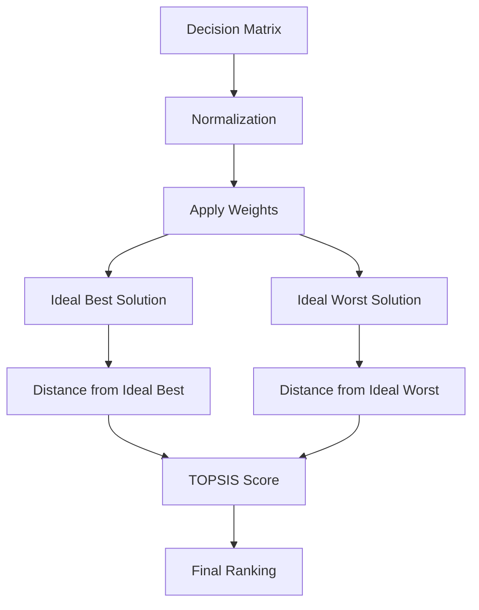
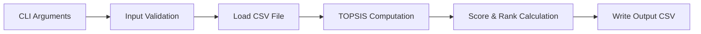

# Topsis-Py (CLI-Based Python Package)

A **Python command-line implementation of TOPSIS**  
(**Technique for Order Preference by Similarity to Ideal Solution**) for  
**Multi-Criteria Decision Making (MCDM)** problems.

This package is designed to be **academically correct**, **easy to use**, and **PyPI-ready**.

---

## 📌 Project Highlights

| Feature | Description |
|--------|-------------|
| Algorithm | Standard TOPSIS methodology |
| Interface | Command-Line Interface (CLI) |
| Input | CSV-based decision matrix |
| Validation | Strict input & argument checks |
| Output | Ranked alternatives with scores |
| Documentation | Clear theory + workflow diagrams |

---

## ❓ What is TOPSIS?

**TOPSIS (Technique for Order Preference by Similarity to Ideal Solution)** is a widely used  
**Multi-Criteria Decision Making (MCDM)** technique.

### 🔑 Core Idea

The best alternative is the one that:

- Is **closest to the ideal best solution**
- Is **farthest from the ideal worst solution**

---

## 🌍 Common Applications

| Domain | Example Use |
|------|------------|
| Engineering | Design or component selection |
| Business | Supplier & product evaluation |
| Finance | Investment ranking |
| Data Science | Model or algorithm comparison |

---

## 🔄 TOPSIS Algorithm Flow



---

## 🧠 Program Workflow



---

## 📦 Installation

```bash
pip install topsis-swastik-102303585
```

---

## 🚀 Usage

```bash
python topsis.py <input_file> <weights> <impacts> <output_file>
```

Example:

```bash
python topsis.py data.csv "1,2,1,1" "+,+,-,+" result.csv
```

---

## ⚠️ Limitations

- Categorical data not supported  
- Missing values not allowed  
- Weights must be positive  
- Impacts must be '+' or '-'  

---

## 📜 License

MIT License
