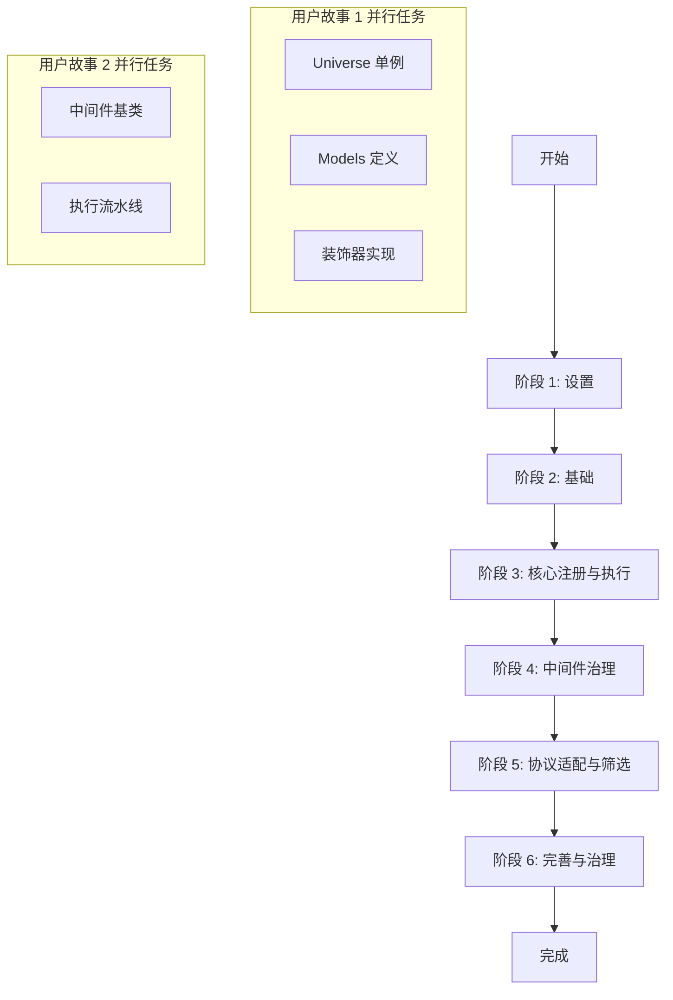

# 实施任务: UniTools SDK

**功能分支**: `001-unitools-sdk`
**输入**: [plan.md](plan.md), [spec.md](spec.md)

## 依赖关系图

## 实施策略

- **MVP 优先**: 首先交付核心的 `Universe` 注册和同步执行能力，确保最基础的 `@tool` 和 `@bind` 装饰器可用。
- **增量交付**: 
    1. 完成核心注册表和元数据提取 (US1)。
    2. 实现中间件洋葱模型，无需一开始就实现复杂中间件 (US2)。
    3. 最后接入 OpenAIDriver 实现与 LLM 的真实交互 (US3)。
- **测试驱动**: 这里的任务未强制要求 TDD，但每个阶段都包含对应的测试任务，确保功能闭环。

---

## 阶段 1: 设置 (Setup)

- [X] T001 初始化 Python 项目结构 (`uni_tool/`, `tests/`)
- [X] T002 配置 `pyproject.toml` 添加依赖 (`pydantic>=2.0`, `docstring_parser`)
- [X] T003 配置 `pyproject.toml` 添加开发依赖 (`pytest`, `pytest-asyncio`)
- [X] T004 创建基础包文件 (`uni_tool/__init__.py`, `uni_tool/core/__init__.py`)

## 阶段 2: 基础 (Foundation)

- [X] T005 [P] 在 `uni_tool/core/errors.py` 定义统一异常 (`DuplicateToolError`, `MissingContextKeyError` 等)
- [X] T006 [P] 在 `uni_tool/core/models.py` 定义核心 Pydantic 模型 (`ToolMetadata`, `ToolCall`, `ToolResult`)
- [X] T007 在 `uni_tool/utils/docstring.py` 实现文档解析工具函数

## 阶段 3: 用户故事 1 - 核心工具注册与执行 (Core Registration & Execution)

**目标**: 实现 `@tool` 装饰器，提取元数据，并通过 `Universe` 单例进行简单的函数调用。

**独立测试标准**: 
- 被装饰的函数出现在 `Universe._registry` 中。
- `Universe.dispatch` 能成功调用同步和异步工具。
- `Injected` 参数能从 context 自动填充。

- [X] T008 [US1] 在 `uni_tool/core/universe.py` 实现 `Universe` 单例模式及 `_registry` 管理
- [X] T009 [US1] 在 `uni_tool/utils/injection.py` 实现依赖注入解析逻辑 (处理 `Annotated[T, Injected]`)
- [X] T010 [US1] 在 `uni_tool/decorators/tool.py` 实现 `@tool` 装饰器 (元数据提取、Pydantic 模型生成)
- [X] T011 [US1] 在 `uni_tool/decorators/bind.py` 实现 `@bind` 类装饰器
- [X] T012 [US1] 在 `uni_tool/core/execution.py` 实现基础 `dispatch` 逻辑 (暂无中间件，仅执行)
- [X] T013 [US1] 在 `tests/unit/test_registry.py` 编写注册与依赖注入的单元测试
- [X] T014 [US1] 在 `tests/integration/test_execution.py` 编写基础执行流程的集成测试

## 阶段 4: 用户故事 2 - 中间件流水线治理 (Middleware Governance)

**目标**: 实现 "洋葱模型" 中间件机制，支持全局、作用域和局部中间件，以及异常隔离。

**独立测试标准**: 
- 中间件按 Global -> Scope -> Local 顺序执行。
- `critical=True` 的中间件异常会阻断流程，`False` 则仅记录日志。

- [X] T015 [US2] 在 `uni_tool/middlewares/base.py` 定义 `MiddlewareProtocol` 及 `MiddlewareObj`
- [X] T016 [US2] 在 `uni_tool/core/universe.py` 添加 `use` 方法及中间件存储结构
- [X] T017 [US2] 在 `uni_tool/core/execution.py` 升级 `dispatch` 以支持中间件流水线 (Assembly, Deduplication, Wrapping)
- [X] T018 [US2] 在 `uni_tool/middlewares/audit.py` 实现基础审计中间件 `AuditMiddleware`
- [X] T019 [US2] 在 `tests/unit/test_middleware.py` 编写中间件顺序、去重和异常隔离的单元测试

## 阶段 5: 用户故事 3 - 协议适配与工具筛选 (Protocol & Filtering)

**目标**: 实现 `Tag`/`Prefix` 筛选表达式，以及 `OpenAIDriver` 对协议的适配。

**独立测试标准**: 
- `u[Tag('a')]` 能筛选出正确工具。
- `OpenAIDriver.render` 生成正确的 JSON Schema。

- [X] T020 [US3] 在 `uni_tool/core/expressions.py` 实现 `ToolExpression` 及逻辑运算，并在 `uni_tool/filters/__init__.py` 实现 `Tag`/`Prefix`
- [X] T021 [US3] 在 `uni_tool/drivers/base.py` 定义 `BaseDriver` 抽象基类
- [X] T022 [US3] 在 `uni_tool/drivers/openai.py` 实现 `OpenAIDriver` (render & parse)
- [X] T023 [US3] 在 `uni_tool/core/universe.py` 集成 `ToolExpression` 支持 (`__getitem__`) 和 Driver 选择
- [X] T024 [US3] 在 `tests/unit/test_expression.py` 编写筛选表达式测试
- [X] T025 [US3] 在 `tests/unit/test_openai_driver.py` 编写 OpenAI 协议适配测试

## 阶段 6: 完善与横切关注点 (Refinement)

**目标**: 实现剩余的内置中间件 (日志、监控)，并导出顶级 API。

- [X] T026 在 `uni_tool/middlewares/monitor.py` 实现监控中间件
- [X] T027 在 `uni_tool/middlewares/logging.py` 实现日志中间件
- [X] T028 在 `uni_tool/__init__.py` 导出所有公共 API 并实例化全局 `universe`
- [X] T029 在 `tests/integration/test_full_flow.py` 编写模拟真实 LLM 交互的端到端测试 (使用 Mock 数据)
