---
# Global deck settings
theme: default
title: Your Presentation Title
info: |
  Professional presentation template with dark theme
  20 slides with modern components
class: text-left
mdc: true
transition: slide-left
fonts:
  sans: Inter, ui-sans-serif, system-ui, -apple-system, Segoe UI, Roboto, Helvetica Neue, Arial
  mono: ui-monospace, SFMono-Regular, Menlo, Monaco, Consolas, "Liberation Mono", "Courier New", monospace
css: |
  @import "./style.css";
---

# PROJECT TITLE

  

    <h2 class="text-hero">Transform Your Business with Innovation</h2>
    
A comprehensive solution for modern enterprises

    
Presenter Name • Date • contact@example.com

    

      <button class="btn-primary">Get Started</button>
      <button class="btn-secondary">Learn More</button>
    

  

---

# The Challenge

  

    
Current State

    <h3 class="feature-title">Market Inefficiencies</h3>
    <ul class="points-clean">
      <li>Complex processes and workflows</li>
      <li>Disconnected systems and data silos</li>
      <li>High operational costs</li>
    </ul>
  

  

    
Industry Trends

    <h3 class="feature-title">Rapid Digital Evolution</h3>
    <ul class="points-clean">
      <li>Accelerating technology adoption</li>
      <li>Changing customer expectations</li>
      <li>New competitive pressures</li>
    </ul>
  

  

    
Gap Analysis

    <h3 class="feature-title">Missing Capabilities</h3>
    <ul class="points-clean">
      <li>Limited automation tools</li>
      <li>Insufficient analytics</li>
      <li>Poor integration options</li>
      <li>Lack of scalability</li>
    </ul>
  

---

# Our Solution

A comprehensive platform that addresses key business challenges

  

    
10x

    
Faster Processing

  

  

    
50%

    
Cost Reduction

  

  

    
99.9%

    
Uptime

  

  

    
Core

    <h3 class="feature-title">Intelligent Automation</h3>
    
Streamline workflows with AI-powered processes

  

  

    
Integration

    <h3 class="feature-title">Seamless Connectivity</h3>
    
Connect all your tools and systems effortlessly

  

  

    
Analytics

    <h3 class="feature-title">Real-time Insights</h3>
    
Make data-driven decisions with powerful analytics

  

---

# Key Features

  

    

      <h3 class="feature-title">Smart Dashboard</h3>
      
Centralized control and monitoring

    

    

      <h3 class="feature-title">Advanced Analytics</h3>
      
Deep insights and predictive modeling

    

    

      <h3 class="feature-title">Workflow Automation</h3>
      
Streamline repetitive tasks

    

  

  

    

      
Product Screenshot / Dashboard UI

    

  

---

# Architecture Overview

```mermaid
%%{init: {
  "theme": "dark",
  "themeVariables": {
    "primaryTextColor": "#E6EDF3",
    "primaryColor": "#0B1220",
    "lineColor": "#6E7681"
  }
}}%%

flowchart TD
    UI[🖥️ User Interface] --> API[⚙️ API Gateway]
    API --> Auth[🔐 Authentication]
    API --> Core[💼 Core Services]
    Core --> DB[(📊 Database)]
    Core --> Cache[(⚡ Cache)]
    Core --> Queue[📬 Message Queue]
    Queue --> Workers[🤖 Background Workers]
    
    style UI fill:#1C1A2B,stroke:#6B7FEB
    style API fill:#1C1A2B,stroke:#6B7FEB
    style Core fill:#1C1A2B,stroke:#6B7FEB
    style DB fill:#2B2931,stroke:#40D79E
    style Cache fill:#2B2931,stroke:#FFC75A
```

---

# Use Cases

  
<h3 class="feature-title">Enterprise Resource Planning</h3>
Unified business management

  
<h3 class="feature-title">Customer Relationship Management</h3>
360-degree customer view

  
<h3 class="feature-title">Supply Chain Optimization</h3>
End-to-end visibility

  
<h3 class="feature-title">Financial Analytics</h3>
Real-time financial insights

  
<h3 class="feature-title">HR Management</h3>
Streamlined HR processes

  
<h3 class="feature-title">Project Management</h3>
Collaborative project tracking

---

# Market Opportunity

  

    

      
TAM

      <h3 class="feature-title">Total Addressable Market</h3>
      
$100B+ globally

    

    

      
Growth

      <h3 class="feature-title">Market Expansion</h3>
      
25% CAGR expected

    

    

      
Segments

      <ul class="points-clean">
        <li>Enterprise (500+ employees)</li>
        <li>Mid-market (50-500)</li>
        <li>SMB (under 50)</li>
      </ul>
    

  

  

    

      
Market Size Chart

    

  

---

# Competitive Landscape

  
Competitive Positioning Matrix

  

    <h3 class="feature-title">Our Advantages</h3>
    <ul class="points-clean">
      <li>Superior technology</li>
      <li>Better user experience</li>
      <li>Competitive pricing</li>
    </ul>
  

  

    <h3 class="feature-title">Market Position</h3>
    <ul class="points-clean">
      <li>Leader in innovation</li>
      <li>Strong brand recognition</li>
      <li>Growing market share</li>
    </ul>
  

  

    <h3 class="feature-title">Differentiators</h3>
    <ul class="points-clean">
      <li>AI-powered features</li>
      <li>Seamless integrations</li>
      <li>Enterprise-grade security</li>
    </ul>
  

---

# Implementation Timeline

  

    

    

      
Phase 1: Q1 2025

      <h4>Foundation</h4>
      <ul class="points-clean">
        <li>System architecture design</li>
        <li>Core infrastructure setup</li>
        <li>Initial team formation</li>
      </ul>
    

  

  

    

    

      
Phase 2: Q2 2025

      <h4>Development</h4>
      <ul class="points-clean">
        <li>MVP development</li>
        <li>Beta testing program</li>
        <li>Initial customer feedback</li>
      </ul>
    

  

  

    

    

      
Phase 3: Q3 2025

      <h4>Launch</h4>
      <ul class="points-clean">
        <li>Public release</li>
        <li>Marketing campaign</li>
        <li>Customer onboarding</li>
      </ul>
    

  

---

# Success Metrics

  

    
1M+

    
Active Users

  

  

    
$50M

    
ARR

  

  

    
95%

    
Retention Rate

  

  

    
150

    
Enterprise Clients

  

  

    
4.8

    
Customer Rating

  

  

    
24/7

    
Support

  

---

# Case Study

  

    

      
Client

      <h3 class="feature-title">Fortune 500 Company</h3>
      <ul class="points-clean">
        <li>10,000+ employees</li>
        <li>Global operations</li>
        <li>Complex IT infrastructure</li>
      </ul>
    

    

      
Challenge

      <ul class="points-clean">
        <li>Fragmented systems</li>
        <li>Manual processes</li>
        <li>Limited visibility</li>
      </ul>
    

  

  

    

      
Results

      <h3 class="feature-title">Transformation Achieved</h3>
      <ul class="points-clean">
        <li>60% efficiency improvement</li>
        <li>$5M annual savings</li>
        <li>Real-time insights</li>
      </ul>
    

    

      
ROI Chart

    

  

---

# Pricing & Plans

  

    
Starter

    <h3 class="feature-title">$99/month</h3>
    <ul class="points-clean">
      <li>Up to 10 users</li>
      <li>Basic features</li>
      <li>Email support</li>
      <li>5GB storage</li>
    </ul>
    <button class="btn-secondary mt-2">Choose Plan</button>
  

  

    
Popular

    <h3 class="feature-title">$299/month</h3>
    <ul class="points-clean">
      <li>Up to 50 users</li>
      <li>Advanced features</li>
      <li>Priority support</li>
      <li>100GB storage</li>
      <li>API access</li>
    </ul>
    <button class="btn-primary mt-2">Choose Plan</button>
  

  

    
Enterprise

    <h3 class="feature-title">Custom</h3>
    <ul class="points-clean">
      <li>Unlimited users</li>
      <li>All features</li>
      <li>Dedicated support</li>
      <li>Unlimited storage</li>
      <li>Custom integrations</li>
    </ul>
    <button class="btn-secondary mt-2">Contact Sales</button>
  

---

# Technology Stack

  

    
Frontend

    <ul class="points-clean">
      <li>React / Vue.js / Angular</li>
      <li>TypeScript</li>
      <li>Tailwind CSS</li>
    </ul>
  

  

    
Backend

    <ul class="points-clean">
      <li>Node.js / Python / Go</li>
      <li>GraphQL / REST APIs</li>
      <li>Microservices</li>
    </ul>
  

  

    
Infrastructure

    <ul class="points-clean">
      <li>AWS / Azure / GCP</li>
      <li>Kubernetes</li>
      <li>CI/CD pipelines</li>
    </ul>
  

  

    
Data

    <ul class="points-clean">
      <li>PostgreSQL / MongoDB</li>
      <li>Redis</li>
      <li>Elasticsearch</li>
    </ul>
  

  

    
Security

    <ul class="points-clean">
      <li>End-to-end encryption</li>
      <li>OAuth 2.0 / SAML</li>
      <li>SOC 2 compliant</li>
    </ul>
  

  

    
Monitoring

    <ul class="points-clean">
      <li>Prometheus / Grafana</li>
      <li>ELK Stack</li>
      <li>APM tools</li>
    </ul>
  

---

# Team

  

    <h4 class="feature-title">CEO</h4>
    
20+ years experience

    
Former Fortune 500 exec

  

  

    <h4 class="feature-title">CTO</h4>
    
15+ years in tech

    
Ex-FAANG engineer

  

  

    <h4 class="feature-title">CPO</h4>
    
Product visionary

    
3 successful exits

  

  

    <h4 class="feature-title">CFO</h4>
    
Finance expert

    
IPO experience

  

  <h3>Advisory Board</h3>
  <ul class="points-clean">
    <li>Industry veterans from leading tech companies</li>
    <li>Domain experts in enterprise software</li>
    <li>Strategic advisors with deep market connections</li>
  </ul>

---

# Customer Testimonials

  

    
"This platform transformed our operations. We've seen incredible efficiency gains and cost savings."

    

      <strong>John Smith</strong> 
      CTO, Tech Corp
    

  

  

    
"The best investment we've made. ROI was evident within the first quarter."

    

      <strong>Jane Doe</strong> 
      CEO, Innovation Inc
    

  

---

# Next Steps

  

    
Get Started Today

    <h2 class="text-hero">Ready to Transform Your Business?</h2>
    
Join thousands of companies already using our platform

    

      <button class="btn-primary">Start Free Trial</button>
      <button class="btn-secondary">Schedule Demo</button>
    

  

  

    

      
Contact

      <ul class="points-clean">
        <li>Sales: sales@example.com</li>
        <li>Support: support@example.com</li>
        <li>Phone: 1-800-EXAMPLE</li>
      </ul>
      
www.example.com

    

  

---

# Appendix

  

    <h3 class="feature-title">Resources</h3>
    <ul class="points-clean">
      <li>Technical documentation</li>
      <li>API reference</li>
      <li>Video tutorials</li>
      <li>Community forum</li>
    </ul>
  

  

    <h3 class="feature-title">Legal</h3>
    <ul class="points-clean">
      <li>Terms of service</li>
      <li>Privacy policy</li>
      <li>Security compliance</li>
      <li>SLA agreements</li>
    </ul>
  

---
layout: center
class: text-center
---

# Thank You

Questions?

Press S for presenter mode • Press E to open editor • Use arrow keys to navigate

