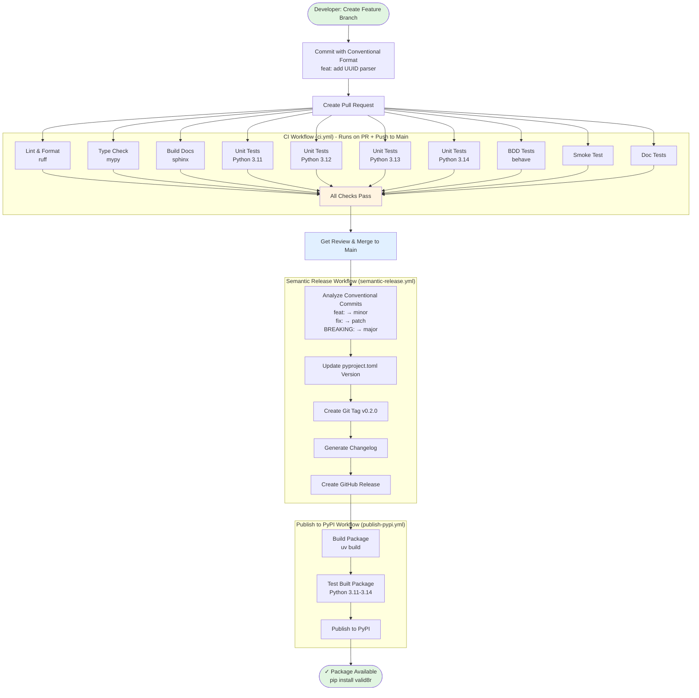
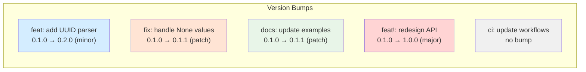
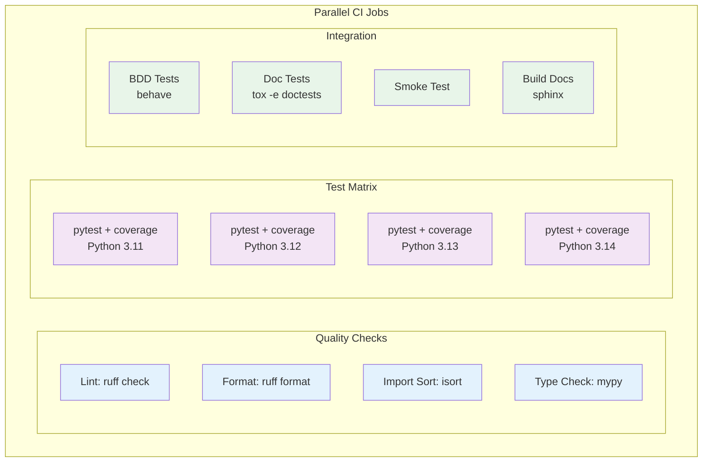

# GitHub Actions CI/CD Pipeline for valid8r

This document visualizes the complete CI/CD pipeline using Mermaid diagrams.

## Developer Workflow → CI → Release → Publish



## Conventional Commit Examples



## Python Version Support Matrix

| Python Version | Status | Notes |
|----------------|--------|-------|
| 3.11 | ✅ Supported | Minimum required version |
| 3.12 | ✅ Supported | Recommended |
| 3.13 | ✅ Supported | Latest stable |
| 3.14 | ✅ Supported | Latest release |

## CI Job Details



## Manual Workflow Triggers

```bash
# Override automatic version detection
gh workflow run semantic-release.yml

# Trigger CI manually
gh workflow run ci.yml

# Re-run publish workflow
gh workflow run publish-pypi.yml
```

## Useful Links

- **Actions**: https://github.com/mikelane/valid8r/actions
- **Releases**: https://github.com/mikelane/valid8r/releases
- **PyPI**: https://pypi.org/project/valid8r/
- **Docs**: https://valid8r.readthedocs.io/

## Migration Note: Poetry → uv

As of this migration, all workflows use `uv` for dependency management:
- `poetry install` → `uv sync`
- `poetry run` → `uv run`
- `poetry build` → `uv build`

Performance improvements:
- CI runs: 8-12 min → 3-5 min (60% faster)
- Dependency resolution: ~2-3 min → ~380ms (300x+ faster)
