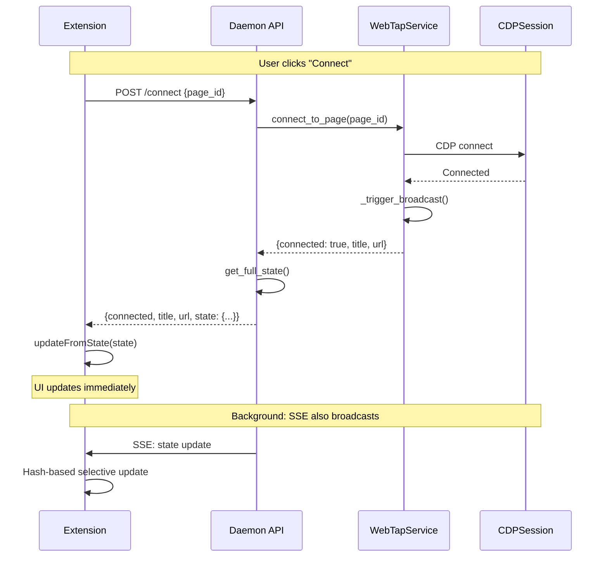

# Design: WebTap Client-Daemon Sync Refactoring

## Architecture Overview

The WebTap extension communicates with the daemon via:
- **SSE** (`/events/stream`): Real-time state broadcasts for background updates
- **REST API**: Action endpoints for user interactions

**Current Problem:** SSE broadcasts rely on `_trigger_broadcast()` which exits early if `_broadcast_queue` is None. In daemon mode, the queue is never wired, so state never updates.

**Solution:** Two-part fix:
1. Wire the broadcast queue in daemon mode
2. Action endpoints return full state in response (immediate sync)

```
┌─────────────────────────────────────────────────────────────────────┐
│                         CURRENT FLOW                                 │
├─────────────────────────────────────────────────────────────────────┤
│  Click "Connect"                                                     │
│       ↓                                                              │
│  POST /connect → {connected: true}                                   │
│       ↓                                                              │
│  Extension waits for SSE... (SSE broken, never comes)                │
│       ↓                                                              │
│  UI shows "Not connected" indefinitely                               │
└─────────────────────────────────────────────────────────────────────┘

┌─────────────────────────────────────────────────────────────────────┐
│                          NEW FLOW                                    │
├─────────────────────────────────────────────────────────────────────┤
│  Click "Connect"                                                     │
│       ↓                                                              │
│  POST /connect → {connected: true, state: {full state}}              │
│       ↓                                                              │
│  Extension updates UI immediately from response.state                │
│       ↓                                                              │
│  SSE also broadcasts (now works) for background updates              │
└─────────────────────────────────────────────────────────────────────┘
```

## Component Analysis

### Existing Components to Modify

#### `packages/webtap/src/webtap/api.py`

**Part A: Wire broadcast queue (lines ~1192-1193)**
```python
# After: broadcast_task = asyncio.create_task(broadcast_processor())
# Add:
await asyncio.sleep(0.1)  # Let broadcast_processor create queue
if _broadcast_queue and app_state:
    app_state.service.set_broadcast_queue(_broadcast_queue)
```

**Part B: Action endpoints return state**

| Endpoint | Lines | Change |
|----------|-------|--------|
| `/connect` | 586-595 | Add `"state": get_full_state()` to response |
| `/disconnect` | 598-607 | Add `"state": get_full_state()` to response |
| `/fetch` | 658-676 | Add `"state": get_full_state()` to response |
| `/clear` | 618-656 | Add `"state": get_full_state()` to response |

#### `packages/webtap/extension/sidepanel.js`

**Part C: Use response state for immediate updates**

Current pattern (all actions):
```javascript
const result = await api("/connect", "POST", { page_id: selectedPageId });
// State update will come via SSE  ← UNRELIABLE
```

New pattern:
```javascript
const result = await api("/connect", "POST", { page_id: selectedPageId });
if (result.state) {
  updateFromState(result.state);  // Immediate update
}
// SSE still broadcasts for background updates
```

### New Components to Create

#### Helper function in `sidepanel.js`

```javascript
/**
 * Update all UI from a full state object.
 * Used for immediate updates from action responses.
 */
function updateFromState(newState) {
  state = newState;
  updateConnectionStatus(newState);
  updateEventCount(newState.events.total);
  updateButtons(newState.connected);
  updateErrorBanner(newState.error);
  updateFetchStatus(newState.fetch.enabled, newState.fetch.paused_count);
  updateFiltersUI(newState.filters);
  updateSelectionUI(newState.browser);

  // Update hashes for SSE change detection
  previousHashes = {
    selections: newState.selections_hash,
    filters: newState.filters_hash,
    fetch: newState.fetch_hash,
    page: newState.page_hash,
    error: newState.error_hash,
  };
}
```

## Data Models

### State Object (unchanged)

```typescript
interface WebTapState {
  connected: boolean;
  page: { id: string; title: string; url: string } | null;
  events: { total: number };
  fetch: { enabled: boolean; paused_count: number };
  filters: { enabled: string[]; disabled: string[] };
  browser: {
    inspect_active: boolean;
    selections: Record<string, any>;
    prompt: string;
    pending_count: number;
  };
  error: { message: string; timestamp: number } | null;
  // Hashes for change detection
  selections_hash: string;
  filters_hash: string;
  fetch_hash: string;
  page_hash: string;
  error_hash: string;
}
```

### Action Response Format (new)

```typescript
// Before
interface ConnectResponse {
  connected: boolean;
  title: string;
  url: string;
}

// After
interface ConnectResponse {
  connected: boolean;
  title: string;
  url: string;
  state: WebTapState;  // NEW: Full state for immediate sync
}

// Same pattern for all action endpoints
interface ActionResponse<T> {
  ...T;              // Original response fields
  state: WebTapState; // Always included
}
```

## API Endpoints

### POST /connect

**Request:**
```json
{ "page_id": "ABC123" }
```

**Response (updated):**
```json
{
  "connected": true,
  "title": "Page Title",
  "url": "https://example.com",
  "state": { /* full WebTapState */ }
}
```

### POST /disconnect

**Response (updated):**
```json
{
  "disconnected": true,
  "was_connected": true,
  "state": { /* full WebTapState */ }
}
```

### POST /fetch

**Request:**
```json
{ "enabled": true, "response_stage": false }
```

**Response (updated):**
```json
{
  "enabled": true,
  "response_stage": false,
  "state": { /* full WebTapState */ }
}
```

### POST /clear

**Request:**
```json
{ "events": true, "console": false, "cache": false }
```

**Response (updated):**
```json
{
  "cleared": ["events"],
  "state": { /* full WebTapState */ }
}
```

## Data Flow



## Error Handling Strategy

All endpoints follow consistent error pattern:

```python
@api.post("/connect")
async def connect(request: ConnectRequest) -> Dict[str, Any]:
    if not app_state:
        return {"error": "WebTap not initialized", "state": get_full_state()}

    try:
        result = await asyncio.to_thread(app_state.service.connect_to_page, page_id=request.page_id)
        return {**result, "state": get_full_state()}
    except Exception as e:
        return {"error": str(e), "state": get_full_state()}
```

**Key principle:** Always return state, even on error, so UI stays consistent.

## Security Considerations

- No new attack surface (same endpoints, just richer responses)
- State contains no secrets (just connection status, counts, hashes)
- All requests are localhost-only (127.0.0.1:8765)

## Migration Strategy

**Breaking changes allowed** - this is a comprehensive refactor prioritizing clean architecture over backward compatibility.

1. **Backend:** Update all action endpoints to return state
2. **Extension:** Refactor to use response state as primary, SSE as secondary
3. **Clean up:** Remove any backward-compat shims or workarounds
