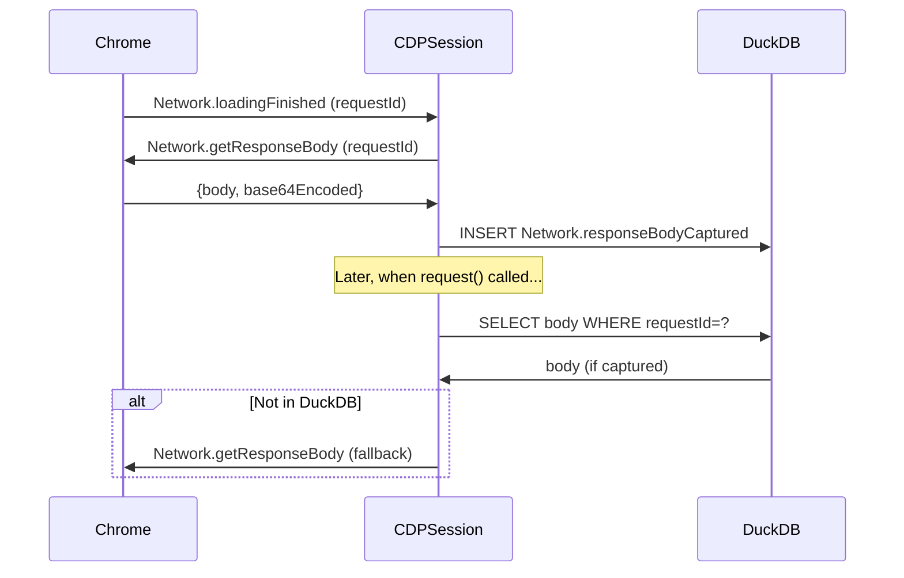

# Design: Daemon-Side Immediate Body Capture

## Architecture Overview

The daemon already receives `Network.loadingFinished` events via CDP WebSocket. We add an event callback to capture bodies immediately when requests complete, before any page navigation can evict them.

```
Chrome                    Daemon
  │                         │
  ├─ loadingFinished ──────►│
  │                         ├─ callback fires
  │◄─ getResponseBody ──────┤
  ├─ body ─────────────────►│
  │                         ├─ store in DuckDB
  │                         │
  ├─ JS redirect ──────────►│ (body already safe)
```

## Component Analysis

### Existing Components to Modify

#### `src/webtap/cdp/session.py` - CDPSession
Already modified:
- `fetch_body()` - checks DuckDB for captured body before CDP fallback ✓
- `store_response_body()` - stores captured bodies as synthetic events ✓

Needs addition:
- Register callback on `Network.loadingFinished` after connection

#### `src/webtap/services/main.py` - WebTapService
- After enabling Network domain, register the body capture callback on CDPSession

### No New Components Needed

The infrastructure already exists:
- Event callback system in CDPSession (`register_event_callback`)
- Body storage (`store_response_body`)
- Body retrieval with DuckDB fallback (`fetch_body`)

## Data Flow



## Implementation Details

### Callback Registration

Register in `WebTapService._enable_domains()` after `Network.enable` succeeds:

```python
def _on_loading_finished(event: dict) -> None:
    params = event.get("params", {})
    request_id = params.get("requestId")
    if not request_id:
        return

    # Capture body immediately (blocking is OK - fast operation)
    try:
        result = cdp.execute("Network.getResponseBody", {"requestId": request_id}, timeout=5)
        if result and "body" in result:
            cdp.store_response_body(request_id, result["body"], result.get("base64Encoded", False))
    except Exception:
        pass  # Body might not exist (204, redirects, etc.)

cdp.register_event_callback("Network.loadingFinished", _on_loading_finished)
```

### Timeout Handling

- Use short timeout (5s) for `getResponseBody` to not block event processing
- Silently ignore failures (body might not exist for 204, redirects, etc.)

### Thread Safety

- Callback runs in WebSocket thread (same as other event callbacks)
- `store_response_body` uses `_db_execute` with `wait_result=False` (async insert)
- No locking needed - DuckDB handles concurrency

## Error Handling Strategy

| Scenario | Handling |
|----------|----------|
| Body not available (204, etc.) | Silent ignore |
| Timeout fetching body | Silent ignore |
| DuckDB insert fails | Log warning, continue |
| Duplicate capture (extension + daemon) | Both succeed, first wins on lookup |

## Security Considerations

None - this is purely internal event handling within the daemon.

## Migration Strategy

None needed - purely additive change with transparent fallback.
