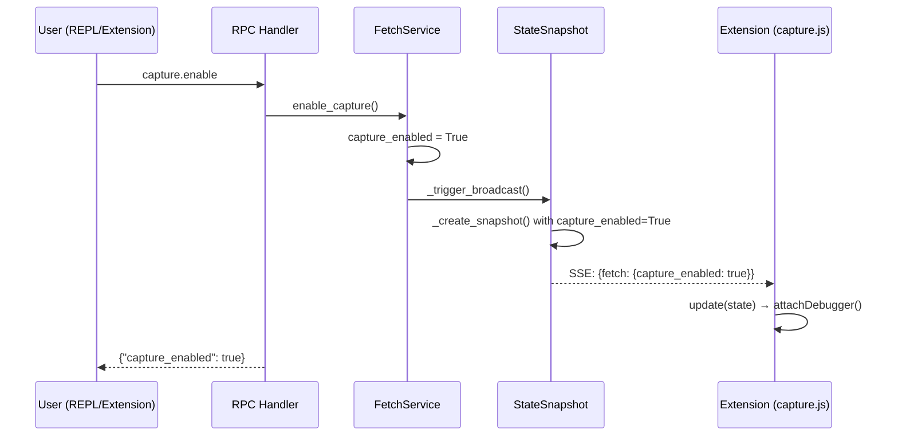
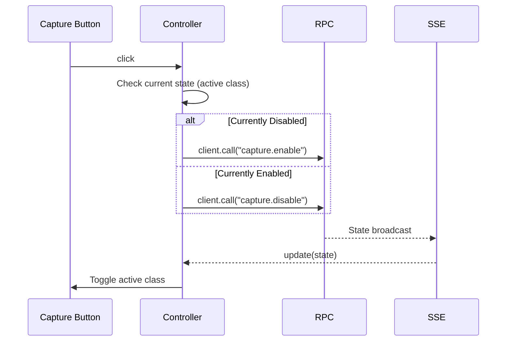

# Design: Fetch Capture Toggle

## Architecture Overview

The capture toggle adds a new state flag (`capture_enabled`) to the existing FetchService, following the same patterns as `fetch_enabled` for interception. The extension already has `capture.js` implemented—it just needs the backend state and RPC methods to control it.

```
┌─────────────────────────────────────────────────────────────────┐
│                         REPL/MCP                                │
│                    capture("enable")                            │
└───────────────────────────┬─────────────────────────────────────┘
                            │ RPC: capture.enable
┌───────────────────────────▼─────────────────────────────────────┐
│                      RPC Handlers                               │
│              capture_enable() / capture_disable()               │
└───────────────────────────┬─────────────────────────────────────┘
                            │ delegates to
┌───────────────────────────▼─────────────────────────────────────┐
│                      FetchService                               │
│   capture_enabled: bool                                         │
│   enable_capture() → _trigger_broadcast()                       │
│   disable_capture() → _trigger_broadcast()                      │
└───────────────────────────┬─────────────────────────────────────┘
                            │ creates
┌───────────────────────────▼─────────────────────────────────────┐
│                     StateSnapshot                               │
│   capture_enabled: bool  ◄── NEW FIELD                          │
└───────────────────────────┬─────────────────────────────────────┘
                            │ SSE broadcast
┌───────────────────────────▼─────────────────────────────────────┐
│                   Extension (capture.js)                        │
│   update(state) → checks state.fetch.capture_enabled            │
│   Already implemented: attaches/detaches chrome.debugger        │
└─────────────────────────────────────────────────────────────────┘
```

## Component Analysis

### Existing Components to Modify

| File | Changes |
|------|---------|
| `src/webtap/services/fetch.py` | Add `capture_enabled` flag, `enable_capture()`, `disable_capture()` methods |
| `src/webtap/services/state_snapshot.py` | Add `capture_enabled: bool` field to frozen dataclass |
| `src/webtap/services/main.py` | Include `capture_enabled` in `_create_snapshot()` |
| `src/webtap/api/state.py` | Add `capture_enabled` to `fetch` dict, update `fetch_hash` |
| `src/webtap/rpc/handlers.py` | Register `capture.enable` and `capture.disable` handlers |
| `extension/sidepanel.html` | Add Capture toggle button in header |
| `extension/main.js` | Import and wire capture controller (update calls already exist) |

### New Components to Create

| File | Purpose |
|------|---------|
| `src/webtap/commands/capture.py` | REPL/MCP `capture()` command |
| `extension/controllers/capture.js` | UI controller for toggle button |

## Data Models

### StateSnapshot Addition

```python
# In services/state_snapshot.py
@dataclass(frozen=True)
class StateSnapshot:
    # ... existing fields ...

    # Fetch interception state
    fetch_enabled: bool
    response_stage: bool
    paused_count: int
    capture_enabled: bool  # NEW - Extension-side body capture
```

### SSE State Format

```python
# In api/state.py get_full_state()
{
    "fetch": {
        "enabled": snapshot.fetch_enabled,
        "response_stage": snapshot.response_stage,
        "paused_count": snapshot.paused_count,
        "capture_enabled": snapshot.capture_enabled,  # NEW
    },
    # Update fetch_hash to include capture state
    "fetch_hash": _stable_hash(
        f"{snapshot.fetch_enabled}:{snapshot.response_stage}:"
        f"{snapshot.paused_count}:{snapshot.capture_enabled}"
    ),
}
```

## API Design

### RPC Methods

```python
# capture.enable - Requires connected state
# Request: {}
# Response: {"capture_enabled": true}

# capture.disable - Requires connected state
# Request: {}
# Response: {"capture_enabled": false}
```

### REPL Command

```python
capture("enable")   # → {"capture_enabled": True}
capture("disable")  # → {"capture_enabled": False}
capture("status")   # → {"capture_enabled": True/False}
capture()           # → Same as capture("status")
```

## Data Flow

### Enable Capture Flow



### Extension Toggle Flow



## Error Handling Strategy

| Error Condition | Handling |
|----------------|----------|
| Enable without connection | RPC returns error, button stays disabled via `data-disabled="!connected"` |
| chrome.debugger attach fails | `capture.js` logs error, continues (graceful degradation) |
| RPC call fails | Controller catches, calls `onError` callback |

## Security Considerations

- No new security concerns—capture uses existing `chrome.debugger` permission
- Response bodies stored via existing `store_response_body()` mechanism
- No sensitive data exposed beyond what's already available via DevTools

## Implementation Details

### FetchService Changes

```python
# services/fetch.py
class FetchService:
    def __init__(self):
        self._lock = threading.Lock()
        self.enabled = False
        self.enable_response_stage = False
        self.capture_enabled = False  # NEW
        self.service: "Any" = None

    def enable_capture(self) -> dict:
        """Enable extension-side body capture."""
        with self._lock:
            self.capture_enabled = True
        self._trigger_broadcast()
        return {"capture_enabled": True}

    def disable_capture(self) -> dict:
        """Disable extension-side body capture."""
        with self._lock:
            self.capture_enabled = False
        self._trigger_broadcast()
        return {"capture_enabled": False}
```

### RPC Handler Registration

```python
# rpc/handlers.py
def register_handlers(rpc: RPCFramework) -> None:
    # ... existing handlers ...

    # Capture (extension-side body recording)
    rpc.method("capture.enable", requires_state=CONNECTED_STATES)(capture_enable)
    rpc.method("capture.disable", requires_state=CONNECTED_STATES)(capture_disable)

def capture_enable(ctx: RPCContext) -> dict:
    """Enable extension-side response body capture."""
    return ctx.service.fetch.enable_capture()

def capture_disable(ctx: RPCContext) -> dict:
    """Disable extension-side response body capture."""
    return ctx.service.fetch.disable_capture()
```

### Extension Controller

```javascript
// controllers/capture.js
let client = null;
let onError = null;

export function init(c, callbacks = {}) {
  client = c;
  onError = callbacks.onError || console.error;

  const btn = document.getElementById("captureToggle");
  if (!btn) return;

  btn.onclick = async () => {
    const isEnabled = btn.classList.contains("active");
    const method = isEnabled ? "capture.disable" : "capture.enable";
    try {
      await client.call(method);
    } catch (err) {
      onError(err);
    }
  };
}

export function update(state) {
  const btn = document.getElementById("captureToggle");
  if (!btn) return;

  const enabled = state.fetch?.capture_enabled || false;
  btn.classList.toggle("active", enabled);
}
```

### HTML Button

```html
<!-- In sidepanel.html, after interceptDropdown -->
<button
  id="captureToggle"
  class="btn-sm"
  title="Toggle response body capture"
  data-disabled="!connected"
>
  Capture
</button>
```

### Main.js Wiring

```javascript
// Already exists:
import * as capture from "./capture.js";

// Already exists in setupEventHandlers():
capture.update(state);

// Already exists in discoverAndConnect():
capture.init(client);

// CHANGE NEEDED: Pass callbacks to capture.init()
capture.init(client, callbacks);  // Add callbacks parameter
```

## File Changes Summary

| File | Lines Changed | Type |
|------|---------------|------|
| `services/state_snapshot.py` | +1 field | Modify |
| `services/fetch.py` | +15 lines | Modify |
| `services/main.py` | +1 line in snapshot | Modify |
| `api/state.py` | +2 lines | Modify |
| `rpc/handlers.py` | +10 lines | Modify |
| `commands/capture.py` | ~30 lines | New |
| `commands/__init__.py` | +1 import | Modify |
| `extension/sidepanel.html` | +6 lines | Modify |
| `extension/controllers/capture.js` | ~30 lines | New |
| `extension/main.js` | +1 import, +1 line | Modify |
