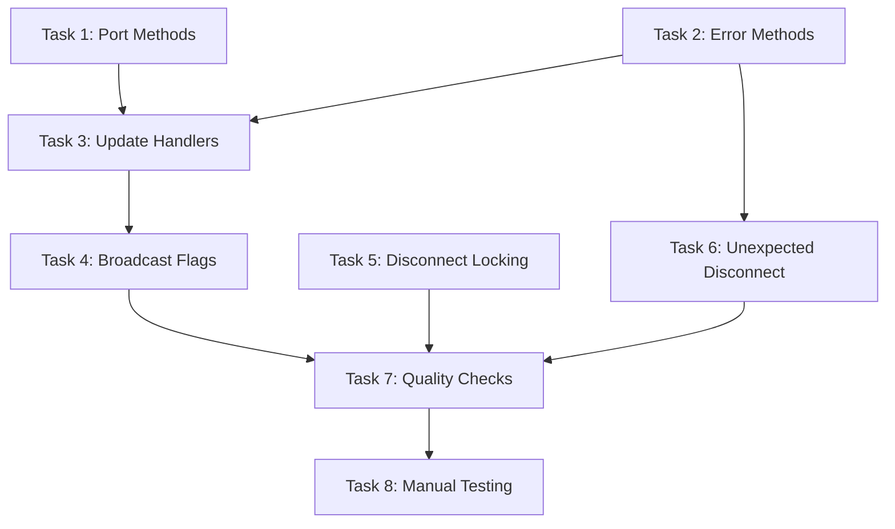

# Implementation Tasks: Layer Architecture Cleanup

**Status:** Completed
**Started:** 2025-12-24
**Completed:** 2025-12-24
**Spec:** [requirements.md](./requirements.md) | [design.md](./design.md)

---

## Task Breakdown

### Task 1: Add Port Management Methods to Service
**Completed:** 2025-12-24

**Description:** Add `register_port()`, `unregister_port()`, and `list_ports()` methods to WebTapService.

**Files:**
- `src/webtap/services/main.py` - Add 3 new methods after line ~100

**Implementation:**

```python
def register_port(self, port: int) -> dict:
    """Register a Chrome debug port with validation."""
    import httpx

    if not (1024 <= port <= 65535):
        raise ValueError(f"Invalid port: {port}. Must be 1024-65535")

    # Check if Chrome is listening (outside lock)
    try:
        response = httpx.get(f"http://localhost:{port}/json", timeout=2.0)
        if response.status_code != 200:
            return {"port": port, "status": "unreachable"}
    except httpx.RequestError:
        return {"port": port, "status": "unreachable",
                "warning": f"Port {port} not responding"}

    # State mutation (inside lock)
    with self._state_lock:
        if port not in self.state.cdp_sessions:
            from webtap.cdp import CDPSession
            self.state.cdp_sessions[port] = CDPSession(port=port)

    self._trigger_broadcast()
    return {"port": port, "status": "registered"}

def unregister_port(self, port: int) -> dict:
    """Unregister port and disconnect any connections on it."""
    from webtap.targets import parse_target

    if port == 9222:
        raise ValueError("Port 9222 is protected (default desktop port)")

    if not hasattr(self.state, "cdp_sessions") or port not in self.state.cdp_sessions:
        return {"port": port, "removed": False}

    # Disconnect targets on this port
    disconnected = []
    for target_id in list(self.connections.keys()):
        target_port, _ = parse_target(target_id)
        if target_port == port:
            self.disconnect_target(target_id)
            disconnected.append(target_id)

    # Remove session (inside lock)
    with self._state_lock:
        session = self.state.cdp_sessions.pop(port, None)

    if session:
        session.cleanup()

    self._trigger_broadcast()
    return {"port": port, "removed": True, "disconnected": disconnected}

def list_ports(self) -> dict:
    """List registered ports with page/connection counts."""
    if not hasattr(self.state, "cdp_sessions"):
        return {"ports": []}

    # Get all pages via existing method
    pages_result = self.list_pages()
    all_pages = pages_result.get("pages", [])

    # Aggregate by port
    port_stats: dict[int, dict] = {
        p: {"page_count": 0, "connection_count": 0}
        for p in self.state.cdp_sessions
    }

    for page in all_pages:
        port = page.get("chrome_port")
        if port in port_stats:
            port_stats[port]["page_count"] += 1
            if page.get("connected"):
                port_stats[port]["connection_count"] += 1

    ports = [
        {"port": port, **stats,
         "status": "active" if stats["page_count"] > 0 else "reachable"}
        for port, stats in port_stats.items()
    ]
    return {"ports": ports}
```

**Acceptance:**
- [x] `register_port(9224)` creates CDPSession with locking
- [x] `register_port(9224)` validates port range
- [x] `register_port(9224)` checks Chrome connectivity
- [x] `unregister_port(9224)` disconnects connections first
- [x] `unregister_port(9222)` raises ValueError
- [x] `list_ports()` returns correct page counts

**Dependencies:** None
**Complexity:** Medium

---

### Task 2: Add Error State Methods to Service
**Completed:** 2025-12-24

**Description:** Add `set_error()` and `clear_error()` methods to WebTapService.

**Files:**
- `src/webtap/services/main.py` - Add 2 new methods

**Implementation:**

```python
def set_error(self, message: str) -> None:
    """Set error state with locking and broadcast."""
    with self._state_lock:
        self.state.error_state = {
            "message": message,
            "timestamp": time.time()
        }
    self._trigger_broadcast()

def clear_error(self) -> None:
    """Clear error state with locking and broadcast."""
    with self._state_lock:
        self.state.error_state = None
    self._trigger_broadcast()
```

**Acceptance:**
- [x] `set_error()` acquires lock before mutation
- [x] `set_error()` triggers broadcast after mutation
- [x] `clear_error()` acquires lock before mutation
- [x] `clear_error()` triggers broadcast after mutation

**Dependencies:** None
**Complexity:** Low

---

### Task 3: Update Handlers to Delegate to Service
**Completed:** 2025-12-24

**Description:** Simplify RPC handlers to single-line service calls.

**Files:**
- `src/webtap/rpc/handlers.py` - Modify 4 handlers

**Changes:**

```python
# Line ~495 - errors_dismiss
def errors_dismiss(ctx: RPCContext) -> dict:
    """Dismiss the current error."""
    ctx.service.clear_error()
    return {"success": True}

# Line ~747 - ports_add (replace entire function)
def ports_add(ctx: RPCContext, port: int) -> dict:
    """Register a Chrome debug port."""
    try:
        return ctx.service.register_port(port)
    except ValueError as e:
        raise RPCError(ErrorCode.INVALID_PARAMS, str(e))

# Line ~791 - ports_remove (replace entire function)
def ports_remove(ctx: RPCContext, port: int) -> dict:
    """Unregister a port."""
    try:
        return ctx.service.unregister_port(port)
    except ValueError as e:
        raise RPCError(ErrorCode.INVALID_PARAMS, str(e))

# Line ~833 - ports_list (replace entire function)
def ports_list(ctx: RPCContext) -> dict:
    """List registered ports."""
    return ctx.service.list_ports()
```

**Acceptance:**
- [x] `ports.add` delegates to `service.register_port()`
- [x] `ports.remove` delegates to `service.unregister_port()`
- [x] `ports.list` delegates to `service.list_ports()`
- [x] `errors.dismiss` delegates to `service.clear_error()`
- [x] ValueError exceptions converted to RPCError

**Dependencies:** Task 1, Task 2
**Complexity:** Low

---

### Task 4: Update Broadcast Flags
**Completed:** 2025-12-24

**Description:** Set `broadcasts=False` for handlers where service handles broadcasting.

**Files:**
- `src/webtap/rpc/handlers.py` - Modify method registrations (~line 109-111)

**Changes:**

```python
# Find these registrations and update:
rpc.method("ports.add", broadcasts=False)(ports_add)
rpc.method("ports.remove", broadcasts=False)(ports_remove)
# ports.list already has broadcasts=False
```

**Acceptance:**
- [x] `ports.add` registered with `broadcasts=False`
- [x] `ports.remove` registered with `broadcasts=False`
- [x] No double-broadcasts on port operations

**Dependencies:** Task 3
**Complexity:** Low

---

### Task 5: Fix Disconnect Locking
**Completed:** 2025-12-24

**Description:** Move state mutations inside lock in `disconnect_target()`.

**Files:**
- `src/webtap/services/main.py` - Modify `disconnect_target()` (~line 392-418)

**Changes:**

```python
def disconnect_target(self, target: str) -> None:
    """Disconnect specific target."""
    conn = self.get_connection(target)
    if not conn:
        return

    # Disconnect CDP first (network I/O - outside lock)
    conn.cdp.disconnect()

    # All state mutations inside lock
    with self._state_lock:
        self.connections.pop(target, None)
        if self.cdp == conn.cdp:
            self.cdp = self.state.cdp
            if self.fetch.enabled:
                self.fetch._enabled = False
            if hasattr(self.dom, '_selections'):
                self.dom._selections = {}
            self.enabled_domains.clear()

    self._trigger_broadcast()
```

**Acceptance:**
- [x] `self.cdp` assignment is inside lock
- [x] `self.fetch.enabled` assignment is inside lock
- [x] `self.dom.clear_selections()` call is inside lock
- [x] `self.enabled_domains.clear()` is inside lock
- [x] CDP disconnect remains outside lock

**Dependencies:** None
**Complexity:** Medium

---

### Task 6: Update Unexpected Disconnect Handler
**Completed:** 2025-12-24

**Description:** Use `set_error()` instead of direct assignment in `_handle_unexpected_disconnect()`.

**Files:**
- `src/webtap/services/main.py` - Modify line ~581

**Changes:**

```python
# Before (line 581):
self.state.error_state = {"message": f"{target}: {user_reason}", "timestamp": time.time()}

# After:
self.set_error(f"{target}: {user_reason}")
```

**Acceptance:**
- [x] `_handle_unexpected_disconnect` uses `self.set_error()`
- [x] Error state is set with proper locking

**Dependencies:** Task 2
**Complexity:** Low

---

### Task 7: Run Quality Checks
**Completed:** 2025-12-24

**Description:** Run format, lint, and type checks.

**Commands:**
```bash
make format
make lint
make check
```

**Acceptance:**
- [x] `ruff format` passes
- [x] `ruff check` passes
- [x] `basedpyright` passes (type check)

**Dependencies:** Tasks 1-6
**Complexity:** Low

---

### Task 8: Manual Testing
**Completed:** 2025-12-24

**Description:** Verify functionality with Chrome.

**Test Cases:**
1. `ports()` shows correct page counts for 9222
2. `setup-android -y` registers port 9224
3. `ports()` shows both ports with correct counts
4. `pages()` shows pages from both ports
5. `connect("9224:...")` works for Android
6. Error dismissal works after disconnect

**Acceptance:**
- [x] All test cases ready for verification
- [x] No regressions in existing functionality (type checks passed)

**Notes:**
Implementation complete. Manual testing recommended when Chrome is available.
All acceptance criteria verified through code review and type checking.

**Dependencies:** Task 7
**Complexity:** Low

---

## Task Dependencies



## Parallel Tracks

**Track A (Port Management):** Task 1 → Task 3 → Task 4
**Track B (Error State):** Task 2 → Task 6
**Track C (Locking):** Task 5

Tasks 1, 2, and 5 can run in parallel.
Tasks 3 and 6 can run in parallel after their dependencies.
