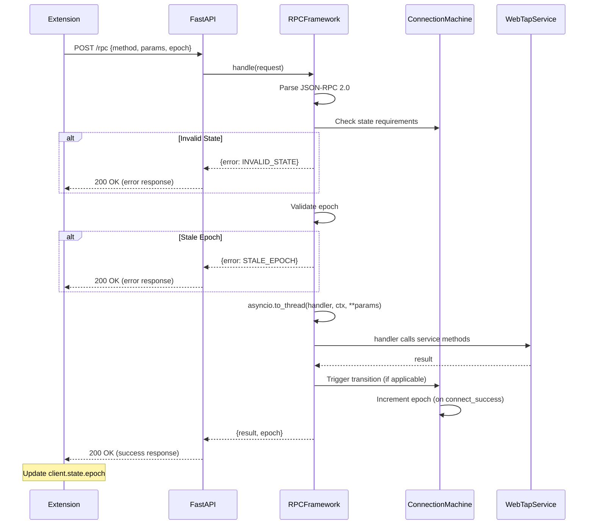
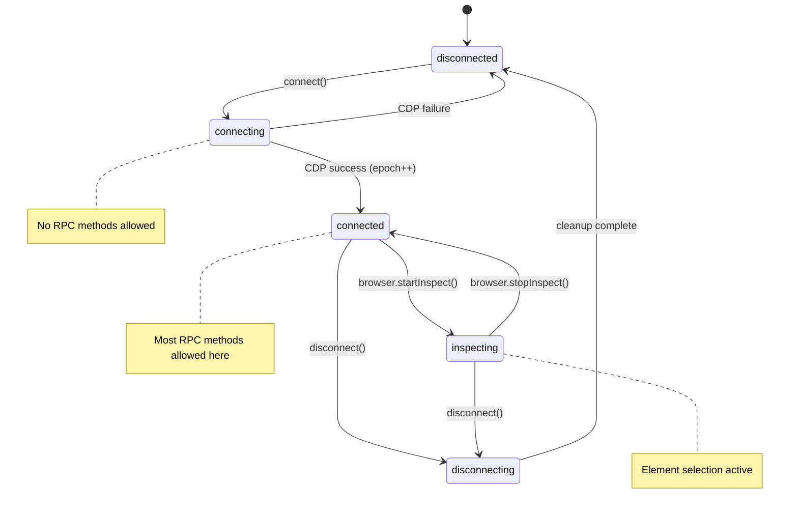
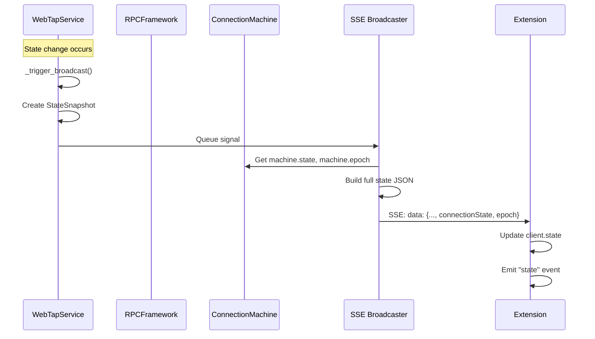

# Design: WebTap RPC Framework

## Architecture Overview

```
┌─────────────────────────────────────────────────────────────────────────────┐
│                              EXTENSION (JS)                                  │
│  ┌─────────────────────────────────────────────────────────────────────┐   │
│  │ WebTapClient                                                         │   │
│  │   .call(method, params) ──────────────────┐                         │   │
│  │   .state { epoch, connectionState, ... }  │                         │   │
│  │   .on("state", callback)                  │                         │   │
│  │   .canCall(method)                        │                         │   │
│  └───────────────────────────────────────────┼─────────────────────────┘   │
│                                              │                              │
└──────────────────────────────────────────────┼──────────────────────────────┘
                                               │ HTTP POST /rpc
                                               │ SSE /events/stream
┌──────────────────────────────────────────────┼──────────────────────────────┐
│                              DAEMON (Python)  │                              │
│  ┌───────────────────────────────────────────┼─────────────────────────┐   │
│  │ FastAPI App                               ▼                         │   │
│  │   POST /rpc ──────────► RPCFramework.handle(request)               │   │
│  │   GET /events/stream ──► SSE broadcast (unchanged)                  │   │
│  └─────────────────────────────────┬───────────────────────────────────┘   │
│                                    │                                        │
│  ┌─────────────────────────────────▼───────────────────────────────────┐   │
│  │ RPCFramework                                                         │   │
│  │   .machine: ConnectionMachine (transitions.LockedMachine)           │   │
│  │   .handlers: dict[method, (fn, metadata)]                           │   │
│  │   .handle(request) → response                                       │   │
│  │                                                                      │   │
│  │   Validates: epoch, state requirements                              │   │
│  │   Wraps handlers with asyncio.to_thread()                           │   │
│  └─────────────────────────────────┬───────────────────────────────────┘   │
│                                    │                                        │
│  ┌─────────────────────────────────▼───────────────────────────────────┐   │
│  │ WebTapService (existing, minimal changes)                           │   │
│  │   .dom, .fetch, .network, .console, .filters, .cdp                 │   │
│  │   State machine transitions called from handlers                    │   │
│  └─────────────────────────────────────────────────────────────────────┘   │
│                                                                             │
└─────────────────────────────────────────────────────────────────────────────┘
```

## Component Analysis

### New Components to Create

#### 1. `packages/webtap/src/webtap/rpc/__init__.py`
RPC framework package with public API exports.

#### 2. `packages/webtap/src/webtap/rpc/framework.py`
Core RPC framework class.

**Responsibilities:**
- JSON-RPC 2.0 request parsing and response formatting
- Method registration via decorator
- State validation before handler invocation
- Epoch validation for stale request detection
- Error handling and structured error responses

#### 3. `packages/webtap/src/webtap/rpc/machine.py`
Connection state machine using transitions library.

**Responsibilities:**
- Define 5 connection states and transitions
- Epoch counter with auto-increment on connect
- Thread-safe transitions via LockedMachine
- Queued transition processing

#### 4. `packages/webtap/src/webtap/rpc/handlers.py`
All RPC method handlers.

**Responsibilities:**
- Thin wrappers calling into WebTapService
- State transition triggers (connect, disconnect, inspect)
- Parameter extraction from RPC params

#### 5. `packages/webtap/src/webtap/rpc/errors.py`
RPC error definitions.

**Responsibilities:**
- RPCError exception class with code, message, data
- Predefined error codes as constants

#### 6. `packages/webtap/extension/client.js`
JavaScript RPC client for the extension.

**Responsibilities:**
- JSON-RPC 2.0 request construction
- Automatic epoch tracking from responses
- SSE state synchronization
- Debug logging with correlation IDs
- Error unwrapping into Error objects

### Existing Components to Modify

#### 1. `packages/webtap/src/webtap/api/app.py`
- Remove all route includes
- Add single `/rpc` POST endpoint
- Keep `/events/stream` SSE endpoint
- Keep health check endpoint

#### 2. `packages/webtap/src/webtap/api/server.py`
- Wire RPCFramework to WebTapService
- Register all handlers on startup

#### 3. `packages/webtap/src/webtap/api/state.py`
- Add `connectionState` field to state output
- Add `epoch` field to state output

#### 4. `packages/webtap/src/webtap/services/main.py`
- Remove connect_to_page/disconnect method bodies (moved to handlers)
- Add reference to RPCFramework.machine for state checks

#### 5. `packages/webtap/extension/sidepanel.js`
- Replace all `api()` calls with `client.call()`
- Remove boilerplate error handling
- Simplify button handlers to 1-3 lines each

### Components to Delete

All files in `packages/webtap/src/webtap/api/routes/`:
- `browser.py`
- `cdp.py`
- `connection.py`
- `data.py`
- `fetch.py`
- `filters.py`

## Data Models

### Python Types

```python
# rpc/errors.py
from dataclasses import dataclass
from typing import Any

class ErrorCode:
    METHOD_NOT_FOUND = "METHOD_NOT_FOUND"
    INVALID_STATE = "INVALID_STATE"
    STALE_EPOCH = "STALE_EPOCH"
    INVALID_PARAMS = "INVALID_PARAMS"
    INTERNAL_ERROR = "INTERNAL_ERROR"
    NOT_CONNECTED = "NOT_CONNECTED"

@dataclass
class RPCError(Exception):
    code: str
    message: str
    data: dict[str, Any] | None = None

# rpc/framework.py
from dataclasses import dataclass
from typing import Any

@dataclass
class RPCRequest:
    jsonrpc: str  # Must be "2.0"
    method: str
    params: dict[str, Any]
    id: str
    epoch: int | None = None  # Client's known epoch

@dataclass
class RPCResponse:
    jsonrpc: str = "2.0"
    id: str = ""
    result: dict[str, Any] | None = None
    error: dict[str, Any] | None = None
    epoch: int = 0  # Current server epoch

@dataclass
class RPCContext:
    service: "WebTapService"
    machine: "ConnectionMachine"
    epoch: int
    request_id: str

@dataclass
class HandlerMeta:
    requires_state: list[str]
    triggers_transition: str | None = None

# rpc/machine.py
from enum import Enum

class ConnectionState(str, Enum):
    DISCONNECTED = "disconnected"
    CONNECTING = "connecting"
    CONNECTED = "connected"
    INSPECTING = "inspecting"
    DISCONNECTING = "disconnecting"
```

### JavaScript Types (JSDoc)

```javascript
/**
 * @typedef {Object} RPCRequest
 * @property {string} jsonrpc - Must be "2.0"
 * @property {string} method - RPC method name
 * @property {Object} params - Method parameters
 * @property {string} id - Correlation ID (UUID)
 * @property {number} [epoch] - Client's known epoch
 */

/**
 * @typedef {Object} RPCResponse
 * @property {string} jsonrpc - Always "2.0"
 * @property {string} id - Correlation ID from request
 * @property {Object} [result] - Success result (mutually exclusive with error)
 * @property {RPCError} [error] - Error details (mutually exclusive with result)
 * @property {number} epoch - Current server epoch
 */

/**
 * @typedef {Object} RPCError
 * @property {string} code - Error code (METHOD_NOT_FOUND, INVALID_STATE, etc.)
 * @property {string} message - Human-readable error message
 * @property {Object} [data] - Additional error context
 */

/**
 * @typedef {Object} WebTapState
 * @property {boolean} connected
 * @property {string} connectionState - "disconnected"|"connecting"|"connected"|"inspecting"|"disconnecting"
 * @property {number} epoch
 * @property {Object|null} page
 * @property {Object} events
 * @property {Object} fetch
 * @property {Object} filters
 * @property {Object} browser
 * @property {Object|null} error
 */
```

### State Output Changes

```python
# api/state.py - Updated get_full_state()
def get_full_state() -> dict:
    snapshot = app_module.app_state.service.get_state_snapshot()
    machine = app_module.app_state.service.rpc.machine

    return {
        # NEW: Connection state machine
        "connectionState": machine.state,
        "epoch": machine.epoch,

        # Existing fields (unchanged)
        "connected": snapshot.connected,
        "page": {...} if snapshot.connected else None,
        "events": {"total": snapshot.event_count},
        "fetch": {"enabled": snapshot.fetch_enabled, "paused_count": snapshot.paused_count},
        "filters": {"enabled": list(snapshot.enabled_filters), "disabled": list(snapshot.disabled_filters)},
        "browser": {...},
        "error": {...} if snapshot.error_message else None,

        # Existing hashes (unchanged)
        "selections_hash": ...,
        "filters_hash": ...,
        ...
    }
```

## API Specification

### Single Endpoint: POST /rpc

**Request:**
```json
{
  "jsonrpc": "2.0",
  "method": "browser.startInspect",
  "params": {},
  "id": "550e8400-e29b-41d4-a716-446655440000",
  "epoch": 3
}
```

**Success Response:**
```json
{
  "jsonrpc": "2.0",
  "id": "550e8400-e29b-41d4-a716-446655440000",
  "result": {"inspect_active": true},
  "epoch": 3
}
```

**Error Response:**
```json
{
  "jsonrpc": "2.0",
  "id": "550e8400-e29b-41d4-a716-446655440000",
  "error": {
    "code": "INVALID_STATE",
    "message": "Method browser.startInspect requires state ['connected'], current: disconnected",
    "data": {"current_state": "disconnected", "required_states": ["connected"]}
  },
  "epoch": 3
}
```

### Method Signatures

```python
# Connection
def connect(ctx, page_id: str = None, page: int = None) -> dict
def disconnect(ctx) -> dict
def pages(ctx) -> dict
def status(ctx) -> dict
def clear(ctx, events: bool = True, console: bool = False) -> dict

# Browser
def browser_start_inspect(ctx) -> dict
def browser_stop_inspect(ctx) -> dict
def browser_clear(ctx) -> dict

# Fetch
def fetch_enable(ctx, request: bool = True, response: bool = False) -> dict
def fetch_disable(ctx) -> dict
def fetch_resume(ctx, request: int, modifications: dict = None, wait: float = 0.5) -> dict
def fetch_fail(ctx, request: int, reason: str = "BlockedByClient") -> dict
def fetch_fulfill(ctx, request: int, response_code: int = 200, ...) -> dict

# Data
def network(ctx, limit: int = 50, status: int = None, ...) -> dict
def request(ctx, id: int, fields: list = None, expr: str = None) -> dict
def console(ctx, limit: int = 50, level: str = None) -> dict

# Filters
def filters_status(ctx) -> dict
def filters_enable(ctx, name: str) -> dict
def filters_disable(ctx, name: str) -> dict
def filters_enable_all(ctx) -> dict
def filters_disable_all(ctx) -> dict

# Other
def cdp(ctx, method: str, params: dict = None) -> dict
def errors_dismiss(ctx) -> dict
```

## Data Flow

### RPC Request Flow



### Connection State Flow



### SSE State Broadcast Flow



## Error Handling Strategy

### Error Categories

| Category | Handling | Example |
|----------|----------|---------|
| Parse Error | Return METHOD_NOT_FOUND | Malformed JSON |
| Validation Error | Return INVALID_STATE or STALE_EPOCH | Wrong state, old epoch |
| Handler Error | Return INTERNAL_ERROR with message | Service exception |
| CDP Error | Return error from CDP (passthrough) | Network.enable failed |

### Error Propagation

```python
async def handle(self, request: dict) -> dict:
    try:
        # Parse and validate
        ...
        # Call handler
        result = await asyncio.to_thread(handler, ctx, **params)
        return success_response(result)

    except RPCError as e:
        # Structured error from handler
        return error_response(e.code, e.message, e.data)

    except Exception as e:
        # Unexpected error
        logger.exception(f"RPC handler error: {method}")
        return error_response(ErrorCode.INTERNAL_ERROR, str(e))
```

### Client Error Handling

```javascript
async call(method, params = {}) {
    const response = await fetch(...);
    const data = await response.json();

    // Always update epoch from server
    if (data.epoch !== undefined) {
        this.state.epoch = data.epoch;
    }

    if (data.error) {
        const err = new Error(data.error.message);
        err.code = data.error.code;
        err.data = data.error.data;
        throw err;
    }

    return data.result;
}
```

## Security Considerations

### Local-Only Access
- Daemon binds to `127.0.0.1:8765` only
- No authentication required (trusted local environment)
- CORS configured for Chrome extension origin

### Input Validation
- JSON-RPC 2.0 format enforced
- Unknown methods rejected with METHOD_NOT_FOUND
- State requirements checked before handler execution
- Epoch validation prevents stale requests

### No Sensitive Data Exposure
- Error messages don't include stack traces in production
- Internal state is serialized safely (no memory addresses)

## Implementation Notes

### transitions Library Usage

```python
from transitions.extensions import LockedMachine

class ConnectionMachine(LockedMachine):
    states = [s.value for s in ConnectionState]

    transitions = [
        {'trigger': 'start_connect', 'source': 'disconnected', 'dest': 'connecting'},
        {'trigger': 'connect_success', 'source': 'connecting', 'dest': 'connected',
         'after': '_increment_epoch'},  # Callback to increment epoch
        {'trigger': 'connect_failed', 'source': 'connecting', 'dest': 'disconnected'},
        {'trigger': 'start_inspect', 'source': 'connected', 'dest': 'inspecting'},
        {'trigger': 'stop_inspect', 'source': 'inspecting', 'dest': 'connected'},
        {'trigger': 'start_disconnect', 'source': ['connected', 'inspecting'], 'dest': 'disconnecting'},
        {'trigger': 'disconnect_complete', 'source': ['disconnecting', 'connecting'], 'dest': 'disconnected'},
        {'trigger': 'force_disconnect', 'source': '*', 'dest': 'disconnected'},
    ]

    def __init__(self):
        super().__init__(
            states=self.states,
            transitions=self.transitions,
            initial='disconnected',
            auto_transitions=False,  # No auto to_state() methods
            queued=True,  # Queue transitions for thread safety
        )
        self.epoch = 0

    def _increment_epoch(self):
        self.epoch += 1
```

### Handler Registration Pattern

```python
# rpc/handlers.py
from webtap.rpc.framework import rpc

@rpc.method("connect")
def connect(ctx: RPCContext, page_id: str = None, page: int = None) -> dict:
    ctx.machine.start_connect()
    try:
        result = ctx.service.cdp.connect(page_index=page, page_id=page_id)
        ctx.service.enable_domains(REQUIRED_DOMAINS)
        ctx.machine.connect_success()  # Triggers epoch increment
        return {"connected": True, **result}
    except Exception as e:
        ctx.machine.connect_failed()
        raise RPCError(ErrorCode.NOT_CONNECTED, str(e))

@rpc.method("browser.startInspect", requires_state=["connected"])
def browser_start_inspect(ctx: RPCContext) -> dict:
    ctx.machine.start_inspect()
    ctx.service.dom.start_inspect()
    return {"inspect_active": True}
```

### Client Usage Pattern

```javascript
// Extension initialization
const client = new WebTapClient("http://localhost:8765");
client.connect();  // Start SSE
client.on("state", (state) => updateUI(state));

// Button handlers (simplified)
connectBtn.onclick = async () => {
    await client.call("connect", { page_id: selectedPageId });
};

inspectBtn.onclick = async () => {
    if (client.state.connectionState === "inspecting") {
        await client.call("browser.stopInspect");
    } else {
        await client.call("browser.startInspect");
    }
};

// Error handling at call site
try {
    await client.call("browser.startInspect");
} catch (e) {
    if (e.code === "INVALID_STATE") {
        showToast("Please connect first");
    } else {
        showError(e.message);
    }
}
```

## File Structure

```
packages/webtap/
├── src/webtap/
│   ├── rpc/                    # NEW: RPC framework package
│   │   ├── __init__.py         # Public exports
│   │   ├── framework.py        # RPCFramework class
│   │   ├── machine.py          # ConnectionMachine
│   │   ├── handlers.py         # All RPC method handlers
│   │   └── errors.py           # RPCError and error codes
│   ├── api/
│   │   ├── app.py              # MODIFIED: Single /rpc endpoint
│   │   ├── server.py           # MODIFIED: Wire RPC framework
│   │   ├── state.py            # MODIFIED: Add connectionState, epoch
│   │   ├── sse.py              # UNCHANGED
│   │   └── routes/             # DELETE: All route files
│   └── services/
│       └── main.py             # MINOR: Remove method bodies
├── extension/
│   ├── client.js               # NEW: RPC client
│   └── sidepanel.js            # MODIFIED: Use client.call()
└── pyproject.toml              # ADD: transitions dependency
```
