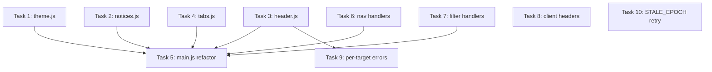

# Implementation Tasks: Separation of Concerns

**Status:** EVOLVED - See: [state-architecture-refactor](../state-architecture-refactor/)
**Spec:** [requirements.md](./requirements.md) | [design.md](./design.md)
**Completed:** 2025-12-25

> **Note:** This spec identified remaining framework-level issues (ResizeObserver loop, pages connected state, startup race, state inconsistency) that are addressed in the evolved spec.

---

## Phase 1: Extension Controllers

### Task 1: Create theme.js
**Description:** Extract theme management from main.js

**Files:**
- `extension/controllers/theme.js` - Create new controller

**Implementation:**
```javascript
export function init() {
  const saved = localStorage.getItem("webtap-theme");
  if (saved) document.documentElement.dataset.theme = saved;
  _updateButton();
}

export function toggle() {
  const current = document.documentElement.dataset.theme;
  const next = !current ? "light" : current === "light" ? "dark" : null;
  if (next) {
    document.documentElement.dataset.theme = next;
    localStorage.setItem("webtap-theme", next);
  } else {
    delete document.documentElement.dataset.theme;
    localStorage.removeItem("webtap-theme");
  }
  _updateButton();
}

function _updateButton() {
  const btn = document.getElementById("themeToggle");
  if (!btn) return;
  const theme = document.documentElement.dataset.theme;
  btn.textContent = theme === "light" ? "Light" : theme === "dark" ? "Dark" : "Auto";
}
```

**Acceptance:**
- [x] Theme cycles auto → light → dark → auto
- [x] Theme persists in localStorage
- [x] Button text updates correctly

**Dependencies:** None
**Complexity:** Low
**Completed:** 2025-12-25

---

### Task 2: Create notices.js
**Description:** Extract notice rendering from main.js

**Files:**
- `extension/controllers/notices.js` - Create new controller

**Implementation:**
- Move `NOTICE_TYPE_CLASSES` constant
- Move `renderNotices()` function
- Import `icons`, `ui` from lib/ui.js

**Acceptance:**
- [x] Notices render with correct type classes
- [x] Stale client notices generated from clients object
- [x] Dismiss buttons work (non-auto-clear notices)

**Dependencies:** None
**Complexity:** Low
**Completed:** 2025-12-25

---

### Task 3: Create header.js
**Description:** Extract header/status management from main.js

**Files:**
- `extension/controllers/header.js` - Create new controller

**Functions to include:**
- `updateStatus(text, state)` - from `updateHeaderStatus()`
- `updateConnection(state)` - from `updateConnectionStatus()`
- `updateEventCount(count)` - from `updateEventCount()`
- `updateError(error)` - from `updateErrorBanner()`
- `showError(message)` - from `showError()`

**Acceptance:**
- [x] Status text and classes update correctly
- [x] Error banner shows/hides
- [x] Event count updates in header
- [x] showError() handles Error objects and strings

**Dependencies:** None
**Complexity:** Medium
**Completed:** 2025-12-25

---

### Task 4: Create tabs.js
**Description:** Extract tab management from main.js

**Files:**
- `extension/controllers/tabs.js` - Create new controller

**Implementation:**
- Move `activeTab` state into controller
- `init(callbacks)` - setup listeners, store `onNetworkTabActive`
- `switchTo(tabName)` - update UI, call callback if network tab
- `getActive()` - return current tab

**Acceptance:**
- [x] Tab switching updates UI correctly
- [x] Active tab persists in localStorage
- [x] Callback fires when switching to network tab

**Dependencies:** None
**Complexity:** Medium
**Completed:** 2025-12-25

---

### Task 5: Refactor main.js
**Description:** Remove extracted code, wire new controllers

**Files:**
- `extension/main.js` - Refactor

**Changes:**
1. Add imports for new controllers
2. Remove extracted functions and constants
3. Remove `activeTab` variable (now in tabs.js)
4. Remove `updateButtons()` (dead code)
5. Update `setupEventHandlers()` to call controller methods
6. Update initialization to call `theme.init()`, `tabs.init()`
7. Wire `#themeToggle` to `theme.toggle()`

**Acceptance:**
- [x] main.js reduced to ~246 lines (from ~430)
- [x] All controller integrations work
- [x] No functionality regression

**Dependencies:** Tasks 1-4
**Complexity:** Medium
**Completed:** 2025-12-25

**Notes:** main.js reduced from 430 to 246 lines (43% reduction). All extracted controllers integrated successfully.

---

## Phase 2: Daemon Quick Fixes

### Task 6: Fix navigation handler state requirements
**Description:** Add `requires_state=CONNECTED_STATES` to navigation handlers

**Files:**
- `src/webtap/rpc/handlers.py` - Modify handler decorators

**Handlers to update:**
- `navigate`
- `reload`
- `back`
- `forward`

**Acceptance:**
- [x] Calling navigate without connection returns INVALID_STATE
- [x] Calling reload without connection returns INVALID_STATE
- [x] Calling back/forward without connection returns INVALID_STATE

**Dependencies:** None
**Complexity:** Low
**Completed:** 2025-12-25

---

### Task 7: Fix filter handler broadcast flags
**Description:** Add `broadcasts=False` to filter management handlers

**Files:**
- `src/webtap/rpc/handlers.py` - Modify handler decorators

**Handlers to update:**
- `filters.add`
- `filters.remove`

**Acceptance:**
- [x] filters.add does not trigger SSE broadcast
- [x] filters.remove does not trigger SSE broadcast

**Dependencies:** None
**Complexity:** Low
**Completed:** 2025-12-25

---

### Task 8: Add client tracking headers
**Description:** Extension should send identifying headers with RPC calls

**Files:**
- `extension/client.js` - Add headers to fetch calls

**Headers to add:**
```javascript
headers: {
  "Content-Type": "application/json",
  "x-webtap-client-type": "extension",
  "x-webtap-version": chrome.runtime.getManifest().version,
  "x-webtap-context": "sidepanel"
}
```

**Acceptance:**
- [x] RPC calls include client headers
- [x] Daemon logs show extension in client tracking

**Dependencies:** None
**Complexity:** Low
**Completed:** 2025-12-25

---

## Phase 3: Daemon Improvements

### Task 9: Implement per-target errors
**Description:** Change error state from global to per-target dict

**Files:**
- `src/webtap/services/main.py` - Change error_state structure
- `src/webtap/api/state.py` - Update get_full_state()
- `extension/controllers/header.js` - Handle new error shape

**Changes:**
1. Change `error_state` from `dict | None` to `dict[str, dict]`
2. Update `set_error()` to take target_id parameter
3. Update `clear_error()` to take optional target_id
4. Update `get_full_state()` to return `errors` dict
5. Update extension to display per-target errors

**Acceptance:**
- [x] Errors stored with target ID
- [x] SSE broadcasts include `errors` dict
- [x] Error dismissal clears specific target

**Dependencies:** Task 3 (header.js)
**Complexity:** High
**Completed:** 2025-12-25

**Notes:** Implemented per-target errors with backward compatibility. Extension handles both old single-error format and new errors dict.

---

### Task 10: Implement STALE_EPOCH retry
**Description:** Auto-retry RPC calls that fail with STALE_EPOCH

**Files:**
- `extension/client.js` - Add retry logic

**Implementation:**
1. Detect STALE_EPOCH error in `call()`
2. Add `_waitForStateUpdate()` helper
3. Retry once with `_isRetry` flag
4. Surface error if retry also fails

**Acceptance:**
- [x] STALE_EPOCH triggers wait for SSE update
- [x] Retry happens automatically once
- [x] Second failure surfaces to user
- [x] Timeout after 2s if no SSE update

**Dependencies:** None
**Complexity:** Medium
**Completed:** 2025-12-25

---

## Task Dependencies



## Parallel Tracks

**Track A (Extension Controllers):** Tasks 1-4 can run in parallel, then Task 5

**Track B (Daemon Fixes):** Tasks 6-7 can run in parallel

**Track C (Independent):** Tasks 8, 10 have no dependencies

**Track D (Requires header.js):** Task 9 after Task 3
