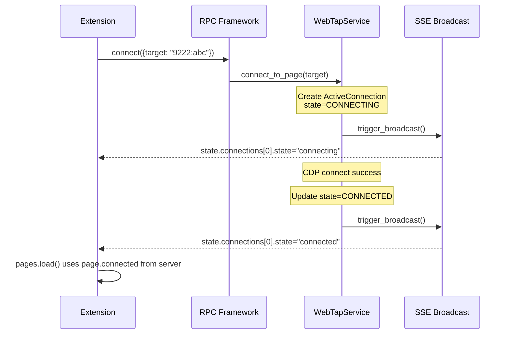
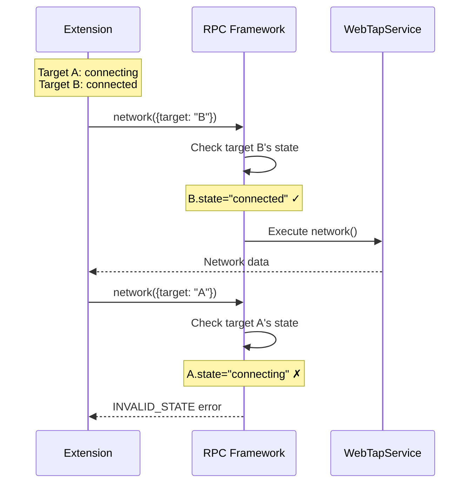

# Design: State Architecture Refactor

## Architecture Overview

This refactor makes the extension a "thin client" that trusts server state, adds per-target connection state to the daemon, and fixes UX issues (ResizeObserver, startup race).

```
┌─────────────────────────────────────────────────────────────────┐
│                        EXTENSION                                 │
├─────────────────────────────────────────────────────────────────┤
│  client.js                                                       │
│  ├─ discoverDaemon() + retry with backoff (NEW)                 │
│  ├─ state.connections[] (replaces state.page)                   │
│  └─ canCall(method, target) - per-target validation (NEW)       │
│                                                                  │
│  controllers/pages.js                                            │
│  └─ Use page.connected from server (not local computation)      │
│                                                                  │
│  datatable.js                                                    │
│  └─ RAF-debounced ResizeObserver (NEW)                          │
└─────────────────────────────────────────────────────────────────┘
                              │ SSE + RPC
┌─────────────────────────────────────────────────────────────────┐
│                         DAEMON                                   │
├─────────────────────────────────────────────────────────────────┤
│  services/main.py                                                │
│  ├─ TargetState enum (NEW)                                       │
│  ├─ ActiveConnection.state field (NEW)                          │
│  └─ connect_to_page() / disconnect_target() state transitions   │
│                                                                  │
│  rpc/framework.py                                                │
│  └─ Per-target state validation when target param present (NEW) │
│                                                                  │
│  api/state.py                                                    │
│  ├─ Remove `page` field from SSE state                          │
│  └─ Add `state` field to each connection object                 │
└─────────────────────────────────────────────────────────────────┘
```

---

## Component Analysis

### Existing Components to Modify

#### `extension/client.js`
**Current:** Single-attempt daemon discovery, `state.page` in initial state
**Changes:**
- Add retry wrapper to `discoverDaemon()` with exponential backoff
- Remove `page` from initial state shape
- Update `canCall(method, target)` to check per-target state

#### `extension/controllers/pages.js`
**Current:** Lines 60-64 recompute `connected` locally
```javascript
// CURRENT (wrong)
pageData = pages.map((page) => ({
  target: page.target,
  url: (page.url || "").replace(/^https?:\/\//, ""),
  connected: page.target === currentTarget,  // Local computation
}));
```
**Changes:**
```javascript
// NEW (trust server)
pageData = pages.map((page) => ({
  target: page.target,
  url: (page.url || "").replace(/^https?:\/\//, ""),
  connected: page.connected,  // Server's value
}));
```
- Remove all `client.state.page` references
- Use `client.state.connections` for connection checks

#### `extension/controllers/header.js`
**Current:** Line 28 checks `state.page`
```javascript
if (state.connected && state.page) {
```
**Changes:**
```javascript
if (state.connected) {  // state.page removed
```

#### `extension/main.js`
**Current:** Line 110 uses `state.page?.id`
```javascript
const pageChanged = previousState?.page?.id !== state.page?.id;
```
**Changes:**
- Use `state.connections` to detect page changes
- Remove all `state.page` references

#### `extension/datatable.js`
**Current:** Lines 39-53 direct ResizeObserver callback
```javascript
this._resizeObserver = new ResizeObserver((entries) => {
  for (const entry of entries) {
    // Direct execution triggers loop
    this._applyDynamicTruncation(cell, info.col, info.item, entry.contentRect.width);
  }
});
```
**Changes:**
```javascript
this._resizeObserver = new ResizeObserver((entries) => {
  if (this._rafId) cancelAnimationFrame(this._rafId);
  this._rafId = requestAnimationFrame(() => {
    this._rafId = null;
    for (const entry of entries) {
      // Debounced execution
      this._applyDynamicTruncation(cell, info.col, info.item, entry.contentRect.width);
    }
  });
});
```

#### `src/webtap/services/main.py`
**Current:** `ActiveConnection` has no state field (lines 16-23)
```python
@dataclass
class ActiveConnection:
    target: str
    cdp: "Any"
    page_info: dict
    connected_at: float
```
**Changes:**
```python
class TargetState(str, Enum):
    CONNECTING = "connecting"
    CONNECTED = "connected"
    DISCONNECTING = "disconnecting"

@dataclass
class ActiveConnection:
    target: str
    cdp: "Any"
    page_info: dict
    connected_at: float
    state: TargetState = TargetState.CONNECTED
```

#### `src/webtap/rpc/framework.py`
**Current:** Lines 190-198 validate against global state only
```python
current_state = self.machine.state
if meta.requires_state and current_state not in meta.requires_state:
    return self._error_response(...)
```
**Changes:**
```python
# Per-target validation when target param present
target_param = params.get("target")
if target_param and meta.requires_state:
    conn = self.service.get_connection(target_param)
    if conn:
        if conn.state.value not in meta.requires_state:
            return self._error_response(...)
    # If no connection, fall through to global check
elif meta.requires_state:
    # No target specified - use global state (backward compatible)
    if self.machine.state not in meta.requires_state:
        return self._error_response(...)
```

#### `src/webtap/api/state.py`
**Current:** Lines 71-79 build `page` field, lines 87-89 build `connections`
```python
"page": {
    "id": snapshot.page_id,
    "title": snapshot.page_title,
    "url": snapshot.page_url,
    "target": snapshot.connections[0]["target"] if snapshot.connections else None,
}
```
**Changes:**
- Remove `page` field entirely
- Add `state` to each connection object:
```python
"connections": [
    {
        "target": conn["target"],
        "title": conn["title"],
        "url": conn["url"],
        "state": conn["state"],  # NEW
    }
    for conn in snapshot.connections
],
```

---

## Data Models

### New: TargetState Enum
```python
# src/webtap/services/main.py
class TargetState(str, Enum):
    """Per-target connection state."""
    CONNECTING = "connecting"
    CONNECTED = "connected"
    DISCONNECTING = "disconnecting"
```

### Updated: ActiveConnection
```python
@dataclass
class ActiveConnection:
    """Tracks an active CDP connection."""
    target: str
    cdp: "Any"  # CDPSession
    page_info: dict
    connected_at: float
    state: TargetState = TargetState.CONNECTED
```

### Updated: StateSnapshot
```python
# src/webtap/services/state_snapshot.py
@dataclass(frozen=True)
class StateSnapshot:
    # ... existing fields ...
    connections: tuple[dict, ...]  # Each dict now includes "state" field
```

### Updated: SSE State Shape
```typescript
// Extension receives this from SSE
interface SSEState {
  connectionState: "disconnected" | "connecting" | "connected" | "inspecting";
  epoch: number;
  connected: boolean;
  // page: {...}  // REMOVED
  connections: Array<{
    target: string;
    title: string;
    url: string;
    state: "connecting" | "connected" | "disconnecting";  // NEW
  }>;
  events: { total: number };
  fetch: { enabled: boolean; paused_count: number };
  filters: { enabled: string[]; disabled: string[] };
  browser: { inspect_active: boolean; selections: object; prompt: string };
  errors: Record<string, { message: string; timestamp: number }>;
  notices: Array<object>;
}
```

---

## Data Flow

### Connection State Flow


### Per-Target RPC Validation


---

## Error Handling Strategy

### Daemon Discovery Retry
```javascript
// client.js
static async discoverDaemon(maxRetries = 3) {
  const delays = [500, 1000, 2000];

  for (let attempt = 0; attempt <= maxRetries; attempt++) {
    const port = await this._tryDiscover();
    if (port) return port;

    if (attempt < maxRetries) {
      await this._sleep(delays[attempt]);
    }
  }
  return null;  // All retries failed
}
```

### Per-Target State Errors
```python
# framework.py
if conn and conn.state.value not in meta.requires_state:
    return self._error_response(
        request_id,
        ErrorCode.INVALID_STATE,
        f"Target {target_param} in state {conn.state.value}, requires {meta.requires_state}",
        {
            "target": target_param,
            "current_state": conn.state.value,
            "required_states": meta.requires_state,
        },
    )
```

---

## Migration Strategy

### Breaking Change: `state.page` Removed

**Impact:** Extension must be updated simultaneously with daemon.

**Atomic Deployment:**
1. All daemon changes deployed together
2. All extension changes deployed together
3. No backward compatibility period needed (single user, local tool)

### Rollback Plan

If issues discovered:
1. Revert daemon to previous commit
2. Revert extension to previous commit
3. Both must revert together

---

## Testing Strategy

### Manual Test Cases

1. **Single target connect/disconnect**
   - Connect to page → green dot appears
   - Disconnect → green dot disappears

2. **Multi-target connections**
   - Connect to page A → green dot on A
   - Connect to page B → green dots on A AND B
   - Disconnect A → green dot only on B

3. **Concurrent operations**
   - Start connecting to A (slow network simulation)
   - While A connecting, query network on B
   - B query should succeed

4. **Startup retry**
   - Start extension before daemon
   - Wait 3-5 seconds
   - Start daemon
   - Extension should auto-connect

5. **ResizeObserver**
   - Rapidly resize sidepanel
   - Check console for loop errors
   - Should see no errors
