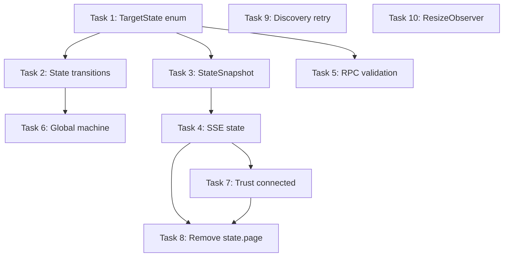

# Implementation Tasks: State Architecture Refactor

**Status:** Complete
**Started:** 2025-12-25
**Completed:** 2025-12-25
**Spec:** [requirements.md](./requirements.md) | [design.md](./design.md)
**Type:** Big bang atomic refactor - all tasks deployed together

---

## Task Overview

| # | Task | Complexity | Files |
|---|------|------------|-------|
| 1 | Add TargetState enum and update ActiveConnection | Low | `services/main.py` |
| 2 | Update connection state transitions | Medium | `services/main.py` |
| 3 | Add per-target state to StateSnapshot | Low | `services/state_snapshot.py` |
| 4 | Update SSE state shape | Low | `api/state.py` |
| 5 | Add per-target RPC validation | Medium | `rpc/framework.py` |
| 6 | Update global machine behavior | Medium | `rpc/handlers.py` |
| 7 | Trust server connected field | Low | `extension/controllers/pages.js` |
| 8 | Remove state.page usage | Medium | `extension/*.js` |
| 9 | Add daemon discovery retry | Low | `extension/client.js` |
| 10 | Debounce ResizeObserver | Low | `extension/datatable.js` |

---

## Daemon Tasks

### Task 1: Add TargetState enum and update ActiveConnection

**Description:** Add per-target state tracking to the connection model.

**Files:**
- `src/webtap/services/main.py` - Add enum and update dataclass

**Implementation:**
```python
from enum import Enum

class TargetState(str, Enum):
    """Per-target connection state."""
    CONNECTING = "connecting"
    CONNECTED = "connected"
    DISCONNECTING = "disconnecting"

@dataclass
class ActiveConnection:
    """Tracks an active CDP connection."""
    target: str
    cdp: "Any"
    page_info: dict
    connected_at: float
    state: TargetState = TargetState.CONNECTED
```

**Acceptance:**
- [ ] `TargetState` enum defined with 3 states
- [ ] `ActiveConnection` has `state` field with default `CONNECTED`
- [ ] Existing code continues to work (backward compatible default)

**Dependencies:** None
**Complexity:** Low

---

### Task 2: Update connection state transitions

**Description:** Set per-target state during connect/disconnect lifecycle.

**Files:**
- `src/webtap/services/main.py` - Modify `connect_to_page()` and `disconnect_target()`

**Changes:**

In `connect_to_page()`:
```python
# When creating ActiveConnection
connection = ActiveConnection(
    target=target,
    cdp=cdp_session,
    page_info=page_info,
    connected_at=time.time(),
    state=TargetState.CONNECTING,  # Start as connecting
)
self.connections[target] = connection

# After successful domain enables
connection.state = TargetState.CONNECTED
self._trigger_broadcast()
```

In `disconnect_target()`:
```python
# Before CDP disconnect
if target in self.connections:
    self.connections[target].state = TargetState.DISCONNECTING
    self._trigger_broadcast()

# After cleanup, remove from connections dict
```

**Acceptance:**
- [ ] New connections start with `state=CONNECTING`
- [ ] Connections transition to `CONNECTED` after domain enables
- [ ] Connections transition to `DISCONNECTING` before cleanup
- [ ] State changes trigger SSE broadcast

**Dependencies:** Task 1
**Complexity:** Medium

---

### Task 3: Add per-target state to StateSnapshot

**Description:** Include target state in the immutable snapshot.

**Files:**
- `src/webtap/services/state_snapshot.py` - Update snapshot creation
- `src/webtap/services/main.py` - Update `_create_snapshot()`

**Changes:**

In `_create_snapshot()`:
```python
connections_list = [
    {
        "target": conn.target,
        "title": conn.page_info.get("title", ""),
        "url": conn.page_info.get("url", ""),
        "state": conn.state.value,  # NEW: include state
    }
    for conn in self.connections.values()
]
```

**Acceptance:**
- [ ] Each connection in snapshot includes `state` field
- [ ] State is string value ("connecting", "connected", "disconnecting")

**Dependencies:** Task 1
**Complexity:** Low

---

### Task 4: Update SSE state shape

**Description:** Remove `page` field, ensure `connections` includes state.

**Files:**
- `src/webtap/api/state.py` - Modify `get_full_state()`

**Changes:**

Remove lines 71-79 (`page` field construction):
```python
# DELETE THIS BLOCK
"page": {
    "id": snapshot.page_id,
    ...
}
```

The `connections` field already comes from snapshot, which now includes state (Task 3).

**Acceptance:**
- [ ] SSE state no longer includes `page` field
- [ ] `connections` array includes `state` for each connection
- [ ] All content hashes still computed correctly

**Dependencies:** Task 3
**Complexity:** Low

---

### Task 5: Add per-target RPC validation

**Description:** Validate state requirements against target's individual state when target param present.

**Files:**
- `src/webtap/rpc/framework.py` - Modify state validation in `handle()`

**Changes:**

Replace lines 190-198 with:
```python
# Per-target or global state validation
target_param = params.get("target")
if target_param and meta.requires_state:
    conn = self.service.get_connection(target_param)
    if conn:
        target_state = conn.state.value
        if target_state not in meta.requires_state:
            return self._error_response(
                request_id,
                ErrorCode.INVALID_STATE,
                f"Target {target_param} in state {target_state}, requires {meta.requires_state}",
                {"target": target_param, "current_state": target_state, "required_states": meta.requires_state},
            )
    # If target not found, fall through to global check (connect may be creating it)

# Global state validation (backward compatible)
if meta.requires_state:
    current_state = self.machine.state
    if current_state not in meta.requires_state:
        return self._error_response(
            request_id,
            ErrorCode.INVALID_STATE,
            f"Method {method} requires state {meta.requires_state}, current: {current_state}",
            {"current_state": current_state, "required_states": meta.requires_state},
        )
```

**Acceptance:**
- [ ] RPC with `target` param validates against that target's state
- [ ] RPC without `target` param uses global state (backward compatible)
- [ ] Error messages include target info when applicable

**Dependencies:** Task 1
**Complexity:** Medium

---

### Task 6: Update global machine behavior

**Description:** Global machine only transitions on first/last connection.

**Files:**
- `src/webtap/rpc/handlers.py` - Modify `connect()` and `disconnect()` handlers

**Changes:**

In `connect()` handler:
```python
def connect(ctx: RPCContext, target: str) -> dict:
    is_first_connection = len(ctx.service.connections) == 0

    # Only transition global machine on first connection
    if is_first_connection:
        if not ctx.machine.may_start_connect():
            raise RPCError(ErrorCode.INVALID_STATE, "Cannot connect in current state")
        ctx.machine.start_connect()

    try:
        result = ctx.service.connect_to_page(target)

        if is_first_connection:
            ctx.machine.connect_success()

        return result
    except Exception as e:
        if is_first_connection:
            ctx.machine.connect_failed()
        raise
```

In `disconnect()` handler:
```python
def disconnect(ctx: RPCContext, target: str = None) -> dict:
    result = ctx.service.disconnect_target(target)

    # Transition to disconnected only if no connections remain
    if len(ctx.service.connections) == 0:
        ctx.machine.force_disconnect()

    return result
```

**Acceptance:**
- [ ] Global state only changes on first connection
- [ ] Global state only goes to `disconnected` when all targets disconnected
- [ ] Subsequent connections don't change global state

**Dependencies:** Task 2
**Complexity:** Medium

---

## Extension Tasks

### Task 7: Trust server connected field

**Description:** Use `page.connected` from server response instead of local computation.

**Files:**
- `extension/controllers/pages.js` - Modify `load()` function

**Changes:**

Replace lines 60-64:
```javascript
// OLD
pageData = pages.map((page) => ({
  target: page.target,
  url: (page.url || "").replace(/^https?:\/\//, ""),
  connected: page.target === currentTarget,
}));

// NEW
pageData = pages.map((page) => ({
  target: page.target,
  url: (page.url || "").replace(/^https?:\/\//, ""),
  connected: page.connected,  // Trust server
}));
```

Remove line 58 (`const currentTarget = client.state.page?.target;`) - no longer needed.

Also update `connectToSelected()` (lines 94-97) to use `client.state.connections`:
```javascript
// OLD
const currentTarget = client.state.page?.target;
const isConnectedToSelected = client.state.connected && currentTarget === selectedPageTarget;

// NEW
const connectedTargets = new Set((client.state.connections || []).map(c => c.target));
const isConnectedToSelected = connectedTargets.has(selectedPageTarget);
```

**Acceptance:**
- [ ] `page.connected` comes from server response
- [ ] No local computation of connected state
- [ ] Connect/disconnect toggle works correctly

**Dependencies:** Task 4 (SSE shape)
**Complexity:** Low

---

### Task 8: Remove state.page usage

**Description:** Remove all references to `state.page` throughout extension.

**Files:**
- `extension/client.js` - Remove from initial state
- `extension/controllers/pages.js` - Already handled in Task 7
- `extension/controllers/header.js` - Update condition
- `extension/main.js` - Update page change detection

**Changes:**

`client.js` - Remove `page` from initial state (line 86):
```javascript
this.state = {
  connectionState: "disconnected",
  epoch: 0,
  connected: false,
  // page: null,  // REMOVED
  connections: [],  // Already exists conceptually from SSE
  events: { total: 0 },
  // ...
};
```

`header.js` - Update line 28:
```javascript
// OLD
if (state.connected && state.page) {

// NEW
if (state.connected) {
```

`main.js` - Update line 110:
```javascript
// OLD
const pageChanged = previousState?.page?.id !== state.page?.id;

// NEW - use connections array
const prevTargets = new Set((previousState?.connections || []).map(c => c.target));
const currTargets = new Set((state.connections || []).map(c => c.target));
const connectionsChanged = prevTargets.size !== currTargets.size ||
  [...prevTargets].some(t => !currTargets.has(t));
```

**Acceptance:**
- [ ] No references to `state.page` in extension
- [ ] All logic uses `state.connections` array
- [ ] Header status works correctly
- [ ] Page change detection works

**Dependencies:** Task 4, Task 7
**Complexity:** Medium

---

### Task 9: Add daemon discovery retry

**Description:** Retry daemon discovery with exponential backoff.

**Files:**
- `extension/client.js` - Wrap `discoverDaemon()` with retry logic

**Changes:**

Add retry wrapper:
```javascript
static async discoverDaemonWithRetry(maxRetries = 3) {
  const delays = [500, 1000, 2000];

  for (let attempt = 0; attempt <= maxRetries; attempt++) {
    const port = await WebTapClient.discoverDaemon();
    if (port !== null) {
      return port;
    }

    if (attempt < maxRetries) {
      console.log(`[WebTap] Daemon not found, retry ${attempt + 1}/${maxRetries} in ${delays[attempt]}ms`);
      await new Promise(resolve => setTimeout(resolve, delays[attempt]));
    }
  }

  console.log('[WebTap] Daemon discovery failed after retries');
  return null;
}
```

Update `create()` to use retry version:
```javascript
static async create() {
  const port = await WebTapClient.discoverDaemonWithRetry();
  if (port === null) {
    return null;
  }
  return new WebTapClient(`http://localhost:${port}`);
}
```

**Acceptance:**
- [ ] Retries 3 times with 500ms, 1s, 2s delays
- [ ] Logs retry attempts for debugging
- [ ] Returns null after all retries exhausted
- [ ] Successful discovery on any retry returns port

**Dependencies:** None
**Complexity:** Low

---

### Task 10: Debounce ResizeObserver

**Description:** Use requestAnimationFrame to debounce ResizeObserver callbacks.

**Files:**
- `extension/datatable.js` - Modify `_setupResizeObserver()`

**Changes:**

Update lines 39-53:
```javascript
_setupResizeObserver() {
  const hasDynamic = this.columns.some(c => c.truncateMiddle === true);
  if (!hasDynamic) return;

  this._rafId = null;  // NEW: track RAF ID

  this._resizeObserver = new ResizeObserver((entries) => {
    // Debounce with requestAnimationFrame
    if (this._rafId) {
      cancelAnimationFrame(this._rafId);
    }

    this._rafId = requestAnimationFrame(() => {
      this._rafId = null;
      for (const entry of entries) {
        const cell = entry.target;
        const info = this._dynamicCells.get(cell);
        if (info) {
          this._applyDynamicTruncation(cell, info.col, info.item, entry.contentRect.width);
        }
      }
    });
  });
}
```

Update `destroy()` to clean up RAF:
```javascript
destroy() {
  if (this._rafId) {
    cancelAnimationFrame(this._rafId);
    this._rafId = null;
  }
  if (this._resizeObserver) {
    this._resizeObserver.disconnect();
    this._resizeObserver = null;
  }
  this._dynamicCells.clear();
}
```

**Acceptance:**
- [ ] ResizeObserver callback debounced with RAF
- [ ] No "ResizeObserver loop" errors in console
- [ ] Truncation still works correctly after resize
- [ ] RAF cleaned up on destroy

**Dependencies:** None
**Complexity:** Low

---

## Task Dependencies



## Execution Strategy

**Atomic deployment** - all tasks completed before testing:

1. **Daemon first** (Tasks 1-6):
   - Task 1 → Task 2 → Task 3 → Task 4 (sequential)
   - Task 5 (parallel with Task 3-4)
   - Task 6 (after Task 2)

2. **Extension second** (Tasks 7-10):
   - Task 9, Task 10 (independent, parallel)
   - Task 7 → Task 8 (sequential)

3. **Integration test** - all tasks complete

---

## Verification Checklist

After all tasks complete:

- [x] Daemon starts without errors (type check passed)
- [ ] Extension connects to daemon (requires manual test)
- [ ] Single target: connect shows green dot (requires manual test)
- [ ] Single target: disconnect removes green dot (requires manual test)
- [ ] Multi-target: both show green dots (requires manual test)
- [ ] Multi-target: disconnect one, other stays green (requires manual test)
- [ ] No ResizeObserver errors on resize (requires manual test)
- [ ] Extension retries if daemon slow to start (requires manual test)
- [x] Console has no state.page references (code verified)

## Implementation Notes

**All tasks completed successfully (2025-12-25)**

### Daemon Changes (Tasks 1-6)
- Added `TargetState` enum with CONNECTING, CONNECTED, DISCONNECTING states
- Updated `ActiveConnection` dataclass with `state` field
- Modified `connect_to_page()` to set CONNECTING state initially, then CONNECTED after setup
- Modified `disconnect_target()` to set DISCONNECTING state before cleanup
- Updated `_create_snapshot()` to include `state` in connections tuple
- Removed `page` field from SSE state in `api/state.py`
- Added per-target RPC validation in `framework.py` - validates target's state when target param present
- Updated global machine behavior in `rpc/handlers.py` - only transitions on first/last connection

### Extension Changes (Tasks 7-10)
- Updated `pages.js` to trust server's `connected` field instead of local computation
- Updated `pages.js` to use `state.connections` for checking connection status
- Removed `page` from initial state in `client.js`, replaced with `connections: []`
- Updated `header.js` to remove `state.page` check
- Updated `main.js` to detect connection changes using `connections` array comparison
- Added `discoverDaemonWithRetry()` in `client.js` with exponential backoff (500ms, 1s, 2s)
- Updated `create()` to use retry wrapper
- Debounced ResizeObserver callbacks in `datatable.js` using requestAnimationFrame
- Added RAF cleanup in `destroy()` method

### Type Check
- All Python files pass basedpyright with 0 errors, 0 warnings, 0 notes

### Next Steps
Manual testing required to verify:
1. Extension-daemon connection behavior
2. Multi-target connection state display
3. ResizeObserver performance
4. Daemon discovery retry behavior
