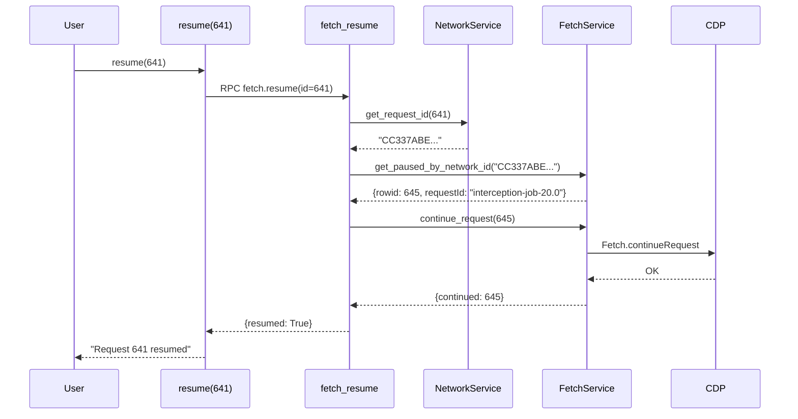

# Design: Unified HAR/Fetch View

## Architecture Overview

This design modifies WebTap's data layer to unify HAR (Network events) with Fetch interception events into a single coherent view. The key insight is that Fetch events correlate to Network events via `networkId`, allowing us to JOIN them in SQL and present a unified interface.

**Before:** Two separate views with different ID spaces
```
network() → HAR IDs (583, 584, 585...)
requests() → Fetch rowids (642, 645, 648...)
```

**After:** Single unified view
```
network() → HAR IDs with pause state and stage
            (583: state=paused, pause=Response)
```

## Component Analysis

### Existing Components to Modify

#### 1. `cdp/har.py` - HAR View SQL
**Changes:**
- Add new CTE `paused_fetch` to extract unresolved Fetch.requestPaused events
- Join with HTTP entries to add `pause_stage` column
- Modify state logic: paused Fetch event → `state = 'paused'`
- At Response stage: use Fetch's `responseStatusCode` for status, extract `responseHeaders`
- Add `paused_id` (Fetch event rowid) for internal correlation

#### 2. `services/network.py` - NetworkService
**Changes:**
- Update `get_requests()` to include `pause_stage` column
- Update `get_request_details()` to merge Fetch response data when paused at Response stage
- Add `get_paused_id_for_network_id(network_id)` helper for resume/fail lookup

#### 3. `services/fetch.py` - FetchService
**Changes:**
- Add `get_paused_by_network_id(network_id)` to lookup paused event by HAR correlation
- Keep `continue_request()` and `fail_request()` but they now receive paused_id internally
- Remove `get_paused_list()` - no longer needed (HAR view handles this)

#### 4. `rpc/handlers.py` - RPC Handlers
**Changes:**
- Modify `fetch_resume(har_id)` to lookup paused event by networkId, then resume
- Modify `fetch_fail(har_id)` to lookup paused event by networkId, then fail
- Remove `paused()` handler - replaced by network(state="paused")
- Keep `fetch_inspect()` for raw CDP access (optional/power-user feature)

#### 5. `commands/network.py` - Network Command
**Changes:**
- Add `state` filter parameter: `network(state="paused")`
- Add `Pause` column to table output when fetch enabled

#### 6. `commands/fetch.py` - Fetch Commands
**Changes:**
- Update `resume()` to accept HAR IDs
- Update `fail()` to accept HAR IDs
- Make `requests()` a thin wrapper: `network(state="paused")` with fetch-specific tips
- Keep `inspect()` for advanced debugging

### Components to Remove

- `FetchService.get_paused_list()` - replaced by HAR view query
- `paused` RPC handler - replaced by network with state filter

## Data Models

### Modified HAR Summary Schema
```sql
har_summary (
    id INTEGER,           -- HAR rowid (from Network.requestWillBeSent)
    request_id VARCHAR,   -- Network domain request ID
    protocol VARCHAR,     -- 'http' | 'websocket'
    method VARCHAR,       -- 'GET', 'POST', 'WS', etc.
    status INTEGER,       -- HTTP status (from Fetch if paused at Response)
    url VARCHAR,
    type VARCHAR,         -- Resource type
    size INTEGER,
    time_ms INTEGER,
    state VARCHAR,        -- 'pending' | 'paused' | 'loading' | 'complete' | 'failed'
    pause_stage VARCHAR,  -- NULL | 'Request' | 'Response' (NEW)
    paused_id INTEGER,    -- Fetch event rowid for internal use (NEW)
    frames_sent INTEGER,
    frames_received INTEGER
)
```

### Modified HAR Entry Schema (for request details)
```sql
har_entries (
    -- ... existing fields ...
    pause_stage VARCHAR,              -- NEW
    paused_id INTEGER,                -- NEW
    fetch_response_headers JSON,      -- NEW: from Fetch event at Response stage
    fetch_response_status INTEGER     -- NEW: from Fetch event at Response stage
)
```

## SQL View Design

### New CTEs for Fetch Integration

```sql
-- Paused Fetch events (unresolved)
paused_fetch AS (
    SELECT
        json_extract_string(event, '$.params.networkId') as network_id,
        rowid as paused_id,
        json_extract_string(event, '$.params.responseStatusCode') as fetch_status,
        json_extract(event, '$.params.responseHeaders') as fetch_response_headers,
        CASE
            WHEN json_extract_string(event, '$.params.responseStatusCode') IS NOT NULL
            THEN 'Response'
            ELSE 'Request'
        END as pause_stage,
        json_extract_string(event, '$.params.requestId') as fetch_request_id
    FROM events
    WHERE method = 'Fetch.requestPaused'
),

-- Resolved Fetch events (continued, failed, or fulfilled)
resolved_fetch AS (
    SELECT DISTINCT json_extract_string(event, '$.params.requestId') as network_id
    FROM events
    WHERE method IN ('Network.loadingFinished', 'Network.loadingFailed')
),

-- Only unresolved paused events (latest per networkId)
active_paused AS (
    SELECT pf.*
    FROM paused_fetch pf
    WHERE pf.network_id IS NOT NULL
      AND pf.network_id NOT IN (SELECT network_id FROM resolved_fetch WHERE network_id IS NOT NULL)
    QUALIFY ROW_NUMBER() OVER (PARTITION BY pf.network_id ORDER BY pf.paused_id DESC) = 1
)
```

### Modified HTTP Entries CTE

```sql
http_entries AS (
    SELECT
        req.first_rowid as id,
        req.request_id,
        req.protocol,
        req.method,
        req.url,
        -- Use Fetch status if paused at Response, otherwise Network status
        CAST(COALESCE(ap.fetch_status, resp.status, '0') AS INTEGER) as status,
        resp.status_text,
        req.resource_type as type,
        CAST(COALESCE(fin.final_size, '0') AS INTEGER) as size,
        CASE
            WHEN fin.finished_timestamp IS NOT NULL
            THEN CAST((CAST(fin.finished_timestamp AS DOUBLE) - CAST(req.started_timestamp AS DOUBLE)) * 1000 AS INTEGER)
            ELSE NULL
        END as time_ms,
        -- State priority: paused > failed > complete > loading > pending
        CASE
            WHEN ap.paused_id IS NOT NULL THEN 'paused'
            WHEN fail.error_text IS NOT NULL THEN 'failed'
            WHEN fin.finished_timestamp IS NOT NULL THEN 'complete'
            WHEN resp.status IS NOT NULL THEN 'loading'
            ELSE 'pending'
        END as state,
        ap.pause_stage,                    -- NEW
        ap.paused_id,                      -- NEW
        req.request_headers,
        req.post_data,
        -- Prefer Fetch response headers if at Response stage
        COALESCE(ap.fetch_response_headers, resp.response_headers) as response_headers,
        resp.mime_type,
        resp.timing,
        fail.error_text,
        CAST(NULL AS BIGINT) as frames_sent,
        CAST(NULL AS BIGINT) as frames_received,
        CAST(NULL AS BIGINT) as ws_total_bytes
    FROM http_requests req
    LEFT JOIN http_responses resp ON req.request_id = resp.request_id
    LEFT JOIN http_finished fin ON req.request_id = fin.request_id
    LEFT JOIN http_failed fail ON req.request_id = fail.request_id
    LEFT JOIN active_paused ap ON req.request_id = ap.network_id  -- NEW JOIN
)
```

## API Changes

### RPC Methods

#### Modified: `fetch.resume`
```python
def fetch_resume(ctx: RPCContext, id: int, modifications: dict | None = None, wait: float = 0.5) -> dict:
    """Resume a paused request using HAR ID.

    Args:
        id: HAR row ID from network() (not Fetch event ID)
        modifications: Optional request/response modifications
        wait: Wait time for follow-up events
    """
    # Lookup network_id from HAR
    network_id = ctx.service.network.get_request_id(id)
    if not network_id:
        raise RPCError(ErrorCode.INVALID_PARAMS, f"Request {id} not found")

    # Find paused Fetch event
    paused = ctx.service.fetch.get_paused_by_network_id(network_id)
    if not paused:
        raise RPCError(ErrorCode.INVALID_PARAMS, f"Request {id} is not paused")

    # Resume using internal paused_id
    result = ctx.service.fetch.continue_request(paused['rowid'], modifications, wait)
    return {"resumed": True, "result": result}
```

#### Modified: `fetch.fail`
```python
def fetch_fail(ctx: RPCContext, id: int, reason: str = "BlockedByClient") -> dict:
    """Fail a paused request using HAR ID."""
    # Same lookup pattern as resume
```

#### Removed: `paused`
Replaced by `network(state="paused")`

#### Modified: `network`
```python
def network(
    ctx: RPCContext,
    limit: int = 50,
    status: int | None = None,
    method: str | None = None,
    resource_type: str | None = None,
    url: str | None = None,
    state: str | None = None,      # NEW: filter by state
    show_all: bool = False,
    order: str = "desc",
) -> dict:
```

## Data Flow

### Resume Flow (New)


## Error Handling Strategy

| Error Condition | Response |
|-----------------|----------|
| HAR ID not found | RPCError(INVALID_PARAMS, "Request {id} not found") |
| Request not paused | RPCError(INVALID_PARAMS, "Request {id} is not paused") |
| Fetch not enabled | RPCError(INVALID_STATE, "Fetch interception is disabled") |
| CDP command fails | RPCError(INTERNAL_ERROR, str(e)) |

## Migration Strategy

This is a **clean break refactor** - no backwards compatibility:

1. Update HAR SQL views (requires reconnect to take effect)
2. Modify services and handlers
3. Update commands
4. Remove deprecated code paths
5. Update TIPS.md documentation

**No database migration needed** - views are recreated on each connection.

## File Changes Summary

| File | Action | Changes |
|------|--------|---------|
| `cdp/har.py` | Modify | Add paused_fetch CTEs, join, new columns |
| `services/network.py` | Modify | Add state filter, pause columns, networkId lookup |
| `services/fetch.py` | Modify | Add `get_paused_by_network_id()`, remove `get_paused_list()` |
| `rpc/handlers.py` | Modify | Update resume/fail to use HAR IDs, remove `paused` handler |
| `commands/network.py` | Modify | Add state filter, Pause column |
| `commands/fetch.py` | Modify | Update resume/fail, make requests() wrapper |
| `commands/TIPS.md` | Modify | Update documentation |
