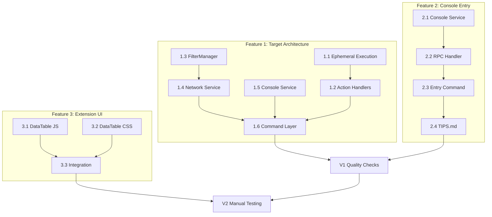

# Implementation Tasks: WebTap Improvements

**Status:** Complete
**Started:** 2025-12-25
**Completed:** 2025-12-25
**Spec:** [requirements.md](./requirements.md) | [design.md](./design.md)

---

## Feature 1: Target Architecture Redesign

### Task 1.1: Add Ephemeral Execution to Service
**Completed:** 2025-12-25

**Description:** Add `execute_on_target()` and `_get_or_create_session()` methods to WebTapService.

**Files:**
- `src/webtap/services/main.py` - Add 2 new methods

**Implementation:**
```python
def execute_on_target(self, target: str, callback: Callable[[CDPSession], Any]) -> Any:
    """Execute callback on target, reusing or creating ephemeral connection."""
    from webtap.targets import parse_target, resolve_target

    # Check existing connection
    existing = self.get_connection(target)
    if existing:
        return callback(existing.cdp)

    # Parse and resolve target
    port, short_id = parse_target(target)
    cdp_session = self._get_or_create_session(port)

    # Resolve to full page
    pages = self.list_pages(chrome_port=port)
    page = resolve_target(target, pages.get("pages", []))
    if not page:
        raise ValueError(f"Target '{target}' not found")

    # Ephemeral connection
    try:
        cdp_session.connect(page_id=page["id"])
        return callback(cdp_session)
    finally:
        cdp_session.disconnect()

def _get_or_create_session(self, port: int) -> CDPSession:
    """Get existing session or create new one (auto-register)."""
    if port not in self.state.cdp_sessions:
        self.register_port(port)
    return self.state.cdp_sessions[port]
```

**Acceptance:**
- [x] Implementation complete
- [x] Uses existing `_get_or_create_session()` method already in codebase
- [x] Error handling for non-existent target

**Dependencies:** None
**Complexity:** Medium

---

### Task 1.2: Remove State Requirements from Action Handlers

**Description:** Remove `requires_state=CONNECTED_STATES` from action handlers and add ephemeral execution logic.

**Files:**
- `src/webtap/rpc/handlers.py` - Modify handler registrations and implementations

**Changes:**

1. Update registrations (~line 91-98):
```python
# Before:
rpc.method("navigate", requires_state=CONNECTED_STATES)(navigate)
rpc.method("reload", requires_state=CONNECTED_STATES)(reload)
rpc.method("back", requires_state=CONNECTED_STATES)(back)
rpc.method("forward", requires_state=CONNECTED_STATES)(forward)
rpc.method("js", requires_state=CONNECTED_STATES)(js)

# After:
rpc.method("navigate")(navigate)
rpc.method("reload")(reload)
rpc.method("back")(back)
rpc.method("forward")(forward)
rpc.method("js")(js)
```

2. Update `navigate()` handler (~line 500):
```python
def navigate(ctx: RPCContext, url: str, target: str | None = None) -> dict:
    try:
        if target:
            def do_navigate(cdp):
                return cdp.execute("Page.navigate", {"url": url})
            result = ctx.service.execute_on_target(target, do_navigate)
        else:
            if not ctx.service.connections:
                raise RPCError(ErrorCode.NOT_CONNECTED, "Specify target or connect first")
            cdp = _resolve_cdp_session(ctx, None)
            result = cdp.execute("Page.navigate", {"url": url})
        return {
            "url": url,
            "frame_id": result.get("frameId"),
            "loader_id": result.get("loaderId"),
            "error": result.get("errorText"),
        }
    except ValueError as e:
        raise RPCError(ErrorCode.INVALID_PARAMS, str(e))
    except Exception as e:
        raise RPCError(ErrorCode.INTERNAL_ERROR, f"Navigation failed: {e}")
```

3. Apply same pattern to `reload()`, `back()`, `forward()`, `js()`

**Acceptance:**
- [ ] `navigate(url, target="9222:abc")` works without prior connect
- [ ] `js(code, target="9224:def")` works without prior connect
- [ ] `reload(target="...")` works without prior connect
- [ ] Error message when no target and no connection: "Specify target or connect first"

**Dependencies:** Task 1.1
**Complexity:** Medium

---

### Task 1.3: Add Target Filter to FilterManager

**Description:** Extend `build_filter_sql()` to accept string or list of targets.

**Files:**
- `src/webtap/filters.py` - Modify `build_filter_sql()` method

**Changes:**
```python
def build_filter_sql(
    self,
    status: int | None = None,
    method: str | None = None,
    type_filter: str | None = None,
    url: str | None = None,
    apply_groups: bool = True,
    target: str | list[str] | None = None,  # NEW
) -> str:
    conditions = []

    # Target filtering - explicit param takes precedence
    if target:
        if isinstance(target, str):
            escaped = target.replace("'", "''")
            conditions.append(f"target = '{escaped}'")
        else:
            escaped = [t.replace("'", "''") for t in target]
            targets_sql = ", ".join(f"'{t}'" for t in escaped)
            conditions.append(f"target IN ({targets_sql})")
    elif self.active_targets:
        # Fall back to session-level active targets
        escaped = [t.replace("'", "''") for t in self.active_targets]
        targets_sql = ", ".join(f"'{t}'" for t in escaped)
        conditions.append(f"target IN ({targets_sql})")

    # ... rest unchanged ...
```

**Acceptance:**
- [ ] `build_filter_sql(target="9222:abc")` produces `target = '9222:abc'`
- [ ] `build_filter_sql(target=["9222:abc", "9224:def"])` produces `target IN (...)`
- [ ] SQL injection prevented via escaping

**Dependencies:** None
**Complexity:** Low

---

### Task 1.4: Add Target Parameter to Network Service

**Description:** Pass target filter through to network queries.

**Files:**
- `src/webtap/services/network.py` - Add target param to `get_requests()`
- `src/webtap/rpc/handlers.py` - Add target to network handler

**Changes:**

1. `services/network.py` - `get_requests()`:
```python
def get_requests(
    self,
    limit: int = 20,
    status: int | None = None,
    method: str | None = None,
    type_filter: str | None = None,
    url: str | None = None,
    state: str | None = None,
    apply_groups: bool = True,
    order: str = "desc",
    target: str | list[str] | None = None,  # NEW
) -> list[dict]:
    # ... existing code ...
    conditions = ""
    if self.filters:
        conditions = self.filters.build_filter_sql(
            status=status,
            method=method,
            type_filter=type_filter,
            url=url,
            apply_groups=apply_groups,
            target=target,  # NEW
        )
```

2. `rpc/handlers.py` - `network()` handler:
```python
def network(
    ctx: RPCContext,
    limit: int = 50,
    status: int | None = None,
    method: str | None = None,
    resource_type: str | None = None,
    url: str | None = None,
    state: str | None = None,
    show_all: bool = False,
    order: str = "desc",
    target: str | list[str] | None = None,  # NEW
) -> dict:
    requests = ctx.service.network.get_requests(
        limit=limit,
        status=status,
        method=method,
        type_filter=resource_type,
        url=url,
        state=state,
        apply_groups=not show_all,
        order=order,
        target=target,  # NEW
    )
    return {"requests": requests}
```

**Acceptance:**
- [ ] `network(target="9222:abc")` filters to single target
- [ ] `network(target=["9222:abc", "9224:def"])` filters to multiple targets
- [ ] `network()` without target returns all (current behavior)

**Dependencies:** Task 1.3
**Complexity:** Low

---

### Task 1.5: Add Target Parameter to Console Service

**Description:** Add target filter to console queries.

**Files:**
- `src/webtap/services/console.py` - Add target param to `get_recent_messages()`
- `src/webtap/rpc/handlers.py` - Add target to console handler

**Changes:**

1. `services/console.py`:
```python
def get_recent_messages(
    self,
    limit: int = 50,
    level: str | None = None,
    target: str | list[str] | None = None,  # NEW
) -> list[tuple]:
    # ... existing SQL ...

    if target:
        if isinstance(target, str):
            escaped = target.replace("'", "''")
            sql += f" AND target = '{escaped}'"
        else:
            escaped = [t.replace("'", "''") for t in target]
            sql += f" AND target IN ({', '.join(repr(t) for t in escaped)})"

    # ... rest unchanged ...
```

2. `rpc/handlers.py` - `console()` handler - add `target` param

**Acceptance:**
- [ ] `console(target="9222:abc")` filters to single target
- [ ] `console(target=["9222:abc", "9224:def"])` filters to multiple

**Dependencies:** None
**Complexity:** Low

---

### Task 1.6: Update Command Layer with Target Parameter

**Description:** Add target parameter to command wrappers.

**Files:**
- `src/webtap/commands/navigation.py` - Add target to navigate, reload, back, forward
- `src/webtap/commands/javascript.py` - Add target to js
- `src/webtap/commands/network.py` - Add target param
- `src/webtap/commands/console.py` - Add target param

**Acceptance:**
- [ ] All navigation commands accept `target` param
- [ ] `js()` command accepts `target` param
- [ ] `network()` command accepts `target` param
- [ ] `console()` command accepts `target` param

**Dependencies:** Tasks 1.2, 1.4, 1.5
**Complexity:** Low

---

## Feature 2: Console Entry Drill-Down

### Task 2.1: Add Console Entry Methods to Service

**Description:** Add `get_entry_details()` and `select_fields()` to ConsoleService.

**Files:**
- `src/webtap/services/console.py` - Add 3 new methods

**Implementation:** See design.md for full code.

**Acceptance:**
- [ ] `get_entry_details(rowid)` returns full CDP event structure
- [ ] Both `Runtime.consoleAPICalled` and `Log.entryAdded` normalized
- [ ] `select_fields(entry, None)` returns minimal fields
- [ ] `select_fields(entry, ["*"])` returns full entry
- [ ] `select_fields(entry, ["stackTrace"])` returns only stack trace
- [ ] `select_fields(entry, ["args.*"])` returns all args

**Dependencies:** None
**Complexity:** Medium

---

### Task 2.2: Add Entry RPC Handler

**Description:** Add `entry()` handler for console drill-down.

**Files:**
- `src/webtap/rpc/handlers.py` - Add handler and registration

**Implementation:**
```python
def entry(ctx: RPCContext, id: int, fields: list[str] | None = None) -> dict:
    """Get console entry details with field selection."""
    entry = ctx.service.console.get_entry_details(id)
    if not entry:
        raise RPCError(ErrorCode.INVALID_PARAMS, f"Console entry {id} not found")

    selected = ctx.service.console.select_fields(entry, fields)
    return {"entry": selected}

# Registration
rpc.method("entry", requires_state=CONNECTED_STATES, broadcasts=False)(entry)
```

**Acceptance:**
- [ ] `entry(id=5)` returns minimal console entry
- [ ] `entry(id=5, fields=["*"])` returns full entry
- [ ] `entry(id=999)` raises RPCError for not found

**Dependencies:** Task 2.1
**Complexity:** Low

---

### Task 2.3: Create Entry Command

**Description:** Create new entry.py command file following request.py pattern.

**Files:**
- `src/webtap/commands/entry.py` - New file
- `src/webtap/app.py` - Add import

**Implementation:** Follow request.py pattern exactly with:
- Field selection via RPC
- Expression evaluation via `evaluate_expression()`
- Output export to file
- Markdown display with formatted stack trace

**Acceptance:**
- [ ] `entry(5)` displays minimal entry
- [ ] `entry(5, ["*"])` displays full CDP event
- [ ] `entry(5, ["stackTrace"])` displays only stack trace
- [ ] `entry(5, expr="len(data['args'])")` evaluates expression
- [ ] `entry(5, output="error.json")` exports to file
- [ ] Stack trace formatted as `at funcName (file:line:col)`

**Dependencies:** Task 2.2
**Complexity:** Medium

---

### Task 2.4: Update TIPS.md

**Description:** Add entry command documentation.

**Files:**
- `src/webtap/commands/TIPS.md` - Add entry section

**Content:**
```markdown
### entry
Get console entry details with field selection and Python expressions.

Uses row ID from `console()` output with flexible field patterns.

Examples:
  entry(5)                    # Minimal (level, message, source)
  entry(5, ["*"])             # Full CDP event
  entry(5, ["stackTrace"])    # Stack trace only
  entry(5, ["args.*"])        # All arguments
  entry(5, expr="data['stackTrace']['callFrames'][0]")
```

**Acceptance:**
- [ ] TIPS.md includes entry documentation
- [ ] MCP description generated correctly

**Dependencies:** Task 2.3
**Complexity:** Low

---

## Feature 3: Extension DataTable Component

### Task 3.1: Create DataTable Component

**Description:** Create reusable DataTable class.

**Files:**
- `extension/datatable.js` - New file (~150 lines)

**Implementation:** See design.md for full code.

**Acceptance:**
- [ ] `new DataTable(selector, {columns: [...]})` creates table
- [ ] `table.update(data)` renders rows efficiently
- [ ] `table.select(key)` highlights row
- [ ] DOM elements reused (not recreated) on update
- [ ] Formatters receive `(value, row)` and return string or element

**Dependencies:** None
**Complexity:** Medium

---

### Task 3.2: Add DataTable CSS

**Description:** Add CSS classes for DataTable and status badges.

**Files:**
- `extension/sidepanel.css` - Add ~60 lines

**Implementation:** See design.md for full CSS.

**Acceptance:**
- [ ] `.data-table` with fixed header, scrollable body
- [ ] `.data-table-row--selected` highlights selected row
- [ ] `.data-table-cell--truncate` shows ellipsis
- [ ] `.status-badge--success/error/warning` styled correctly
- [ ] Works in both light and dark themes

**Dependencies:** None
**Complexity:** Low

---

### Task 3.3: Integrate DataTable for Network

**Description:** Replace manual network table with DataTable.

**Files:**
- `extension/sidepanel.html` - Add script tag
- `extension/sidepanel.js` - Replace `updateNetworkTable()`

**Changes:**

1. `sidepanel.html` - before sidepanel.js:
```html
<script src="datatable.js"></script>
```

2. `sidepanel.js` - create DataTable instance:
```javascript
const networkTable = new DataTable("#networkTable", {
  columns: [
    { key: "method", header: "Method", width: "55px" },
    { key: "status", header: "Status", width: "50px", formatter: formatters.status },
    { key: "url", header: "URL", truncate: true, monospace: true }
  ],
  selectable: true,
  onRowClick: (row) => showRequestDetails(row.id),
  getKey: (row) => row.id
});
```

3. Replace `updateNetworkTable()`:
```javascript
async function fetchNetwork() {
  const result = await client.call("network", { limit: 100 });
  document.getElementById("networkCount").textContent = `${result.requests.length} requests`;
  networkTable.update(result.requests);
}
```

**Acceptance:**
- [ ] Network table uses DataTable component
- [ ] Row click opens request details
- [ ] Status badges display correctly
- [ ] Paused requests show warning badge
- [ ] URL truncates with ellipsis

**Dependencies:** Tasks 3.1, 3.2
**Complexity:** Low

---

## Verification

### Task V1: Quality Checks

**Description:** Run format, lint, and type checks.

**Commands:**
```bash
cd packages/webtap
ruff check src && ruff format src && basedpyright src
```

**Acceptance:**
- [ ] `ruff check` passes
- [ ] `ruff format` passes
- [ ] `basedpyright` passes (0 errors)

**Dependencies:** All Python tasks
**Complexity:** Low

---

### Task V2: Manual Testing

**Description:** Verify all features work correctly.

**Test Cases:**

Feature 1:
- [ ] `js("1+1", target="9222:abc")` without prior connect
- [ ] `navigate("https://example.com", target="9224:def")` auto-registers port
- [ ] `network(target="9222:abc")` filters correctly
- [ ] `console(target=["9222:abc", "9224:def"])` multi-filter

Feature 2:
- [ ] `console()` → find entry ID
- [ ] `entry(id)` → minimal display
- [ ] `entry(id, ["stackTrace"])` → stack only
- [ ] `entry(id, expr="...")` → expression works

Feature 3:
- [ ] Network table renders with DataTable
- [ ] Row selection highlights correctly
- [ ] Status badges colored correctly

**Dependencies:** All tasks
**Complexity:** Low

---

## Task Dependencies



## Parallel Tracks

**Track A (Target Architecture):** 1.1 → 1.2 → 1.6
**Track B (Filters):** 1.3 → 1.4 → 1.6, 1.5 → 1.6
**Track C (Console Entry):** 2.1 → 2.2 → 2.3 → 2.4
**Track D (Extension UI):** 3.1 + 3.2 → 3.3

Tasks 1.1, 1.3, 1.5, 2.1, 3.1, 3.2 can run in parallel.
