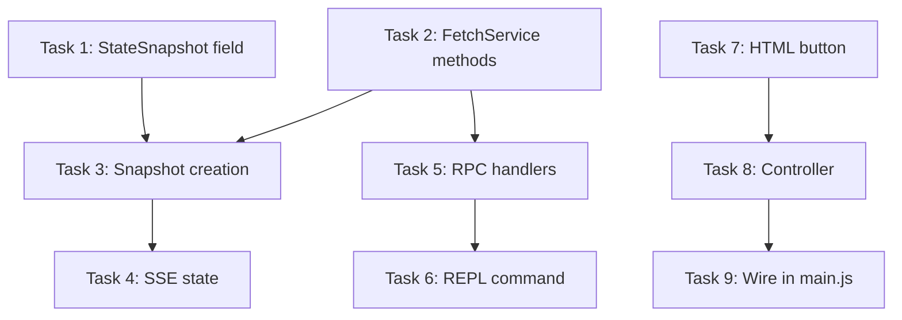

# Implementation Tasks: Fetch Capture Toggle

**Status:** Completed
**Started:** 2025-12-28
**Completed:** 2025-12-28
**Spec:** [requirements.md](./requirements.md) | [design.md](./design.md)

## Task Breakdown

### Task 1: Add capture_enabled to StateSnapshot
**Description:** Add the `capture_enabled` boolean field to the frozen StateSnapshot dataclass.

**Files:**
- `src/webtap/services/state_snapshot.py` - Add field after `paused_count`

**Changes:**
```python
# After line 53 (paused_count: int)
capture_enabled: bool
```

Also update `create_empty()` to include `capture_enabled=False`.

**Acceptance:**
- [ ] Field added to StateSnapshot dataclass
- [ ] Field included in create_empty() method
- [ ] Type check passes (`make check`)

**Dependencies:** None
**Complexity:** Low

---

### Task 2: Add capture methods to FetchService
**Description:** Add `capture_enabled` state flag and `enable_capture()`/`disable_capture()` methods to FetchService.

**Files:**
- `src/webtap/services/fetch.py` - Add state and methods

**Changes:**
```python
# In __init__ (after line 32)
self.capture_enabled = False

# New methods (after disable())
def enable_capture(self) -> dict:
    """Enable extension-side body capture."""
    with self._lock:
        self.capture_enabled = True
    self._trigger_broadcast()
    return {"capture_enabled": True}

def disable_capture(self) -> dict:
    """Disable extension-side body capture."""
    with self._lock:
        self.capture_enabled = False
    self._trigger_broadcast()
    return {"capture_enabled": False}
```

**Acceptance:**
- [ ] `capture_enabled` attribute initialized to False
- [ ] `enable_capture()` sets flag and broadcasts
- [ ] `disable_capture()` clears flag and broadcasts
- [ ] Thread-safe with existing `_lock`

**Dependencies:** Task 1 (StateSnapshot field needed for broadcast)
**Complexity:** Low

---

### Task 3: Include capture_enabled in state snapshot creation
**Description:** Update `_create_snapshot()` in WebTapService to include the capture state.

**Files:**
- `src/webtap/services/main.py` - Update `_create_snapshot()` method

**Changes:**
```python
# In _create_snapshot(), add to StateSnapshot constructor (around line 230):
capture_enabled=self.fetch.capture_enabled,
```

**Acceptance:**
- [ ] `capture_enabled` included in StateSnapshot creation
- [ ] Value correctly reflects FetchService state

**Dependencies:** Task 1, Task 2
**Complexity:** Low

---

### Task 4: Add capture_enabled to SSE state broadcast
**Description:** Include `capture_enabled` in the fetch section of `get_full_state()` and update `fetch_hash`.

**Files:**
- `src/webtap/api/state.py` - Update `get_full_state()` function

**Changes:**
```python
# In fetch dict (around line 67):
"fetch": {
    "enabled": snapshot.fetch_enabled,
    "response_stage": snapshot.response_stage,
    "paused_count": snapshot.paused_count,
    "capture_enabled": snapshot.capture_enabled,  # ADD
},

# Update fetch_hash (around line 55):
fetch_hash = _stable_hash(
    f"{snapshot.fetch_enabled}:{snapshot.response_stage}:"
    f"{snapshot.paused_count}:{snapshot.capture_enabled}"
)
```

**Acceptance:**
- [ ] `capture_enabled` in fetch section of state
- [ ] `fetch_hash` includes capture state for change detection
- [ ] Extension receives updated state via SSE

**Dependencies:** Task 3
**Complexity:** Low

---

### Task 5: Add RPC handlers for capture
**Description:** Register `capture.enable` and `capture.disable` RPC methods.

**Files:**
- `src/webtap/rpc/handlers.py` - Add handlers and registration

**Changes:**
```python
# In register_handlers() (after fetch handlers, around line 66):
rpc.method("capture.enable", requires_state=CONNECTED_STATES)(capture_enable)
rpc.method("capture.disable", requires_state=CONNECTED_STATES)(capture_disable)

# New handler functions:
def capture_enable(ctx: RPCContext) -> dict:
    """Enable extension-side response body capture."""
    return ctx.service.fetch.enable_capture()

def capture_disable(ctx: RPCContext) -> dict:
    """Disable extension-side response body capture."""
    return ctx.service.fetch.disable_capture()
```

**Acceptance:**
- [ ] `capture.enable` registered with CONNECTED_STATES requirement
- [ ] `capture.disable` registered with CONNECTED_STATES requirement
- [ ] Handlers delegate to FetchService methods
- [ ] Returns appropriate response dict

**Dependencies:** Task 2
**Complexity:** Low

---

### Task 6: Create capture REPL/MCP command
**Description:** Create a new `capture()` command for REPL and MCP usage.

**Files:**
- `src/webtap/commands/capture.py` - New file
- `src/webtap/commands/__init__.py` - Add import

**New file content:**
```python
"""Capture command for extension-side body recording.

PUBLIC API:
  - capture: Enable/disable automatic response body capture
"""

from webtap.app import app

@app.command(display="markdown", fastmcp={"type": "tool"})
def capture(state, action: str = "status") -> dict:
    """Control extension-side body capture.

    When enabled, response bodies are automatically captured before Chrome
    evicts them from memory. Zero latency impact - bodies are grabbed
    transparently and stored for later retrieval via request().

    Args:
        action: "enable", "disable", or "status"

    Examples:
        capture("enable")   # Start capturing
        capture("disable")  # Stop capturing
        capture()           # Check status
    """
    if action == "enable":
        return state.client.call("capture.enable")
    elif action == "disable":
        return state.client.call("capture.disable")
    else:
        # Status - get from current state
        snapshot = state.client.call("status")
        return {"capture_enabled": snapshot.get("fetch", {}).get("capture_enabled", False)}
```

**Acceptance:**
- [ ] Command file created with proper docstring
- [ ] `capture("enable")` calls RPC method
- [ ] `capture("disable")` calls RPC method
- [ ] `capture()` returns current status
- [ ] Imported in `__init__.py`

**Dependencies:** Task 5
**Complexity:** Low

---

### Task 7: Add Capture button to extension HTML
**Description:** Add the Capture toggle button to the extension sidebar header.

**Files:**
- `extension/sidepanel.html` - Add button after intercept dropdown

**Changes:**
```html
<!-- After interceptDropdown (line 28), before clear button -->
<button
  id="captureToggle"
  class="btn-sm"
  title="Toggle response body capture"
  data-disabled="!connected"
>
  Capture
</button>
```

**Acceptance:**
- [ ] Button added with correct ID
- [ ] Has `data-disabled="!connected"` attribute
- [ ] Positioned between intercept dropdown and clear button

**Dependencies:** None
**Complexity:** Low

---

### Task 8: Create capture controller for extension
**Description:** Create the UI controller that handles button clicks and state updates.

**Files:**
- `extension/controllers/capture.js` - New file

**New file content:**
```javascript
/**
 * Capture Controller
 * Handles the Capture toggle button for extension-side body recording.
 */

let client = null;
let onError = null;

export function init(c, callbacks = {}) {
  client = c;
  onError = callbacks.onError || console.error;

  const btn = document.getElementById("captureToggle");
  if (!btn) return;

  btn.onclick = async () => {
    const isEnabled = btn.classList.contains("active");
    const method = isEnabled ? "capture.disable" : "capture.enable";
    try {
      await client.call(method);
    } catch (err) {
      onError(err);
    }
  };
}

export function update(state) {
  const btn = document.getElementById("captureToggle");
  if (!btn) return;

  const enabled = state.fetch?.capture_enabled || false;
  btn.classList.toggle("active", enabled);
}
```

**Acceptance:**
- [ ] Controller exports `init()` and `update()` functions
- [ ] Click toggles between enable/disable based on current state
- [ ] `update()` syncs button class with SSE state
- [ ] Errors handled via callback

**Dependencies:** Task 7
**Complexity:** Low

---

### Task 9: Wire capture controller in main.js
**Description:** Import the new controller and pass callbacks to `capture.init()`.

**Files:**
- `extension/main.js` - Update capture initialization

**Changes:**
```javascript
// Change import (line 21) - already imports from capture.js, need controller
import * as captureController from "./controllers/capture.js";

// Update init call in discoverAndConnect() (around line 191):
// FROM: capture.init(client);
// TO:
captureController.init(client, callbacks);
capture.init(client);

// Update state listener (around line 94):
// FROM: capture.update(state);
// TO:
captureController.update(state);
capture.update(state);
```

**Acceptance:**
- [ ] Controller imported separately from capture.js
- [ ] Controller initialized with callbacks
- [ ] Both controller and capture module updated on state changes
- [ ] No console errors on load

**Dependencies:** Task 8
**Complexity:** Low

---

## Task Dependencies



## Parallel Tracks

**Backend Track (Tasks 1-6):**
1. Task 1 → Task 2 → Task 3 → Task 4
2. Task 5 (parallel with Task 3-4) → Task 6

**Frontend Track (Tasks 7-9):**
1. Task 7 → Task 8 → Task 9

Both tracks can proceed in parallel. Integration testing after both complete.

## Testing Checklist

After implementation:
- [ ] `make check` passes (type checking)
- [ ] `make lint` passes
- [ ] Daemon starts without errors
- [ ] Extension loads without console errors
- [ ] Capture button visible and disabled when not connected
- [ ] Connect to page → button becomes clickable
- [ ] Click Capture → button shows active state
- [ ] Click again → button shows inactive state
- [ ] REPL: `capture("enable")` returns `{"capture_enabled": True}`
- [ ] REPL: `capture()` shows current status
- [ ] Response bodies captured when enabled (check via `request(id, fields=["body"])`)
