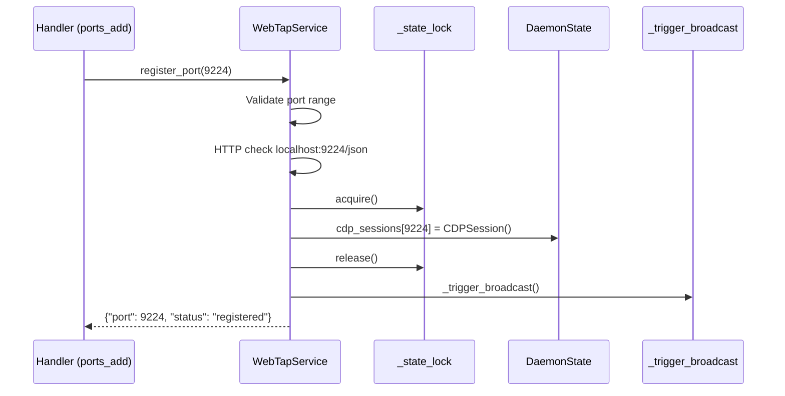
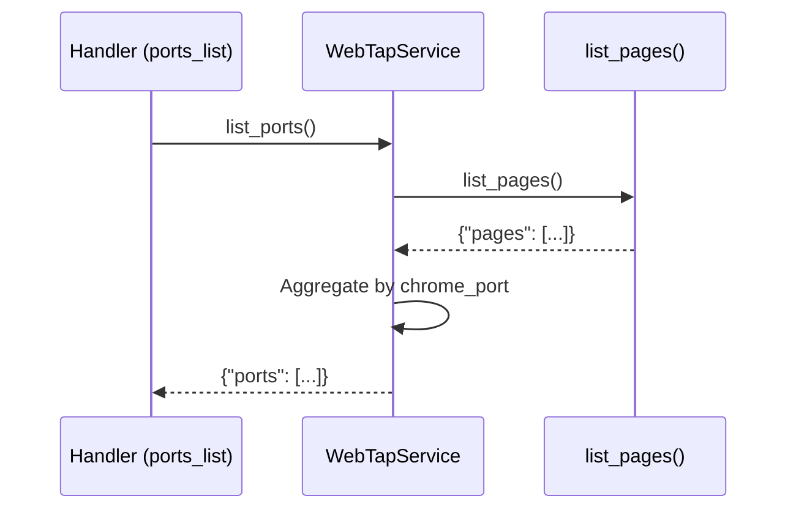

# Design: Layer Architecture Cleanup

## Architecture Overview

WebTap uses a layered architecture where RPC handlers should delegate to the service layer for all state mutations. This cleanup enforces that pattern for port management and error state.

```
┌─────────────────────────────────────────────────────────────────┐
│                    RPC HANDLER LAYER                             │
│                    rpc/handlers.py                               │
│   Thin wrappers: validate params, delegate to service, return   │
└─────────────────────────────────────────────────────────────────┘
                             ↓ ctx.service.method()
┌─────────────────────────────────────────────────────────────────┐
│                    SERVICE LAYER                                 │
│                    services/main.py                              │
│   - Owns all state mutations (with _state_lock)                  │
│   - Calls _trigger_broadcast() after state changes              │
│   - Coordinates domain services (fetch, network, console, dom)   │
└─────────────────────────────────────────────────────────────────┘
                             ↓
┌─────────────────────────────────────────────────────────────────┐
│                    CDP/STATE LAYER                               │
│   cdp/session.py, DaemonState                                   │
│   - Raw CDP communication                                        │
│   - DuckDB event storage                                         │
│   - Session management                                           │
└─────────────────────────────────────────────────────────────────┘
```

## Component Analysis

### Existing Components to Modify

#### `services/main.py` - WebTapService class

**Current state:**
- Has `_state_lock` (RLock) for thread safety
- Has `_trigger_broadcast()` for SSE notifications
- Has `list_pages()` that aggregates pages from all ports
- Missing: port management methods, error state methods

**Changes needed:**
- Add `register_port(port: int) -> dict`
- Add `unregister_port(port: int) -> dict`
- Add `list_ports() -> dict`
- Add `set_error(message: str) -> None`
- Add `clear_error() -> None`
- Fix `disconnect_target()` locking (lines 410-416 are outside lock)
- Update `_handle_unexpected_disconnect()` to use `set_error()`

#### `rpc/handlers.py` - RPC method handlers

**Current state (problematic):**
```python
# ports_add - directly mutates state
if port not in ctx.service.state.cdp_sessions:
    ctx.service.state.cdp_sessions[port] = CDPSession(port=port)

# ports_list - calls non-existent method
pages = session.get_pages()  # ❌ Doesn't exist!

# errors_dismiss - no locking
ctx.service.state.error_state = None  # ❌ Direct mutation
```

**Changes needed:**
- Simplify `ports_add` to: `return ctx.service.register_port(port)`
- Simplify `ports_remove` to: `return ctx.service.unregister_port(port)`
- Simplify `ports_list` to: `return ctx.service.list_ports()`
- Simplify `errors_dismiss` to: `ctx.service.clear_error(); return {"success": True}`
- Update method registrations to `broadcasts=False`

### New Components

None - all changes are to existing files.

## Data Models

### Port Registration Result

```python
# From register_port()
{
    "port": 9224,
    "status": "registered" | "unreachable",
    "warning": "Port 9224 not responding"  # Optional
}
```

### Port List Result

```python
# From list_ports()
{
    "ports": [
        {
            "port": 9222,
            "page_count": 5,
            "connection_count": 1,
            "status": "active" | "reachable"
        }
    ]
}
```

### Unregister Result

```python
# From unregister_port()
{
    "port": 9224,
    "removed": True,
    "disconnected": ["9224:abc123"]  # Targets that were disconnected
}
```

## Method Signatures

### WebTapService (services/main.py)

```python
def register_port(self, port: int) -> dict:
    """Register a Chrome debug port.

    Args:
        port: Port number (1024-65535)

    Returns:
        {"port": N, "status": "registered"|"unreachable", "warning": ...}

    Raises:
        ValueError: If port out of range
    """

def unregister_port(self, port: int) -> dict:
    """Unregister port and disconnect connections.

    Args:
        port: Port number to remove

    Returns:
        {"port": N, "removed": True, "disconnected": [...]}

    Raises:
        ValueError: If port is 9222 (protected)
    """

def list_ports(self) -> dict:
    """List registered ports with statistics.

    Returns:
        {"ports": [{"port": N, "page_count": N, "connection_count": N, "status": str}]}
    """

def set_error(self, message: str) -> None:
    """Set error state with locking and broadcast."""

def clear_error(self) -> None:
    """Clear error state with locking and broadcast."""
```

## Data Flow

### Port Registration Flow



### Port Listing Flow



## Error Handling Strategy

### Port Registration Errors

| Error | Handling |
|-------|----------|
| Port < 1024 or > 65535 | Raise `ValueError` |
| Chrome not listening | Return `{"status": "unreachable", "warning": ...}` |
| Port already registered | Silently succeed (idempotent) |

### Port Unregistration Errors

| Error | Handling |
|-------|----------|
| Port is 9222 | Raise `ValueError("Port 9222 is protected")` |
| Port not registered | Return `{"removed": False}` |

### RPC Error Mapping

Handlers should catch service exceptions and convert to `RPCError`:

```python
def ports_add(ctx: RPCContext, port: int) -> dict:
    try:
        return ctx.service.register_port(port)
    except ValueError as e:
        raise RPCError(ErrorCode.INVALID_PARAMS, str(e))
```

## Thread Safety Design

### Lock Acquisition Pattern

```python
def register_port(self, port: int) -> dict:
    # 1. Validation (no lock needed)
    if not (1024 <= port <= 65535):
        raise ValueError(...)

    # 2. Network I/O (MUST be outside lock to prevent deadlock)
    try:
        response = httpx.get(f"http://localhost:{port}/json", timeout=2.0)
    except httpx.RequestError:
        return {"port": port, "status": "unreachable", ...}

    # 3. State mutation (inside lock)
    with self._state_lock:
        if port not in self.state.cdp_sessions:
            self.state.cdp_sessions[port] = CDPSession(port=port)

    # 4. Broadcast (outside lock, after mutation)
    self._trigger_broadcast()
    return {"port": port, "status": "registered"}
```

### Disconnect Locking Fix

Current `disconnect_target()` has race condition:

```python
# CURRENT (buggy) - lines 410-416 are outside lock
if self.cdp == conn.cdp:
    self.cdp = self.state.cdp  # ❌ Outside lock!
```

Fixed version:

```python
def disconnect_target(self, target: str) -> None:
    conn = self.get_connection(target)
    if not conn:
        return

    # Disconnect CDP first (network I/O - outside lock)
    conn.cdp.disconnect()

    # All state mutations inside lock
    with self._state_lock:
        self.connections.pop(target, None)
        if self.cdp == conn.cdp:
            self.cdp = self.state.cdp
            if self.fetch.enabled:
                self.fetch._enabled = False  # Direct attribute to avoid side effects
            self.dom._selections = {}  # Direct clear

    self._trigger_broadcast()
```

## Broadcast Pattern

**Decision:** Service owns broadcasts, handlers don't.

Update handler registrations:

```python
# Before
rpc.method("ports.add")(ports_add)  # broadcasts=True by default

# After
rpc.method("ports.add", broadcasts=False)(ports_add)  # Service handles it
rpc.method("ports.remove", broadcasts=False)(ports_remove)
```

This prevents double-broadcasts and makes the pattern consistent.

## Files to Modify

| File | Line Range | Changes |
|------|------------|---------|
| `services/main.py` | After line 100 | Add `register_port()`, `unregister_port()`, `list_ports()` |
| `services/main.py` | After line 100 | Add `set_error()`, `clear_error()` |
| `services/main.py` | Lines 392-418 | Fix `disconnect_target()` locking |
| `services/main.py` | Line 581 | Use `self.set_error()` instead of direct assignment |
| `rpc/handlers.py` | Lines 495-498 | Simplify `errors_dismiss` |
| `rpc/handlers.py` | Lines 747-788 | Simplify `ports_add` |
| `rpc/handlers.py` | Lines 791-830 | Simplify `ports_remove` |
| `rpc/handlers.py` | Lines 833-868 | Simplify `ports_list` |
| `rpc/handlers.py` | Lines 109-111 | Update broadcast flags for port methods |

## Testing Strategy

### Manual Testing

1. Start daemon, run `ports()` → should show correct page counts
2. Run `setup-android -y` → port 9224 should register
3. Run `ports()` again → should show both 9222 and 9224
4. Disconnect and reconnect → error state should clear properly

### Race Condition Testing

Not easily testable manually, but the locking pattern prevents:
- Concurrent port registration creating duplicate sessions
- Concurrent disconnect corrupting connection state
- Error state being half-written during read
