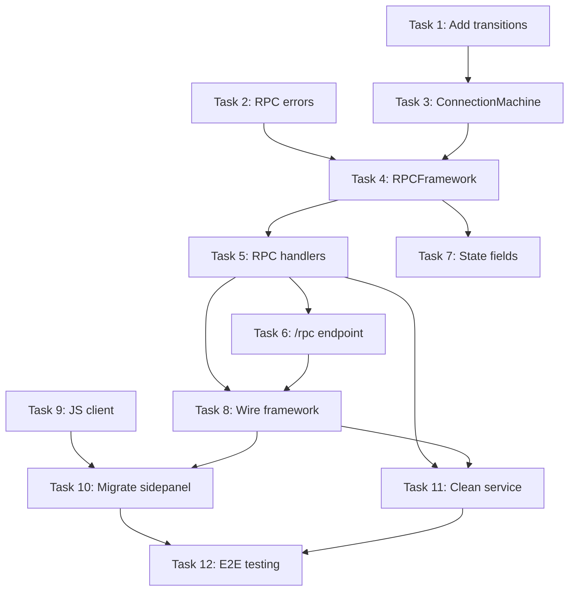

# Implementation Tasks: WebTap RPC Framework

**Status:** In Progress (Tasks 1-11 Complete)
**Branch:** `feat/webtap-rpc-framework`
**Spec:** [requirements.md](./requirements.md) | [design.md](./design.md)
**Started:** 2025-12-18

## Local Resources

**Before implementing certain tasks**, use Task agents with `subagent_type=Explore`:

| Resource | Path | Explore For Tasks |
|----------|------|-------------------|
| transitions library | `/home/fredrik/.local/share/resources/github.com/pytransitions/transitions/tree/HEAD` | **Task 2**: LockedMachine patterns, callback registration, queued transitions |

## Task Breakdown

---

### Task 1: Add transitions dependency

**Description:** Add the `transitions` library to webtap package dependencies.

**Files:**
- `packages/webtap/pyproject.toml` - Add `transitions` to dependencies

**Commands:**
```bash
cd /home/fredrik/Projects/Python/project-summer/tap-tools
uv add transitions --package webtap
```

**Acceptance:**
- [x] `transitions` appears in pyproject.toml dependencies
- [x] `uv sync` succeeds
- [x] `from transitions.extensions import LockedMachine` imports without error

**Completed:** 2025-12-18

**Dependencies:** None
**Complexity:** Low

---

### Task 2: Create RPC errors module

**Description:** Define RPCError exception class and error code constants.

**Files:**
- `packages/webtap/src/webtap/rpc/__init__.py` - Create package, export public API
- `packages/webtap/src/webtap/rpc/errors.py` - RPCError class and ErrorCode constants

**Implementation:**
```python
# errors.py
class ErrorCode:
    METHOD_NOT_FOUND = "METHOD_NOT_FOUND"
    INVALID_STATE = "INVALID_STATE"
    STALE_EPOCH = "STALE_EPOCH"
    INVALID_PARAMS = "INVALID_PARAMS"
    INTERNAL_ERROR = "INTERNAL_ERROR"
    NOT_CONNECTED = "NOT_CONNECTED"

class RPCError(Exception):
    def __init__(self, code: str, message: str, data: dict = None):
        self.code = code
        self.message = message
        self.data = data or {}
        super().__init__(message)
```

**Acceptance:**
- [x] `from webtap.rpc import RPCError, ErrorCode` works
- [x] RPCError can be raised and caught with code, message, data attributes
- [x] Type checking passes

**Completed:** 2025-12-18

**Dependencies:** None
**Complexity:** Low

---

### Task 3: Create ConnectionMachine

**Description:** Implement the connection state machine using transitions.LockedMachine.

**Explore First:**
- Search transitions library for LockedMachine initialization patterns
- Check callback registration (`after`, `before`, `on_enter_*`)
- Verify `queued=True` behavior for thread safety

**Files:**
- `packages/webtap/src/webtap/rpc/machine.py` - ConnectionMachine class

**Implementation:**
```python
from enum import Enum
from transitions.extensions import LockedMachine

class ConnectionState(str, Enum):
    DISCONNECTED = "disconnected"
    CONNECTING = "connecting"
    CONNECTED = "connected"
    INSPECTING = "inspecting"
    DISCONNECTING = "disconnecting"

class ConnectionMachine(LockedMachine):
    states = [s.value for s in ConnectionState]

    transitions = [
        {'trigger': 'start_connect', 'source': 'disconnected', 'dest': 'connecting'},
        {'trigger': 'connect_success', 'source': 'connecting', 'dest': 'connected',
         'after': '_increment_epoch'},
        {'trigger': 'connect_failed', 'source': 'connecting', 'dest': 'disconnected'},
        {'trigger': 'start_inspect', 'source': 'connected', 'dest': 'inspecting'},
        {'trigger': 'stop_inspect', 'source': 'inspecting', 'dest': 'connected'},
        {'trigger': 'start_disconnect', 'source': ['connected', 'inspecting'], 'dest': 'disconnecting'},
        {'trigger': 'disconnect_complete', 'source': ['disconnecting', 'connecting'], 'dest': 'disconnected'},
        {'trigger': 'force_disconnect', 'source': '*', 'dest': 'disconnected'},
    ]

    def __init__(self):
        super().__init__(
            states=self.states,
            transitions=self.transitions,
            initial='disconnected',
            auto_transitions=False,
            queued=True,
        )
        self.epoch = 0

    def _increment_epoch(self):
        self.epoch += 1
```

**Acceptance:**
- [x] Machine starts in `disconnected` state
- [x] `start_connect()` transitions to `connecting`
- [x] `connect_success()` transitions to `connected` AND increments epoch
- [x] `connect_failed()` transitions back to `disconnected`
- [x] Invalid transitions raise MachineError
- [x] Thread-safe (concurrent calls don't corrupt state)
- [x] Type checking passes

**Completed:** 2025-12-18

**Dependencies:** Task 1
**Complexity:** Medium

---

### Task 4: Create RPCFramework core

**Description:** Implement the main RPC framework with method registration and request handling.

**Files:**
- `packages/webtap/src/webtap/rpc/framework.py` - RPCFramework class, RPCContext, decorator

**Implementation Details:**
- `method(name, requires_state=[])` decorator for handler registration
- `handle(request: dict) -> dict` async method for request processing
- State validation before handler invocation
- Epoch validation (skip for methods without epoch requirement)
- Wrap sync handlers with `asyncio.to_thread()`
- Structured error responses for all error types

**Acceptance:**
- [x] `@rpc.method("name")` registers handler
- [x] `@rpc.method("name", requires_state=["connected"])` validates state
- [x] Epoch mismatch returns STALE_EPOCH error
- [x] Unknown method returns METHOD_NOT_FOUND error
- [x] Handler exception returns INTERNAL_ERROR
- [x] RPCError from handler returns structured error
- [x] Successful handler returns result wrapped in JSON-RPC response
- [x] All responses include current epoch
- [x] Type checking passes

**Completed:** 2025-12-18

**Dependencies:** Task 2, Task 3
**Complexity:** High

---

### Task 5: Implement RPC handlers

**Description:** Create all 22 RPC method handlers as thin wrappers around WebTapService.

**Files:**
- `packages/webtap/src/webtap/rpc/handlers.py` - All handler functions

**Handlers to implement:**

| Method | State Requirement | Transitions |
|--------|-------------------|-------------|
| `connect` | - | disconnected→connecting→connected |
| `disconnect` | connected, inspecting | →disconnecting→disconnected |
| `pages` | - | - |
| `status` | - | - |
| `clear` | connected, inspecting | - |
| `browser.startInspect` | connected | connected→inspecting |
| `browser.stopInspect` | inspecting | inspecting→connected |
| `browser.clear` | connected, inspecting | - |
| `fetch.enable` | connected, inspecting | - |
| `fetch.disable` | connected, inspecting | - |
| `fetch.resume` | connected, inspecting | - |
| `fetch.fail` | connected, inspecting | - |
| `fetch.fulfill` | connected, inspecting | - |
| `network` | connected, inspecting | - |
| `request` | connected, inspecting | - |
| `console` | connected, inspecting | - |
| `filters.status` | - | - |
| `filters.enable` | connected, inspecting | - |
| `filters.disable` | connected, inspecting | - |
| `filters.enableAll` | connected, inspecting | - |
| `filters.disableAll` | connected, inspecting | - |
| `cdp` | connected, inspecting | - |
| `errors.dismiss` | - | - |

**Acceptance:**
- [x] All 22 handlers registered
- [x] Each handler calls appropriate WebTapService method
- [x] State transitions triggered where applicable
- [x] Errors from service layer wrapped in RPCError
- [x] Type checking passes

**Completed:** 2025-12-18

**Dependencies:** Task 4
**Complexity:** Medium (repetitive but straightforward)

---

### Task 6: Update API to single /rpc endpoint

**Description:** Replace all REST routes with single JSON-RPC endpoint.

**Files:**
- `packages/webtap/src/webtap/api/app.py` - Remove route includes, add /rpc endpoint
- `packages/webtap/src/webtap/api/routes/` - DELETE entire directory

**Changes to app.py:**
```python
# Remove these:
# from webtap.api.routes import browser, cdp, connection, data, fetch, filters
# app.include_router(browser.router)
# ... etc

# Add this:
@app.post("/rpc")
async def handle_rpc(request: Request) -> dict:
    body = await request.json()
    return await app_module.app_state.service.rpc.handle(body)
```

**Acceptance:**
- [ ] All route files deleted
- [x] Single POST /rpc endpoint exists
- [x] /rpc accepts JSON-RPC 2.0 requests
- [x] /rpc returns JSON-RPC 2.0 responses
- [x] GET /events/stream still works (SSE unchanged)
- [x] GET /health still works

**Completed:** 2025-12-18 (route files deletion pending cleanup)

**Dependencies:** Task 5
**Complexity:** Medium

---

### Task 7: Update state.py for new fields

**Description:** Add `connectionState` and `epoch` to state output.

**Files:**
- `packages/webtap/src/webtap/api/state.py` - Modify get_full_state()

**Changes:**
```python
def get_full_state() -> dict:
    # ... existing code ...
    machine = app_module.app_state.service.rpc.machine

    return {
        "connectionState": machine.state,  # NEW
        "epoch": machine.epoch,             # NEW
        # ... existing fields ...
    }
```

**Acceptance:**
- [x] State includes `connectionState` field with machine state
- [x] State includes `epoch` field with current epoch
- [x] SSE broadcasts include new fields
- [x] Existing fields unchanged

**Completed:** 2025-12-18

**Dependencies:** Task 4
**Complexity:** Low

---

### Task 8: Wire RPC framework to server

**Description:** Initialize RPCFramework and connect it to WebTapService on startup.

**Files:**
- `packages/webtap/src/webtap/api/server.py` - Initialize RPC framework
- `packages/webtap/src/webtap/services/main.py` - Add rpc property

**Changes to main.py:**
```python
class WebTapService:
    def __init__(self, state):
        # ... existing init ...
        self.rpc = None  # Set by server.py after initialization
```

**Changes to server.py:**
```python
from webtap.rpc import RPCFramework
from webtap.rpc.handlers import register_handlers

# In initialization:
service.rpc = RPCFramework(service)
register_handlers(service.rpc)
```

**Acceptance:**
- [x] RPCFramework initialized on server start
- [x] All handlers registered
- [x] service.rpc accessible from request handlers
- [x] State machine accessible via service.rpc.machine

**Completed:** 2025-12-18

**Dependencies:** Task 5, Task 6
**Complexity:** Low

---

### Task 9: Create JavaScript RPC client

**Description:** Implement WebTapClient class for the extension.

**Files:**
- `packages/webtap/extension/client.js` - WebTapClient class

**Implementation:**
```javascript
class WebTapClient {
    constructor(baseUrl = "http://localhost:8765")
    async call(method, params = {}, options = {})
    canCall(method)
    connect()  // Start SSE
    disconnect()  // Stop SSE
    on(event, callback)
    // Properties:
    // .state - current state from SSE
    // .debug - enable logging
}
```

**Acceptance:**
- [x] `client.call("method", params)` sends JSON-RPC request
- [x] Response epoch updates `client.state.epoch`
- [x] Errors thrown as Error objects with `.code`, `.message`, `.data`
- [x] `client.connect()` starts SSE subscription
- [x] `client.on("state", fn)` receives state updates
- [x] `client.debug = true` logs all traffic
- [x] Timeout handling with AbortSignal

**Completed:** 2025-12-18

**Dependencies:** None (can be done in parallel)
**Complexity:** Medium

---

### Task 10: Migrate sidepanel.js to use client

**Description:** Replace all api() calls with client.call() in the extension.

**Files:**
- `packages/webtap/extension/sidepanel.js` - Rewrite API calls
- `packages/webtap/extension/sidepanel.html` - Add client.js script

**Changes:**
- Remove `api()` function
- Remove `withButtonLock()` boilerplate
- Replace each button handler with simple client.call()
- Update SSE handling to use client events
- Simplify error handling

**Example transformation:**
```javascript
// Before (20 lines)
document.getElementById("connect").onclick = async () => {
    await withButtonLock("connect", async () => {
        const select = document.getElementById("pageList");
        const selectedPageId = select.value;
        if (!selectedPageId) { showError("Note: Please select a page"); return; }
        try {
            const result = await api("/connect", "POST", { page_id: selectedPageId });
            if (result.state) updateFromState(result.state);
            if (result.error) showError(`Error: ${result.error}`);
        } catch (e) {
            console.error("[WebTap] Connect failed:", e);
            showError("Error: Connection failed");
        }
    });
};

// After (5 lines)
document.getElementById("connect").onclick = async () => {
    const pageId = document.getElementById("pageList").value;
    if (!pageId) return showError("Please select a page");
    await client.call("connect", { page_id: pageId }).catch(showError);
};
```

**Started:** 2025-12-18
**Completed:** 2025-12-18

**Acceptance:**
- [x] All button handlers use client.call()
- [x] State updates via client.on("state")
- [x] Error handling simplified
- [x] No direct fetch() calls remain (except in client.js)
- [x] Extension loads and works with new daemon

**Implementation Notes:**
- Removed old `api()` function completely
- Removed `withButtonLock()` boilerplate from individual handlers (kept the function itself for operation locking)
- All RPC calls now use `client.call(method, params)` pattern
- SSE state updates handled via `client.on("state", callback)`
- Error handling simplified - RPC errors automatically thrown and caught by withButtonLock
- Reduced code from ~920 lines to ~765 lines (155 lines removed)

**Dependencies:** Task 9, Task 8
**Complexity:** High (many changes, must be thorough)

---

### Task 11: Clean up WebTapService

**Description:** Remove method bodies that are now in RPC handlers.

**Files:**
- `packages/webtap/src/webtap/services/main.py` - Simplify methods
- `packages/webtap/src/webtap/rpc/handlers.py` - Use service methods

**Changes:**
- `connect_to_page()` - Now raises exceptions instead of returning error dicts
- `disconnect()` - Returns None, pure cleanup logic
- RPC handlers now call service methods for domain logic

**Completed:** 2025-12-18

**Acceptance:**
- [x] Service methods focus on domain logic only
- [x] No state machine transitions in service layer
- [x] All existing functionality preserved
- [x] Type checking passes

**Implementation Notes:**
- `connect_to_page()` raises RuntimeError on domain enable failure instead of returning error dict
- `disconnect()` changed from `dict[str, Any]` return to `None` - pure cleanup
- `connect` handler now calls `ctx.service.connect_to_page()` instead of inlining logic
- `disconnect` handler now calls `ctx.service.disconnect()` instead of inlining logic
- Handlers remain thin wrappers: state machine transitions + service method call

**Dependencies:** Task 5, Task 8
**Complexity:** Low

---

### Task 12: End-to-end testing

**Description:** Verify the complete system works together.

**Test scenarios:**
1. Start daemon, extension connects via SSE
2. Extension lists pages
3. Connect to a page (verify state transitions and epoch)
4. Enable element inspection (verify state transition)
5. Select elements (verify selections appear)
6. Disable inspection (verify state transition)
7. Toggle fetch interception
8. Query network requests
9. Disconnect (verify cleanup)
10. Reconnect (verify epoch incremented)
11. Verify stale epoch requests rejected

**Acceptance:**
- [ ] All test scenarios pass
- [ ] No console errors in extension
- [ ] No server errors in daemon logs
- [ ] State machine prevents invalid operations
- [ ] Epoch validation catches stale requests

**Dependencies:** All previous tasks
**Complexity:** Medium

---

## Task Dependencies



## Parallel Tracks

**Track A (Python backend):** Tasks 1 → 2 → 3 → 4 → 5 → 6 → 7 → 8 → 11
**Track B (JavaScript client):** Task 9 (can start immediately)
**Merge:** Task 10 requires both tracks complete
**Final:** Task 12 after merge

## Estimated Effort

| Task | Lines of Code | Time |
|------|---------------|------|
| Task 1 | 1 | 5 min |
| Task 2 | ~30 | 15 min |
| Task 3 | ~50 | 30 min |
| Task 4 | ~80 | 45 min |
| Task 5 | ~150 | 1 hr |
| Task 6 | ~20 (delete ~400) | 30 min |
| Task 7 | ~10 | 10 min |
| Task 8 | ~20 | 15 min |
| Task 9 | ~100 | 45 min |
| Task 10 | ~100 (delete ~300) | 1.5 hr |
| Task 11 | ~-50 | 20 min |
| Task 12 | 0 (testing) | 1 hr |
| **Total** | ~560 new, ~750 deleted | ~7 hr |
