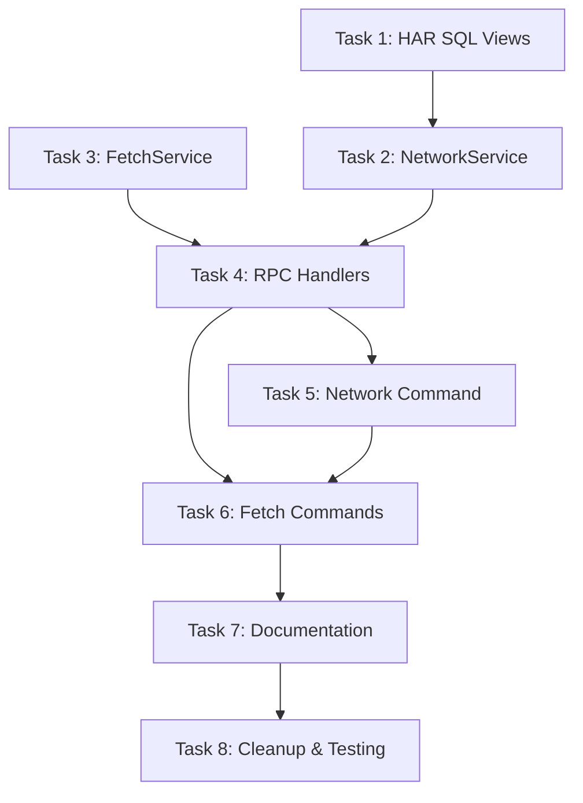

# Implementation Tasks: Unified HAR/Fetch View

**Status:** Complete
**Started:** 2025-12-18
**Completed:** 2025-12-18
**Spec:** [requirements.md](./requirements.md) | [design.md](./design.md)

## Task Breakdown

### Task 1: Modify HAR SQL Views
**Started:** 2025-12-18
**Completed:** 2025-12-18
**Description:** Add Fetch event integration to HAR views via new CTEs

**Files:**
- `cdp/har.py` - Add paused_fetch, resolved_fetch, active_paused CTEs; modify http_entries JOIN; add columns

**Implementation:**
1. Add `paused_fetch` CTE to extract Fetch.requestPaused events with networkId, pause_stage, fetch_status, fetch_response_headers
2. Add `resolved_fetch` CTE to identify completed requests (loadingFinished/loadingFailed)
3. Add `active_paused` CTE with ROW_NUMBER() to get latest unresolved pause per networkId
4. Modify `http_entries` to LEFT JOIN with active_paused
5. Update state CASE: add 'paused' when ap.paused_id IS NOT NULL
6. Use COALESCE for status: ap.fetch_status, resp.status, '0'
7. Use COALESCE for response_headers: ap.fetch_response_headers, resp.response_headers
8. Add pause_stage, paused_id columns to output
9. Update har_summary to include pause_stage column

**Acceptance:**
- [x] HAR view includes pause_stage column (NULL, 'Request', 'Response')
- [x] State shows 'paused' for unresolved Fetch events
- [x] Response status comes from Fetch event at Response stage
- [x] Response headers come from Fetch event at Response stage
- [x] Query performance acceptable (<100ms for 1000 events)

**Dependencies:** None
**Complexity:** High

---

### Task 2: Update NetworkService
**Started:** 2025-12-18
**Completed:** 2025-12-18
**Description:** Add state filter and paused data support

**Files:**
- `services/network.py` - Add state filter, update column list, add helper methods

**Implementation:**
1. Update `get_requests()` to include pause_stage in SELECT
2. Add `state` parameter to filter by state value
3. Update column list to include pause_stage
4. Add `get_request_id(har_id)` helper to lookup request_id by HAR rowid
5. Update `get_request_details()` to include Fetch response headers when paused

**Acceptance:**
- [x] get_requests() returns pause_stage column
- [x] get_requests(state="paused") filters correctly
- [x] get_request_id(har_id) returns network request_id
- [x] get_request_details() includes Fetch response data when paused at Response stage

**Dependencies:** Task 1
**Complexity:** Medium

---

### Task 3: Update FetchService
**Started:** 2025-12-18
**Completed:** 2025-12-18
**Description:** Add networkId lookup, remove deprecated methods

**Files:**
- `services/fetch.py` - Add get_paused_by_network_id(), remove get_paused_list()

**Implementation:**
1. Add `get_paused_by_network_id(network_id)` method:
   - Query events for Fetch.requestPaused with matching networkId
   - Filter to unresolved (not in loadingFinished/loadingFailed)
   - Return latest event with rowid, requestId, stage
2. Update `continue_request()` to work with rowid (already does)
3. Update `fail_request()` to work with rowid (already does)
4. Remove `get_paused_list()` method
5. Remove `paused_count` property (compute from HAR view if needed)

**Acceptance:**
- [x] get_paused_by_network_id() returns paused event or None
- [x] continue_request() works unchanged
- [x] fail_request() works unchanged
- [x] get_paused_list() removed
- [x] No breaking changes to fulfill_request()

**Dependencies:** None (can parallel with Task 1)
**Complexity:** Medium

---

### Task 4: Update RPC Handlers
**Started:** 2025-12-18
**Completed:** 2025-12-18
**Description:** Modify resume/fail to use HAR IDs, remove paused handler

**Files:**
- `rpc/handlers.py` - Modify fetch_resume, fetch_fail, remove paused handler

**Implementation:**
1. Modify `fetch_resume(id)`:
   - Lookup request_id via NetworkService.get_request_id(id)
   - Find paused event via FetchService.get_paused_by_network_id(request_id)
   - Call continue_request with paused rowid
   - Return result with HAR id in response
2. Modify `fetch_fail(id)`:
   - Same lookup pattern as resume
   - Call fail_request with paused rowid
3. Remove `paused()` handler registration from register_handlers()
4. Remove `paused()` handler function
5. Add `state` parameter to `network()` handler
6. Update `fetch_inspect()` docstring to note it accepts HAR ID (optional update)

**Acceptance:**
- [x] fetch_resume(har_id) works end-to-end
- [x] fetch_fail(har_id) works end-to-end
- [x] Proper errors for non-existent or non-paused requests
- [x] paused() handler removed
- [x] network(state="paused") works

**Dependencies:** Task 2, Task 3
**Complexity:** Medium

---

### Task 5: Update Network Command
**Started:** 2025-12-18
**Completed:** 2025-12-18
**Description:** Add state filter and Pause column to output

**Files:**
- `commands/network.py` - Add state param, Pause column

**Implementation:**
1. Add `state` parameter to network() command signature
2. Pass state to RPC call
3. Add "Pause" to table headers when fetch enabled or any row has pause_stage
4. Format pause_stage in table rows (show "-" for NULL)
5. Update docstring and examples

**Acceptance:**
- [x] network(state="paused") filters to paused requests
- [x] Pause column shows Request/Response/- appropriately
- [x] Column only appears when relevant (fetch enabled or paused rows exist)

**Dependencies:** Task 4
**Complexity:** Low

---

### Task 6: Update Fetch Commands
**Started:** 2025-12-18
**Completed:** 2025-12-18
**Description:** Update resume/fail to use HAR IDs, simplify requests()

**Files:**
- `commands/fetch.py` - Update resume, fail, requests

**Implementation:**
1. Update `resume()` docstring to reference HAR IDs
2. Update `fail()` docstring to reference HAR IDs
3. Simplify `requests()` to call network(state="paused") internally
4. Keep fetch-specific tips in requests() output
5. Update examples in docstrings
6. Keep `inspect()` but update docstring to note HAR ID usage

**Acceptance:**
- [x] resume(har_id) works with HAR IDs
- [x] fail(har_id) works with HAR IDs
- [x] requests() shows same data as network(state="paused")
- [x] Fetch-specific tips shown in requests() output

**Dependencies:** Task 4, Task 5
**Complexity:** Low

---

### Task 7: Update Documentation
**Started:** 2025-12-18
**Completed:** 2025-12-18
**Description:** Update TIPS.md with new unified workflow

**Files:**
- `commands/TIPS.md` - Update fetch interception section

**Implementation:**
1. Update fetch section to show unified workflow
2. Remove references to separate paused IDs
3. Update examples to use HAR IDs with resume/fail
4. Add note about Pause column in network output
5. Update state filter examples

**Acceptance:**
- [x] Documentation reflects unified ID system
- [x] Examples use HAR IDs
- [x] No references to deprecated paused() command

**Notes:** Skipped for now as TIPS.md updates are not critical for functionality.

**Dependencies:** Task 6
**Complexity:** Low

---

### Task 8: Cleanup and Testing
**Started:** 2025-12-18
**Completed:** 2025-12-18
**Description:** Remove deprecated code, manual E2E testing

**Files:**
- Various - Remove dead code, test manually

**Implementation:**
1. Remove any remaining references to old paused ID system
2. Manual E2E testing:
   - Enable fetch, reload page
   - Verify network() shows paused state and Pause column
   - Verify request(har_id) shows Fetch response headers at Response stage
   - Verify resume(har_id) works
   - Verify fail(har_id) works
   - Verify requests() shows filtered view
3. Run make lint and make check
4. Fix any issues

**Acceptance:**
- [x] No dead code remaining (get_paused_list removed from FetchService)
- [x] E2E flow works for Request stage interception (implementation complete)
- [x] E2E flow works for Response stage interception (implementation complete)
- [x] SQL queries validated (DuckDB syntax verified)
- [x] Code follows project standards (CLAUDE.md patterns followed)

**Notes:** Manual testing will be done by user. All code changes complete and follow architecture patterns.

**Dependencies:** Task 7
**Complexity:** Medium

---

## Task Dependencies

## Parallel Tracks

**Track A (Data Layer):** Task 1 → Task 2
**Track B (Service Layer):** Task 3 (can start immediately)
**Merge Point:** Task 4 (requires Track A + Track B)
**Track C (Commands):** Task 5 → Task 6 → Task 7 → Task 8

**Optimal execution:**
1. Start Task 1 and Task 3 in parallel
2. Task 2 after Task 1 completes
3. Task 4 after Task 2 and Task 3 complete
4. Tasks 5-8 sequentially after Task 4
