<p align="center">
    
</p>

<p align="center">
  <strong>Accelerate MongoDB analytical queries with parallel execution and Parquet caching</strong>
</p>

<p align="center">
  <em>Faster Queries → Less Memory → Real Savings</em>
</p>

<p align="center">
  <a href="https://pypi.org/project/xlr8/"></a>
    <a href="https://www.python.org/"></a>
    <a href="LICENSE"></a>
</p>

<p align="center">
  <strong>🦀 Rust-Backed</strong> · <strong>⚡ Up to 4x Faster Queries</strong> · <strong>📦 10-12x Compression</strong> · <strong>📊 Configurable Memory Limits</strong>
</p>

---

## Minimal Code Changes

```python
# Before: PyMongo
df = pd.DataFrame(list(collection.find(query)))

xlr8_collction = accelerate(collection, schema, mongodb_uri)
                                                ^ Union(str, callback)
# After: XLR8 - just wrap and go!
df = xlr8_collection.find(query).to_dataframe()
```

That's it. Same query syntax, same DataFrame output-just faster.

---

## The Problem

When running analytical queries over large MongoDB collections, you encounter two fundamental bottlenecks:


**I/O Bound**: PyMongo uses a single cursor, fetching documents one batch at a time. Your CPU sits idle waiting for network round trips.

**CPU/GIL Bound**: Even with the data in hand, Python's Global Interpreter Lock (GIL) means BSON decoding and DataFrame construction happen on a single core.

These aren't PyMongo limitations-they're inherent to Python's design. XLR8 provides a solution.

---

## How XLR8 Solves It


XLR8 releases Python's GIL and hands execution to a Rust backend powered by Tokio's async runtime. Multiple workers fetch from MongoDB in parallel, convert BSON to Arrow, and write Parquet shards-all without touching the GIL.

The result? Your analytical queries run **significantly faster**, especially for large result sets.

---

## Installation

```bash
pip install xlr8
```

XLR8 requires Python 3.11+ and includes pre-compiled Rust extensions.

---

## Quick Start

```python
from pymongo import MongoClient
from xlr8 import accelerate, Schema, Types
from datetime import datetime, timezone, timedelta
from bson import ObjectId

# Connect to MongoDB
client = MongoClient("mongodb://localhost:27017")
collection = client["iot"]["sensor_readings"]

# Define your schema
schema = Schema(
    time_field="timestamp",
    fields={
        "timestamp": Types.Timestamp("ms", tz="UTC"),
        "device_id": Types.ObjectId(),
        "reading": Types.Any(),  # Handles int, float, string dynamically
    },
    avg_doc_size_bytes=200,
)

# Wrap collection with XLR8
xlr8_col = accelerate(collection, schema=schema, mongo_uri="mongodb://localhost:27017")

# Query like normal PyMongo
cursor = xlr8_col.find({
    "device_id": ObjectId("507f1f77bcf86cd799439011"),
    "timestamp": {"$gte": datetime(2024, 1, 1, tzinfo=timezone.utc),
                  "$lt": datetime(2024, 6, 1, tzinfo=timezone.utc)}
}).sort("timestamp", 1)

# Get DataFrame - parallel fetch, cached for reuse
df = cursor.to_dataframe(
    chunking_granularity=timedelta(days=7),
    max_workers=8,
)
```

---

## Key Features

<table>
<tr>
<td width="50%" valign="top">

### 🦀 GIL-Free Rust Backend
Python's GIL is released via `py.allow_threads()`. Rust's Tokio runtime handles async I/O and CPU-intensive work across all cores.

</td>
<td width="50%" valign="top">

### ⚡ Parallel MongoDB Fetching
Queries are split into time-based chunks. Each worker maintains its own MongoDB connection, fetching in parallel.

</td>
</tr>
<tr>
<td width="50%" valign="top">

### 💾 Query aware cache
Data is stored in the query-hash folder, cursors can be supplied a start and end date to filter through the cache.

</td>
<td width="50%" valign="top">

`$or` and `$in` queries are automatically split into **independent “brackets”** that can be executed in parallel.

- **`$or`**: each branch becomes its own bracket (while shared filters are kept as global constraints).
- **`$in`**: the list is expanded into one bracket per value (e.g., 3 values → 3 parallel brackets).

Before execution, XLR8 builds an **execution plan** that detects **overlapping brackets** (cases where multiple brackets could match the same document) and ensures results are **correct and deterministic**. This behavior is covered by extensive tests to prevent duplicates or missing rows. 
</td>
</tr>
<tr>
<td width="50%" valign="top">

### 🔀 DuckDB K-Way Merge
When sorting is required, DuckDB performs a GIL-free K-way merge across sorted shards-O(N log K) complexity.

</td>
<td width="50%" valign="top">

### 🐻‍❄️ Pandas & Polars Support
`to_dataframe()` returns pandas. `to_polars()` returns native Polars. Choose based on your downstream analytics.

</td>
</tr>
<tr>
<td width="50%" valign="top">

### 📊 Memory-Controlled Execution
Set `flush_ram_limit_mb` to control RAM per worker. Process large datasets without OOM errors.

</td>
<td width="50%" valign="top">

### 📤 Stream to Data Lakes
`stream_to_callback()` partitions data by time and custom fields-perfect for S3/GCS ingestion pipelines.

</td>
</tr>
</table>

---

## Cloud & Container Benefits

XLR8's architecture provides specific advantages in cloud environments:


| Benefit | How XLR8 Helps |
|---------|----------------|
| **Reduced container runtime** | Parallel execution finishes faster → lower billable seconds |
| **Cache-first processing** | Fetch once, process many times without hitting MongoDB |
| **Smaller instances** | Memory control via `flush_ram_limit_mb` allows smaller container sizes |
| **Predictable costs** | Consistent memory footprint = consistent billing |

---

## When to Use XLR8

| Use Case | XLR8 Fit | Why |
|----------|:--------:|-----|
| Analytics on 100K+ documents | ✅ **Great** | Parallel fetch + caching provides meaningful speedup |
| Repeated queries on same data | ✅ **Great** | Cache hit avoids network entirely |
| Time-series IoT/sensor data | ✅ **Great** | Time-based chunking is native to the design |
| Multi-device `$or`/`$in` queries | ✅ **Great** | Automatic bracket parallelization |
| One-off small queries | ➖ Neutral | Works fine, but overhead may not be worth it |
| Single document lookups | ❌ Skip | PyMongo is already optimal for this |
| Write-heavy workloads | ❌ Skip | XLR8 accelerates reads, not writes |

---

## Four Ways to Get Your Data

### 1. `to_dataframe()` - Full DataFrame Load

```python
df = cursor.to_dataframe(
    chunking_granularity=timedelta(days=7),
    max_workers=8,
    flush_ram_limit_mb=512,
)
```
**Best for**: Analytical queries where you need all data in memory.

### 2. `to_polars()` - Native Polars DataFrame

```python
df = cursor.to_polars(
    chunking_granularity=timedelta(days=7),
    any_type_strategy="float",
)
```
**Best for**: High-performance analytics with Polars' lazy evaluation.

### 3. `to_dataframe_batches()` - Memory-Efficient Streaming

```python
for batch_df in cursor.to_dataframe_batches(batch_size=50_000):
    process(batch_df)  # Only 50K rows in memory at a time
```
**Best for**: Datasets larger than available RAM.

### 4. `stream_to_callback()` - Data Lake Population

```python
def upload_to_s3(table: pa.Table, metadata: dict):
    week = metadata["time_start"].strftime("%Y-%W")
    path = f"s3://bucket/week={week}.parquet"
    pq.write_table(table, path)

cursor.stream_to_callback(
    callback=upload_to_s3,
    partition_time_delta=timedelta(weeks=1),
    partition_by="device_id",
)
```
**Best for**: ETL pipelines, data lake ingestion.

---

## Architecture Deep-Dive

<details>
<summary><strong>Click to expand the full pipeline</strong></summary>

### The 8-Step Pipeline


### Step-by-Step Breakdown

```mermaid
flowchart TB
    subgraph Step1["1️⃣ Your Query"]
        Q["cursor.to_dataframe(chunking_granularity=7d, max_workers=8)"]
    end
    
    subgraph Step2["2️⃣ Cache Check"]
        Q --> Hash["Query hash → .cache/abc123/"]
        Hash --> CacheHit{"Cache hit?"}
        CacheHit -->|Yes| Skip["Skip to step 8"]
        CacheHit -->|No| Continue["Continue to fetch"]
    end
    
    subgraph Step3["3️⃣ Bracket Analysis"]
        Continue --> Brackets["$or queries → independent brackets"]
        Brackets --> InExpand["$in → expanded to parallel units"]
    end
    
    subgraph Step4["4️⃣ Time Chunking"]
        InExpand --> TimeChunk["6-month range ÷ 7-day granularity = 26 chunks"]
    end
    
    subgraph Step5["5️⃣ Execution Planning"]
        TimeChunk --> Plan["RAM budget + workers → batch sizes"]
    end
    
    subgraph Step6["6️⃣ GIL Release"]
        Plan --> GIL["py.allow_threads() → Rust takes over"]
    end
```



### Parallel Execution in Rust

```mermaid
flowchart TB
    subgraph Rust["🦀 Rust Backend - GIL Free"]
        Runtime["Tokio Async Runtime"]
        Runtime --> W1["Worker 1"]
        Runtime --> W2["Worker 2"]
        Runtime --> W3["Worker 3"]
        Runtime --> W4["Worker N"]
        
        W1 --> F1["MongoDB Fetch"] --> A1["BSON→Arrow"] --> P1["Write Parquet"]
        W2 --> F2["MongoDB Fetch"] --> A2["BSON→Arrow"] --> P2["Write Parquet"]
        W3 --> F3["MongoDB Fetch"] --> A3["BSON→Arrow"] --> P3["Write Parquet"]
        W4 --> F4["MongoDB Fetch"] --> A4["BSON→Arrow"] --> P4["Write Parquet"]
    end
```



### DataFrame Assembly


**Unsorted**: PyArrow reads all shards, concatenates, converts to pandas.

**Sorted**: DuckDB reads Parquet directly (its own reader), performs K-way merge in a single pass, returns sorted DataFrame.

</details>

---

## Query Splitting: Brackets

<details>
<summary><strong>How XLR8 parallelizes complex queries</strong></summary>

XLR8 analyzes your query filter and extracts parallelizable "brackets":


`$in` queries are automatically expanded:

```python
# This query:
{"sensor_id": {"$in": [id1, id2, id3]}}

# Becomes 3 parallel brackets:
# Bracket 1: {"sensor_id": id1}
# Bracket 2: {"sensor_id": id2}
# Bracket 3: {"sensor_id": id3}
```

</details>

---

## Types.Any(): Handling Mixed Types

<details>
<summary><strong>How XLR8 handles MongoDB's flexible typing</strong></summary>

MongoDB fields can contain different types across documents. `Types.Any()` stores values in a 13-field struct:


Supported tags: `null`, `bool`, `int`, `float`, `string`, `bytes`, `date`, `timestamp`, `objectid`, `array`, `object`, `decimal128`, `uuid`

</details>

---

## API Reference

<details>
<summary><strong><code>accelerate(collection, schema, mongo_uri)</code></strong></summary>

```python
xlr8_col = accelerate(
    collection,                              # PyMongo collection
    schema=schema,                           # XLR8 Schema
    mongo_uri="mongodb://localhost:27017",   # Required for Rust backend
)
```

</details>

<details>
<summary><strong><code>Schema(time_field, fields, avg_doc_size_bytes)</code></strong></summary>

```python
schema = Schema(
    time_field="timestamp",
    fields={
        "timestamp": Types.Timestamp("ms", tz="UTC"),
        "device_id": Types.ObjectId(),
        "reading": Types.Any(),
        "metadata.region": Types.String(),  # Nested field access
    },
    avg_doc_size_bytes=250,
)
```

</details>

<details>
<summary><strong><code>cursor.to_dataframe(**kwargs)</code></strong></summary>

| Parameter | Type | Default | Description |
|-----------|------|---------|-------------|
| `chunking_granularity` | `timedelta` | `None` | Time chunk size (required for parallel) |
| `max_workers` | `int` | `4` | Parallel worker count |
| `flush_ram_limit_mb` | `int` | `512` | total ram limit |
| `row_group_size` | `int` | `None` | Parquet row group size |
| `cache_read` | `bool` | `True` | Read from cache if available |
| `cache_write` | `bool` | `True` | Write results to cache |

</details>

<details>
<summary><strong>Type Reference</strong></summary>

| Type | Parquet Storage | Example |
|------|-----------------|---------|
| `Types.String()` | UTF-8 | `"hello"` |
| `Types.Int()` | Int64 | `42` |
| `Types.Float()` | Float64 | `3.14` |
| `Types.Bool()` | Bool | `True` |
| `Types.Timestamp(unit, tz)` | Timestamp | `datetime(...)` |
| `Types.ObjectId()` | String | `ObjectId("...")` |
| `Types.Any()` | 13-field Struct | mixed types |
| `Types.List(element_type)` | List | `[1, 2, 3]` |

</details>

---

## Tips & Tricks

<details>
<summary><strong>Choosing chunk granularity</strong></summary>

```python
# Rule of thumb: 2-4x more chunks than workers

# 1 month of data, 8 workers → ~3 day chunks
chunking_granularity=timedelta(days=3)

# 1 year of data, 8 workers → ~2 week chunks
chunking_granularity=timedelta(days=14)
```

</details>

<details>
<summary><strong>Tuning RAM usage</strong></summary>

```python
# More RAM = fewer files = faster reads
flush_ram_limit_mb=2000

# Less RAM = more files = lower memory footprint
flush_ram_limit_mb=256
```

</details>

<details>
<summary><strong>Using projections</strong></summary>

```python
# Only fetch the fields you need
cursor = xlr8_col.find(
    {"device_id": device_id, "timestamp": time_range},
    {"timestamp": 1, "reading": 1}  # Projection
)
```

</details>

---

## Contributing

```bash
git clone https://github.com/XLR8-DB/xlr8.git
cd xlr8
uv sync
uv run pytest
```