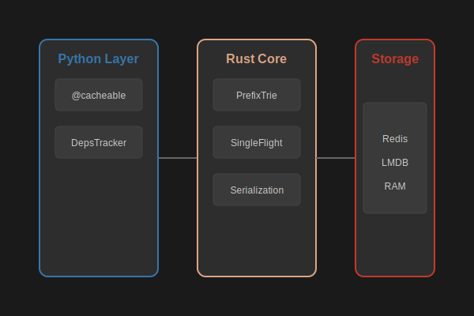

# Architecture

Zoocache is designed as a high-performance caching layer that bridge the gap between Python's flexible ecosystem and Rust's safety and speed.

## Core Components

The system is split into two main layers:

### 1. The Plano de Control (Rust Core)
The Rust engine manages the complex logic of the cache:
- **PrefixTrie**: A thread-safe, hierarchical structure that tracks versioning for dependency tags. Includes a **Global Version Counter** for $O(1)$ validation short-circuiting.
- **Flight Manager**: Handles synchronization to prevent "thundering herd" scenarios for both Sync and Async functions.
- **[Hybrid Logical Clocks (HLC)](consistency.md#hybrid-logical-clocks-hlc)**: Ensures causal consistency across distributed nodes by ratcheting timestamps based on wall clocks and logical counters.

### 2. The Plano de Datos (Python Wrapper)
The Python layer provides the user-facing API:
- **Decorators**: `@cacheable` intercepts function calls.
- **Context Tracking**: `DepsTracker` uses `contextvars` to register dynamic dependencies during function execution.
- **Serialization Proxy**: Passes Python objects to the Rust core for high-performance processing.

## Overall Flow

## Trade-offs & Considerations
While the architecture is highly optimized, it introduces complexity:
- **Trie Memory Leak potential**: Nodes are created for every unique tag. Although a pruning mechanism exists, high-cardinality tags require careful management.
- **FFI Boundary**: Crossing between Python and Rust always has a small cost, though Zoocache minimizes this by doing heavy lifting (serialization/hashing) on the Rust side.
