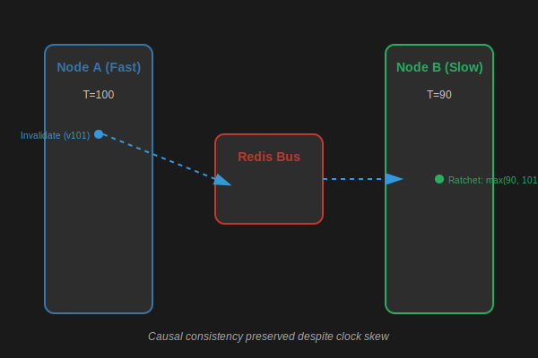

# Distributed Consistency

Maintaining cache consistency across multiple nodes is one of the hardest problems in distributed systems. Zoocache addresses this using Hybrid Logical Clocks (HLC) and a "passive sync" mechanism.

## Hybrid Logical Clocks (HLC)

Standard system clocks (wall clocks) can drift. If Node A's clock is 5 seconds ahead of Node B, invalidations might be applied in the "wrong order" logically.

HLC combines the wall clock with a logical counter to ensure:
- **Causality**: If Event B happens after Event A, B's HLC is guaranteed to be greater than A's.
- **Monotonicity**: Clocks never move backward.

### Distributed Invalidation Flow
1. **Node A** invalidates a tag. It calculates a new HLC version.
2. **Node A** publishes `tag|version` to the Redis Bus.
3. **Node B** receives the message and updates its internal Trie only if the incoming version is greater than its local version (**Ratchet**).

## Passive Resync (Self-Healing)

What if the Redis Pub/Sub message is lost?
Zoocache implements **Passive Resync**:
- Every cached entry in the storage (Redis or LMDB) contains the version snapshot of its dependencies.
- When **Node B** reads an entry written by **Node A**, it extracts the versions from the entry.
- If these versions are newer than what **Node B** has in its local Trie, **Node B** catches up automatically.

This ensures that nodes eventually consistent themselves just by reading data, even without the message bus.

## Trade-offs & Considerations
- **Eventual Consistency**: While HLC and Passive Resync are robust, there is still a tiny window of "stale" hits if the Bus message is delayed and no other read triggers a resync.
- **Redis Dependency**: For distributed mode, a Redis-compatible bus is required. Without it, nodes operate in "local-only" mode.
