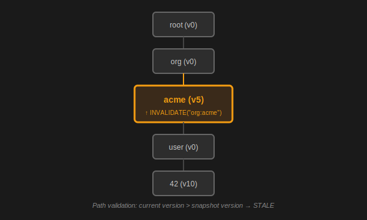

# Hierarchical Invalidation

The defining feature of Zoocache is its ability to invalidate large groups of related data with a single operation.

## The PrefixTrie

Traditional caches use a flat key-value map. To invalidate "all users in organzation 1", you would typically need to search for all keys with that prefix or maintain complex indices.

Zoocache uses a **PrefixTrie**. Each segment of a dependency tag (e.g., `org`, `1`, `user`, `42` in `org:1:user:42`) corresponds to a node in the tree.

### How it works
1. **Writing**: When an entry is cached with dependencies, Zoocache takes a "snapshot" of the current versions of every node in the path of those dependencies.
2. **Invalidating**: Calling `invalidate("org:1")` increments the version of the `org:1` node.
3. **Reading**: On a cache hit, Zoocache re-checks the path versions in the Trie. If any current version is higher than the version stored in the cached entry's snapshot, the entry is considered stale.

In the diagram above, if we invalidate `org:acme`, we bump its version. Any cached item that depends on `org:acme:user:X` will immediately fail the version check because the path now contains a version higher than what was snapshotted.

## Performance Characteristics
- **Invalidation**: $O(D)$ where $D$ is the depth of the tag (number of colons). It is independent of the number of entries in the cache.
- **Validation**: $O(1)$ in the common case (via **Global Version Short-circuit**) and $O(D \times N)$ in the worst case (where $N$ is the number of dependencies).
- **Self-Healing**: $O(1)$ performance is automatically restored after the first validation hit following a change (**Lazy Update**).

## Trade-offs & Considerations
- **Tag Structure**: Dependencies must be hierarchical. If you have non-hierarchical relationships, they must be represented as multiple separate tags.
- **Atomic Bumps**: Invalidation uses atomic operations, which are very fast but can still be a bottleneck under extreme contention on the same exact tag.
